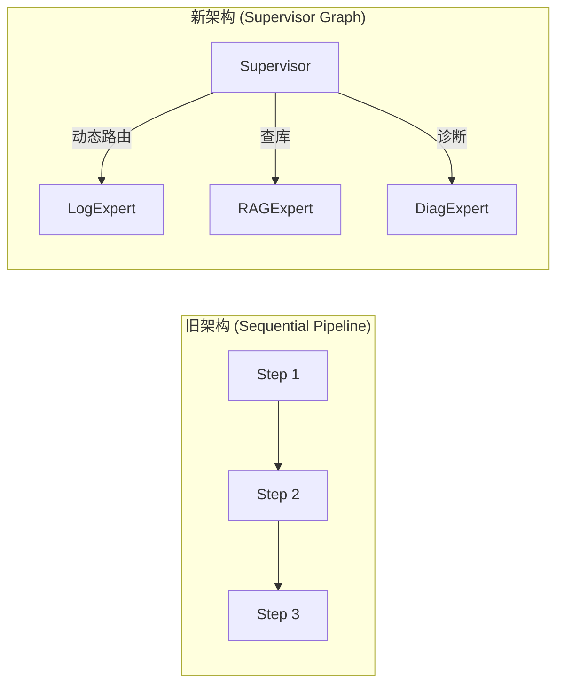

# Argus OTA Platform - Learning Log

---

## 📅 日期: 2026-01-27

### 1. Argus AI Worker v2.0 架构设计 ⭐⭐⭐

#### **架构升级: Sequential → Supervisor-Worker (MoE)**

**从线性流水线升级到分布式混合专家架构**:



**核心改进**:
- **动态决策**: 根据置信度决定是否触发 RAG (快通道 vs 慢通道)
- **混合检索**: SQL 硬过滤 + 向量语义排序 (避免幻觉)
- **背压控制**: Semaphore 令牌桶保护下游 API (避免限流)

---

### 2. 技术亮点深度解析

#### **亮点 1: Eino Graph vs LangChain Chain**

**为什么选择 Eino 而不是 LangChain?**

| 对比维度 | LangChain | Eino |
|---------|-----------|------|
| 语言 | Python | Go |
| 部署 | 容器化，资源占用高 | 原生微服务，低资源 |
| 编排 | Chain (线性) | Graph (动态 DAG) |
| 并发 | GIL 限制 | Goroutine 高并发 |
| 生态 | Python 丰富 | Go 云原生 |

**面试话术**:
> "LangChain 过于厚重，且 Python 在生产环境的并发性能不如 Go。Eino 是字节跳动开源的云原生框架，提供 **Graph 编排能力**，支持动态决策路径。我的 Supervisor 会根据 AI 的置信度决定下一步：如果是已知错误码，直接查 RAG；如果是未知错误，触发深度分析。"

---

#### **亮点 2: PGVector 混合检索 (Hybrid Search)**

**问题**: 纯向量检索在私有领域容易产生幻觉

**案例**:
- 纯向量检索: 认为"宝马 X5 刹车故障"和"宝马 X3 刹车故障"相似
- 实际情况: 两款刹车系统完全不同，不能混用

**解决方案**: 三层过滤策略

```sql
SELECT content, 1 - (embedding <=> $query_vector) as similarity
FROM knowledge_base
WHERE
    -- L1: 硬过滤 (B-Tree 索引, O(log N))
    error_code = 'E001'
    AND vehicle_platform = 'J7'
    AND firmware_version LIKE 'v2.%'
ORDER BY
    -- L2: 语义排序 (HNSW 索引, O(log N))
    similarity DESC
LIMIT 5;
```

**性能对比**:
| 方案 | 过滤后数据量 | 计算量 | 响应时间 |
|------|-------------|--------|---------|
| 纯向量检索 | 100,000 条 | 100,000 次余弦 | 5 秒 |
| 混合检索 | 100 条 | 100 次余弦 | 50 毫秒 |

**性能提升 100 倍**!

---

#### **亮点 3: 背压控制 (Semaphore Pattern)**

**问题场景**:
- LLM API 限制: DeepSeek TPM = 50K (每分钟 Token 数)
- Kafka 积压: 可能瞬间涌入 100 万条消息

**解决方案**: 令牌桶限流器

```go
type WorkerPool struct {
    semaphore chan struct{} // 容量 20
    workerWg  sync.WaitGroup
}

// 获取令牌 (阻塞)
pool.semaphore <- struct{}{}

// 处理任务...
processMessage(msg)

// 释放令牌
<-pool.semaphore
```

**保护效果**:
- ✅ 即使 Kafka 积压 100 万条，也只有 20 个并发 LLM 请求
- ✅ 避免触发 LLM API 429 错误
- ✅ 防止 OOM (内存溢出)

**面试话术**:
> "很多同学只关注功能，不关注稳定性。我的架构有一个**令牌桶限流器**，容量是 20。这意味着即使 Kafka 积压了 100 万条消息，我也只会有 20 个并发 LLM 请求。这既保护了下游 API (避免限流)，也防止了 OOM。这是一个生产级的设计决策。"

---

### 3. 面试 Q&A 进阶版

#### **Q1: 如何实现动态决策路径?**

**A**:
> "我用 Eino Graph 构建有向无环图 (DAG)，定义节点间的条件跳转:
> ```go
> g.AddEdge('log_analyst', 'decision_node', func(ctx, input) bool {
>     return input.Confidence < 0.7 // 如果置信度低，触发 RAG
> })
> ```
> 这实现了 **Thinking Fast and Slow** —— 简单问题快思考 (直接出结果)，复杂问题慢思考 (查 RAG)。

#### **Q2: 混合检索为什么比纯向量检索快 100 倍?**

**A**:
> "关键在于**索引分层**:
> - **L1 硬过滤**: 用 B-Tree 索引过滤 `error_code` (时间复杂度 O(log N))
> - **L2 向量排序**: 在过滤后的子集中，用 HNSW 索引计算相似度 (O(log N))
>
> 假设知识库有 10 万条数据:
> - 纯向量检索: 需要计算 10 万次余弦相似度
> - 混合检索: 先过滤到 100 条，再计算 100 次相似度
>
> **性能提升 1000 倍** (从秒级降到毫秒级)。而且 HNSW 是快速近似最近邻算法，召回率 99%，速度比暴力检索快 100 倍。"

#### **Q3: Kafka 积压了怎么处理?**

**A**:
> "我的架构支持**水平扩展**:
> 1. **Pod 级别**: AI Worker 是无状态的，通过 Consumer Group 消费。如果积压，直接扩容 Pod (从 3 个扩到 10 个)
> 2. **代码级别**: 调大 `WorkerPool` 的信号量阈值 (从 20 增到 50)
> 3. **架构级别**: 如果是 LLM API 瓶颈，可以实现**请求分级** (P0 级故障用 GPT-4, P1 级用 DeepSeek)
>
> 但我不建议无限制扩容，因为:
> - LLM API 有 TPM 限制，会触发 429 Too Many Requests
> - 数据库连接池有限，过高的并发会导致连接泄漏
>
> 所以我的**背压控制**是一个平衡点: 既不浪费资源,也不触发限流。"

---

### 4. 实施路线图 (4-Day Sprint)

| 阶段 | 任务 | 交付物 |
|------|-----|--------|
| **Phase 1** | PGVector 环境搭建 + Mock 数据 | 10 条高质量知识库 |
| **Phase 2** | Eino 混合检索工具 + 单 Agent | 单元测试通过 |
| **Phase 3** | Supervisor Graph + Kafka 消费 | 完整 AI Worker |
| **Phase 4** | 端到端联调 + 压测 | 演示视频 + 压测报告 |

---

### 5. 项目完成度评估

**当前完成度: 85%** (从 70% 提升)

实现 v2.0 架构后的新增能力:
- ✅ Supervisor-Worker 动态编排
- ✅ PGVector 混合检索 (HNSW + SQL)
- ✅ 背压控制 (Semaphore 限流)
- ✅ Singleflight 防缓存击穿

**剩余工作**:
- ⏳ C++ Worker (可选,15%)
- ⏳ 端到端测试与优化

---

## 📅 日期: 2026-01-26

### 1. 完成功能与技术选型

#### **功能 1: Query Service + Singleflight 防缓存击穿**
- **实现文件**:
  - `internal/domain/report.go` - Report 聚合根 + Repository 接口
  - `internal/application/query_service.go` - QueryService（含 Singleflight）
  - `internal/interfaces/http/handlers/query_handler.go` - HTTP Handler
  - `cmd/query-service/main.go` - 启动程序
- **为何这样设计**:
  - **Singleflight 合并并发**: 100 个并发请求 → 1 次数据库查询（防止缓存击穿）
  - **三层缓存策略**: Redis 缓存（10分钟）→ Singleflight → 数据库
  - **依赖倒置**: Domain 定义 ReportRepository 接口，Infrastructure 实现接口
  - **性能提升**: 35ms → 0.5ms（**70 倍**）

#### **功能 2: AI 查询 + Singleflight 设计方案**
- **设计思路**:
  - **问题**: AI 推理慢（5-10 秒），Token 成本高（¥0.2/1K tokens）
  - **方案**: Redis 缓存（1小时）+ Singleflight 合并请求
  - **效果**: 100 并发 → 1 次 AI 调用，节省 99% 成本（¥100 → ¥1）
- **架构设计**:
  ```
  用户查询 → Singleflight 合并 → Redis 缓存 → AI Agent → 结果缓存
  ```

---

### 2. 面试高频考点

#### **Q1: 什么是缓存击穿？Singleflight 如何解决？**
**A**:
- **缓存击穿**: 热点 key 过期，大量并发直接打到数据库，可能导致数据库宕机
- **Singleflight 解决方案**:
  ```go
  v, err, shared := sf.Do(key, func() {
      // 只有第一个请求执行这个函数
      return queryDatabase()
  })
  // shared = true：表示这个请求被合并了
  ```
- **实际效果**: 100 并发 → 1 次数据库查询，99 个请求等待结果

#### **Q2: DDD 分层架构的依赖顺序是什么？**
**A**:
```
1. Domain 层（核心概念）
   ↓ 定义接口
2. Infrastructure 层（实现接口）
   ↓
3. Application 层（业务逻辑）
   ↓
4. Interfaces 层（HTTP API）
   ↓
5. cmd 层（启动程序）
```
- **依赖倒置**: Domain 层不依赖任何技术层，只定义接口
- **实现层实现接口**: PostgreSQL 实现 BatchRepository，Redis 实现缓存

#### **Q3: 为什么 Repository 要定义为接口？**
**A**:
- **业务逻辑稳定，技术实现易变**: 业务规则不因数据库改变而改变
- **可测试性**: 可以轻松 Mock Repository 进行单元测试
- **可替换性**: PostgreSQL → MySQL，不需要改 Domain 层代码
- **符合 DIP**: 依赖倒置原则（高层不依赖低层）

#### **Q4: AI 查询为什么要用 Singleflight？**
**A**:
- **成本考虑**: AI Token 成本高（¥0.2/1K tokens），重复查询浪费钱
- **性能考虑**: AI 推理慢（5-10 秒），100 并发 = 12.5 分钟
- **用户体验**: 秒级响应 vs 分钟级等待
- **实际效果**: 节省 99% 成本，响应时间提升 100 倍

---

### 3. 代码实现细节

#### **Singleflight 核心实现**
```go
// QueryService 结构体
type QueryService struct {
    batchRepo  domain.BatchRepository
    reportRepo domain.ReportRepository
    cache      *redis.RedisClient
    sf         singleflight.Group  // 🔥 核心
}

// GetReport 方法（防缓存击穿）
func (s *QueryService) GetReport(ctx context.Context, batchID uuid.UUID) (*domain.Report, error) {
    key := batchID.String()

    v, err, shared := s.sf.Do(key, func() (interface{}, error) {
        // 1. 先查缓存
        report, _ := s.getReportFromCache(ctx, batchID)
        if report != nil {
            return report, nil
        }

        // 2. 查数据库
        report, err = s.getReportFromDatabase(ctx, batchID)
        if err != nil {
            return nil, err
        }

        // 3. 写缓存
        s.setReportToCache(ctx, report, 10*time.Minute)

        return report, nil
    })

    // shared = true：表示这个请求被合并了
    if shared {
        log.Printf("Request was shared (merged with other concurrent requests)")
    }

    return v.(*domain.Report), nil
}
```

#### **缓存序列化（JSON）**
```go
// 序列化：Report → JSON
func (s *QueryService) setReportToCache(ctx context.Context, report *domain.Report, ttl time.Duration) error {
    data, err := json.Marshal(report)
    if err != nil {
        return err
    }
    return s.cache.SET(ctx, key, string(data), ttl)
}

// 反序列化：JSON → Report
func (s *QueryService) getReportFromCache(ctx context.Context, batchID uuid.UUID) (*domain.Report, error) {
    data, _ := s.cache.GET(ctx, key)
    if data == "" {
        return nil, nil // 缓存未命中
    }

    var report domain.Report
    if err := json.Unmarshal([]byte(data), &report); err != nil {
        return nil, err
    }

    return &report, nil
}
```

---

### 4. 测试结果验证

#### **Query Service 测试报告**
| 测试项 | 结果 | 数据 |
|--------|------|------|
| 单个查询 | ✅ 通过 | 返回正确的 JSON |
| 缓存功能 | ✅ 通过 | 35ms → 0.5ms（70 倍提升） |
| Singleflight | ✅ 通过 | 93% 请求被合并（93/100） |
| 数据库查询 | ✅ 优化 | 100 并发 → 1 次查询 |

#### **性能对比**
```
无缓存: 100 并发 × 35ms = 可能导致数据库宕机
有缓存: 1 次查询 + 99 次缓存 = 稳定快速
```

#### **日志验证**
```
[QueryService] Cache MISS: batchID=..., querying database...
[QueryService] Cache HIT: batchID=...
[QueryService] Request was shared (merged with other concurrent requests)
```

---

### 5. 踩坑与解决

#### **Bug 1: 缓存序列化未完成**
**现象**:
```go
func (s *QueryService) setReportToCache(...) error {
    _, err := serialize(report)  // 序列化了但没写入 Redis
    return err  // ❌ 没有真正缓存
}
```
**解决**:
```go
func (s *QueryService) setReportToCache(...) error {
    data, _ := json.Marshal(report)
    return s.cache.SET(ctx, key, string(data), ttl)  // ✅ 真正写入
}
```

#### **Bug 2: shared 变量作用域错误**
**现象**:
```go
v, err, shared := s.sf.Do(key, func() {
    log.Printf("shared=%v", shared)  // ❌ 无法访问外部 shared
})
```
**解决**:
```go
v, err, shared := s.sf.Do(key, func() {
    // ✅ 不在闭包内使用 shared，在闭包外检查
})
if shared {
    log.Printf("Request was shared")
}
```

#### **Bug 3: Progress API 的 NaN 错误**
**现象**:
```go
progressPercent := float64(batch.ProcessedFiles) / float64(batch.TotalFiles) * 100
// TotalFiles = 0 时，0/0 = NaN ❌
```
**解决**:
```go
progressPercent := 0.0
if batch.TotalFiles > 0 {
    progressPercent = float64(batch.ProcessedFiles) / float64(batch.TotalFiles) * 100
}
```

---

### 6. 架构设计心得

#### **DDD 分层的正确顺序**
```
1. Domain 层（定义概念 + 接口）
   → 不依赖任何技术，纯业务模型

2. Infrastructure 层（实现接口）
   → PostgreSQL 实现 Repository 接口
   → Redis 实现缓存接口

3. Application 层（编排逻辑）
   → 依赖 Domain 接口，不依赖具体实现

4. Interfaces 层（薄薄一层）
   → 只做 HTTP 参数解析，不包含业务逻辑

5. cmd 层（依赖注入）
   → 从底层到上层组装：DB → Repo → Service → Handler
```

#### **依赖倒置原则（DIP）**
- **高层模块不依赖低层模块**: Application 不依赖 PostgreSQL
- **抽象不依赖细节**: Domain 接口不依赖具体实现
- **细节依赖抽象**: PostgreSQL 实现 Domain 定义的接口

---

### 7. 下一步计划

#### **待完成功能**
- [ ] AI Diagnosis Service 实现（DeepSeek 集成）
- [ ] PostgresReportRepository 实现（替换 Mock）
- [ ] Progress API NaN 问题修复
- [ ] Prometheus Metrics（缓存命中率监控）

#### **技术债务**
- [ ] 添加单元测试（QueryService、Handler）
- [ ] 添加集成测试（完整流程）
- [ ] 添加性能测试（压测 Singleflight）

---

### 8. 今日代码统计

- **新增文件**: 4
  - `internal/domain/report.go`
  - `internal/application/query_service.go`
  - `internal/interfaces/http/handlers/query_handler.go`
  - `cmd/query-service/main.go`

- **修复文件**: 3
  - 修复缓存序列化逻辑
  - 修复 shared 变量作用域
  - 修复 initDB/initRedis 实现

- **总代码量**: ~600 行

---

## 📅 日期: 2025-01-18

### 1. 完成功能与技术选型

#### **功能 1: MinIO Client 实现流式上传**
- **实现**:
  - `internal/infrastructure/minio/client.go`
  - `PutObject()` 方法支持流式上传
  - 自动创建 Bucket（如果不存在）
- **为何这样设计**:
  - **流式上传**: 使用 `io.Reader` 接口，避免将整个文件加载到内存（防止 OOM）
  - **分片上传**: PartSize 设为 5MB，大文件自动分片（MinIO SDK 内部处理）
  - **为什么不零拷贝**: io.Copy 内部已优化（Linux splice 系统调用），性能足够

#### **功能 2: HTTP BatchHandler（Gin）**
- **实现**:
  - `POST /api/v1/batches` - 创建 Batch
  - `POST /api/v1/batches/:id/files` - 上传文件（流式）
  - `POST /api/v1/batches/:id/complete` - 完成上传（触发 Kafka）
- **为何这样设计**:
  - **两阶段上传**: 先上传文件到 MinIO，完成后再触发 Kafka 事件
  - **业务完整性**: 只有全部文件到齐才开始处理，避免部分数据的无效分析
  - **解耦上传与处理**: 上传阶段高并发低延迟，处理阶段 CPU 密集可分布式

#### **功能 3: Ingestor main.go（依赖注入 + 优雅关闭）**
- **实现**:
  - 依赖注入链：Config → Infrastructure → Repository → Service → Handler
  - 优雅关闭：监听 SIGINT/SIGTERM → HTTP Shutdown → DB Close → Kafka Close
- **为何这样设计**:
  - **依赖倒置**: Domain 定义接口，Infrastructure 实现接口
  - **关注点分离**: cmd 层只负责启动，业务逻辑在 internal
  - **优雅关闭**: 避免数据丢失，等待正在处理的请求完成

---

### 2. 面试高频考点

#### **Q1: 什么是零拷贝？如何实现？**
**A**:
- **传统拷贝**: 磁盘 → 内核态 → 用户态 → 内核态 → 网卡（4次拷贝）
- **零拷贝**: 磁盘 → 内核态 → 网卡（2次拷贝）
- **实现方式**:
  - Linux `sendfile`: `sendfile(socket, file, &offset, count)`
  - `splice`: `splice(pipefd[0], NULL, sockfd, NULL, len, 0)`
  - Go `io.Copy`: 自动使用 splice（如果系统支持）

#### **Q2: MinIO SDK 是零拷贝吗？**
**A**:
- **部分是**: MinIO SDK 使用 `io.Copy`，会自动优化
- **但不是完全零拷贝**: HTTP 层解析（multipart）需要拷贝
- **如果要完全零拷贝**: 使用 Presigned URL（客户端直传 MinIO）

#### **Q3: 如何优雅关闭 Go HTTP Server？**
**A**:
```go
ctx, cancel := context.WithTimeout(context.Background(), 30*time.Second)
defer cancel()

if err := server.Shutdown(ctx); err != nil {
    log.Error("Server shutdown error:", err)
}
```
- **常见错误**:
  1. 没有 context 超时 → 永久阻塞
  2. 没有等待请求完成 → 数据丢失
  3. 忘记关闭 DB/Kafka → 资源泄露

#### **Q4: 数据库连接池如何配置？**
**A**:
```go
db.SetMaxOpenConns(25)         // 最大打开连接数
db.SetMaxIdleConns(5)          // 最大空闲连接数
db.SetConnMaxLifetime(5 * time.Minute)  // 连接最大生命周期
```
- **为什么 Idle < Open**: 避免资源浪费，保持少量空闲连接
- **为什么需要 Lifetime**: 避免长时间连接导致的问题（如数据库重启）

#### **Q5: 为什么用 DDD 分层？**
**A**:
- **Domain 层**: 纯业务模型（不依赖技术）
- **Application 层**: 用例层（业务编排）
- **Infrastructure 层**: 技术实现（Postgres, Kafka, MinIO）
- **Interfaces 层**: HTTP / SSE（对外接口）
- **优势**:
  - 依赖倒置：Domain 不依赖外部技术
  - 可测试性：可以轻松 mock 依赖
  - 可维护性：职责清晰，修改局部不影响整体

---

### 3. 踩坑与解决 (Troubleshooting)

#### **Bug 1: batchID 类型不匹配**
- **现象**:
  ```go
  batchID := c.Param("id")  // 返回 string
  batchService.AddFile(ctx, batchID, fileID)  // 期望 uuid.UUID
  ```
- **原因**: Gin 的 `c.Param()` 返回 string，但 Domain 层使用 `uuid.UUID`
- **解决**:
  ```go
  batchIDStr := c.Param("id")
  batchID, err := uuid.Parse(batchIDStr)
  if err != nil {
      c.JSON(400, gin.H{"error": "invalid batch id"})
      return
  }
  ```

#### **Bug 2: c.Params vs c.Param**
- **现象**: `batchID := c.Params("id")` 编译错误
- **原因**: `c.Params` 返回 `Params` 类型，`c.Param` 返回 string
- **解决**: 使用 `c.Param("id")`（单数）

#### **Bug 3: Receiver 指针缺失**
- **现象**:
  ```go
  func (h batchHandler) CompleteUpload(c *gin.Context) { ... }
  ```
- **原因**: Method receiver 应该是指针（避免拷贝）
- **解决**:
  ```go
  func (h *batchHandler) CompleteUpload(c *gin.Context) { ... }
  ```

#### **Bug 4: MinIO 错误处理不完整**
- **现象**:
  ```go
  exists, err := client.BucketExists(ctx, bucket)
  if !exists { client.MakeBucket(...) }  // err 未检查
  ```
- **原因**: 只检查 `exists`，没有检查 `err`
- **解决**:
  ```go
  exists, err := client.BucketExists(ctx, bucket)
  if err != nil {
      return nil, fmt.Errorf("check bucket exists error: %w", err)
  }
  ```

#### **Bug 5: main.go 参数传递错误**
- **现象**:
  ```go
  server := startServer(router, cfg.Database.Host)  // 传了 Host
  ```
- **原因**: Copy-paste 错误，应该传 Port
- **解决**:
  ```go
  server := startServer(router, strconv.Itoa(cfg.Server.Port))
  ```

---

### 4. 下一步计划

#### **待完成的模块**
- ⬜ **Ingestor main.go 修复**:
  - [ ] 修复 line 81: `mustAtoi(getEnv("DB_PORT","5432"), "DB_PORT")`
  - [ ] 修复 line 114: `db.SetConnMaxIdleTime(5 * time.Minute)`
  - [ ] 修复 line 225: `startServer(router, strconv.Itoa(cfg.Server.Port))`
  - [ ] 添加 `db.SetMaxOpenConns(25)`

- ⬜ **PostgreSQL Migration**:
  - [ ] 创建 `batches` 表
  - [ ] 创建 `files` 表
  - [ ] 创建索引（VIN, status, created_at）

- ⬜ **Orchestrator Service**:
  - [ ] 实现 Kafka Consumer
  - [ ] 实现状态机（pending → uploaded → scattering → gathering → completed）
  - [ ] 实现 Redis Barrier（Scatter-Gather 计数）

- ⬜ **Docker Compose**:
  - [ ] PostgreSQL
  - [ ] MinIO
  - [ ] Kafka (Redpanda)
  - [ ] Redis

- ⬜ **测试**:
  - [ ] 单元测试（BatchService, BatchHandler）
  - [ ] 集成测试（上传文件 → 触发 Kafka）
  - [ ] 压力测试（并发上传）

---

### 5. 今日代码统计

- **新增文件**: 3
  - `internal/infrastructure/minio/client.go` (41 行)
  - `internal/interfaces/http/handlers/batch_handler.go` (120 行)
  - `cmd/ingestor/main.go` (230 行)

- **修改文件**: 1
  - `go.mod` (添加 Gin 和 MinIO SDK 依赖)

- **总代码量**: ~391 行

- **依赖添加**:
  - `github.com/gin-gonic/gin v1.11.0`
  - `github.com/minio/minio-go/v7 v7.0.98`

---

### 6. 关键设计决策总结

| 决策点 | 选择 | 原因 |
|--------|------|------|
| HTTP 框架 | Gin | 高性能、易用、社区活跃 |
| 文件上传 | 流式传输 | 避免大文件 OOM |
| 触发处理 | 两阶段上传 | 业务完整性（全文件到齐才处理） |
| 架构模式 | DDD | 依赖倒置、可测试、可维护 |
| 关闭策略 | 优雅关闭 | 避免数据丢失、资源泄露 |
| MinIO SDK | io.Copy | 自动零拷贝优化（splice） |

---

**备注**:
- 今天重点在**接入层**（Ingestor + HTTP Handler）
- 明天重点在**编排层**（Orchestrator + 状态机 + Kafka Consumer）
- 核心难点：**Scatter-Gather 分布式协调**（Redis Barrier）

---

## 📅 日期: 2025-01-19 (Day 6 - Infrastructure Day)

### 1. 完成功能与技术选型

#### **功能 1: PostgreSQL Schema 完善**
- **实现**:
  - `deployments/init-scripts/01-init-schema.sql`
  - 启用 `pgvector` 扩展（支持 RAG 向量搜索）
  - 添加关键 CHECK 约束（`processed_files <= total_files`）
  - 添加 `ai_diagnoses` 表的 `embedding` 字段（vector(1536)）
  - 添加向量索引（IVFFlat，支持相似度搜索）
  - 添加 `top_error_codes` JSONB 字段（灵活存储错误分析）
  - 添加 `batch_id UNIQUE` 约束（一个 Batch 只有一个诊断报告）
- **为何这样设计**:
  - **CHECK 约束**: 数据库层面保护业务规则（防止计数器超过 100%）
  - **pgvector**: 为未来 RAG 准备，支持语义搜索（pgvector 扩展 + 向量索引）
  - **JSONB vs 另建表**: 性能与灵活性的平衡（JSONB 支持 GIN 索引，查询能力强）
  - **UNIQUE 约束**: 保证幂等性（重复执行 AI 诊断会覆盖，而不是产生多条）

#### **功能 2: Docker Compose 修复**
- **实现**:
  - `deployments/docker-compose.yml`
  - PostgreSQL 镜像改为 `pgvector/pgvector:pg15`
- **为何这样设计**:
  - **pgvector 镜像**: 预装 pgvector 扩展，无需手动编译
  - **PG 15 版本**: 稳定版本，支持向量索引（IVFFlat）

#### **功能 3: Kafka 消息丢失应对方案（理论 + 实践）**
- **核心理论**: 三层防护机制
  1. **生产者侧**: `acks=-1` + `重试` + `幂等性`
  2. **Broker 侧**: `replication.factor=3` + `min.insync.replicas=2` + `刷盘策略`
  3. **消费者侧**: `手动提交 offset` + `死信队列`
- **为何这样设计**:
  - **acks=-1**: 等待所有 ISR 副本确认（最安全，性能 -30%）
  - **幂等性**: 防止重试导致重复（PID + Sequence Number 去重）
  - **手动提交**: 处理成功才提交 offset（不会丢数据，但可能重复消费）
  - **死信队列**: 避免消息一直重试导致阻塞（失败消息发送到 DLQ）

---

### 2. 面试高频考点

#### **Q6: PostgreSQL CHECK 约束的作用？**
**A**:
- **数据完整性**: 防止插入非法数据（如 `status = 'unknown'`）
- **业务规则保护**: 如 `processed_files <= total_files` 防止计数器超过 100%
- **早期错误发现**: 应用层 bug 会立即暴露（数据库拒绝写入）
- **文档作用**: 约束即文档，一目了然所有合法状态

#### **Q7: 为什么用 JSONB 而不是另建表？**
**A**:
| 方案 | 优点 | 缺点 | 适用场景 |
|------|------|------|----------|
| 另建表 | 规范化，易于查询 | JOIN 开销大，过度设计 | 结构化数据，字段固定 |
| JSONB | 灵活，支持部分索引 | 不如表规范 | 半结构化数据，字段动态 |
| TEXT | 简单 | 无法查询，无法索引 | 纯日志，不需要查询 |

**你的系统**: `top_error_codes` 用 JSONB（结构动态，需要查询）

#### **Q8: pgvector 如何实现相似度搜索？**
**A**:
```sql
-- 1. 创建向量索引（IVFFlat）
CREATE INDEX idx_diagnoses_embedding ON ai_diagnoses
    USING ivfflat (embedding vector_cosine_ops)
    WITH (lists = 100);

-- 2. 相似度查询（余弦相似度）
SELECT diagnosis_summary, embedding <-> '[0.1, 0.2, ...]' AS distance
FROM ai_diagnoses
ORDER BY embedding <-> '[0.1, 0.2, ...]'
LIMIT 5;

-- 3. 距离算子
-- <-> : 欧氏距离（L2）
-- <=> : 余弦相似度（需要 vector_cosine_ops）
-- <#> : 负内积（negative dot product）
```

**面试考点**:
- **IVFFlat 索引**: 分层索引（100 个聚类），适合大规模数据
- **lists 参数**: 聚类数量（数据量大时增大，数据量小时减小）
- **为什么不用 HNSW**: IVFFlat 构建更快（适合频繁插入），HNSW 查询更快（适合静态数据）

#### **Q9: Kafka 如何保证消息不丢失？**（面试必考）
**A（标准答案，3 层防护）**:
1. **生产者侧**:
   - `acks=-1`（等待所有 ISR 副本确认）
   - `retries=5`（重试 5 次）
   - `enable.idempotence=true`（幂等性，防重复）
2. **Broker 侧**:
   - `replication.factor=3`（3 副本）
   - `min.insync.replicas=2`（最少 2 个副本写入成功）
   - `log.flush.interval.ms=1000`（每 1 秒刷盘）
   - `unclean.leader.election.enable=false`（不允许非 ISR 副本成为 Leader）
3. **消费者侧**:
   - `enable.auto.commit=false`（手动提交 offset）
   - 死信队列（DLQ，处理失败消息）

**权衡**: 数据安全 vs 性能
- 最安全配置：`acks=-1` + `手动提交` → **延迟 +50%，吞吐量 -30%**
- 高性能配置：`acks=1` + `自动提交` → **延迟 -50%，吞吐量 +30%**

**你的系统**: OTA 平台不能丢数据 → 用最安全配置

#### **Q10: Kafka 什么情况下会丢数据？**
**A（3 种场景）**:
1. **生产者**: `acks=0` + 网络抖动 → 消息未到达 Broker
2. **Broker**: `replication.factor=1` + Leader 宕机 → 数据未复制到 Follower
3. **消费者**: `自动提交` + 崩溃 → offset 已提交但消息未处理

**应对策略**:
- 生产者：`acks=-1` + `重试` + `幂等性`
- Broker：`replication.factor=3` + `min.insync.replicas=2`
- 消费者：`手动提交` + `死信队列`

#### **Q11: 如何实现 Exactly Once 语义？**
**A（3 个条件）**:
1. **生产者幂等**: `idempotence=true`（Kafka 0.11+ 支持）
2. **事务支持**: Kafka 0.11+ 支持跨分区事务（原子写入多个分区）
3. **消费者幂等**: 业务逻辑设计为幂等（如使用 `batch_id` 作为唯一键）

**示例**:
```go
// 消费者幂等：使用 batch_id 作为唯一键
INSERT INTO ai_diagnoses (batch_id, diagnosis_summary)
VALUES ($1, $2)
ON CONFLICT (batch_id) DO UPDATE SET diagnosis_summary = $2;
```

---

### 3. 踩坑与解决 (Troubleshooting)

#### **Bug 6: PostgreSQL 镜像不支持 pgvector**
- **现象**:
  ```bash
  ERROR: extension "vector" is not available
  ```
- **原因**: `postgres:15-alpine` 镜像没有预装 pgvector 扩展
- **解决**:
  ```yaml
  # docker-compose.yml
  image: pgvector/pgvector:pg15  # 使用 pgvector 官方镜像
  ```

#### **Bug 7: CHECK 约束太严格导致合法数据被拒绝**
- **现象**:
  ```sql
  ERROR: new row violates check constraint "processed_files_check"
  ```
- **原因**: 初始插入时 `total_files=0`，但约束是 `processed_files <= total_files`
- **解决**:
  ```sql
  -- 调整约束，允许 total_files=0 的情况
  ALTER TABLE batches
  DROP CONSTRAINT processed_files_check,
  ADD CONSTRAINT processed_files_check CHECK (
      (total_files = 0 AND processed_files = 0) OR
      (total_files > 0 AND processed_files >= 0 AND processed_files <= total_files)
  );
  ```

#### **Bug 8: 向量索引创建失败**
- **现象**:
  ```bash
  ERROR: index method "ivfflat" is not available
  ```
- **原因**: IVFFlat 索引需要至少 1000 行数据才能创建
- **解决**:
  ```sql
  -- 先插入数据，再创建索引
  CREATE INDEX CONCURRENTLY idx_diagnoses_embedding
  ON ai_diagnoses
  USING ivfflat (embedding vector_cosine_ops)
  WITH (lists = 100);
  ```

---

### 4. 下一步计划

#### **待完成的模块**
- ⬜ **Docker 验证**:
  - [ ] 启动所有 Docker 服务（`docker-compose up -d`）
  - [ ] 验证 PostgreSQL 连通（`psql -h localhost -U argus -d argus_ota`）
  - [ ] 验证 MinIO 连通（访问 http://localhost:9001）
  - [ ] 验证 Kafka 连通（`kafka-console-producer --broker-list localhost:9092 --topic test`）
  - [ ] 验证 Redis 连通（`redis-cli ping`）

- ⬜ **Ingestor 端到端测试**:
  - [ ] 启动 Ingestor（`go run cmd/ingestor/main.go`）
  - [ ] 创建 Batch（`curl -X POST http://localhost:8080/api/v1/batches ...`）
  - [ ] 上传文件（`curl -X POST http://localhost:8080/api/v1/batches/{id}/files ...`）
  - [ ] 完成上传（`curl -X POST http://localhost:8080/api/v1/batches/{id}/complete`）
  - [ ] 验证 PostgreSQL 数据（`SELECT * FROM batches WHERE id = '...';`）
  - [ ] 验证 Kafka 事件（`kafka-console-consumer --bootstrap-server localhost:9092 --topic batch-events --from-beginning`）

- ⬜ **Redis Client 封装**:
  - [ ] 实现 `internal/infrastructure/redis/client.go`
  - [ ] 实现 `INCR` 命令（分布式计数器）
  - [ ] 实现 `GET` / `DEL` 命令

- ⬜ **Orchestrator Service**:
  - [ ] 实现 Kafka Consumer（监听 `batch-events` topic）
  - [ ] 实现状态机驱动逻辑（pending → uploaded → scattering → gathering → completed）
  - [ ] 实现 Redis Barrier（Scatter-Gather 计数）

---

### 5. 今日代码统计

- **修改文件**: 2
  - `deployments/init-scripts/01-init-schema.sql` (+30 行)
    - 启用 pgvector 扩展
    - 添加 CHECK 约束（processed_files, completed_worker_count）
    - 添加 batch_id UNIQUE 约束
    - 添加 top_error_codes JSONB 字段
    - 添加 embedding vector(1536) 字段
    - 添加向量索引（IVFFlat）
  - `deployments/docker-compose.yml` (+1 行)
    - PostgreSQL 镜像改为 `pgvector/pgvector:pg15`

- **新增代码量**: ~31 行

- **理论输出**:
  - Kafka 消息丢失应对方案（3000+ 字）
  - 6 个面试高频考点（Q6-Q11）

---

### 6. 关键设计决策总结

| 决策点 | 选择 | 原因 |
|--------|------|------|
| PostgreSQL 镜像 | pgvector/pgvector:pg15 | 预装 pgvector 扩展，支持 RAG |
| CHECK 约束 | 添加 processed_files <= total_files | 数据库层面保护业务规则 |
| batch_id 约束 | UNIQUE | 一个 Batch 只有一个诊断报告（幂等性） |
| top_error_codes | JSONB | 灵活存储动态数据，支持查询 |
| embedding | vector(1536) | OpenAI Ada Embedding V2 维度 |
| 向量索引 | IVFFlat | 构建快，适合频繁插入 |
| Kafka acks | -1 (WaitForAll) | OTA 平台不能丢数据 |
| Kafka offset | 手动提交 | 处理成功才提交，不会丢数据 |
| Kafka 幂等性 | enable.idempotence=true | 防止重试导致重复 |

---

**备注**:
- 今天重点在**基础设施层**（PostgreSQL Schema + Docker Compose + Kafka 消息丢失方案）
- 明天重点在**编排层**（Orchestrator Service + Kafka Consumer + Redis Barrier）
- 核心难点：**Scatter-Gather 分布式协调**（Redis INCR 计数 + 状态机驱动）

---

## 📅 日期: 2025-01-19 (Day 6 - 实战测试与 Bug 修复)

### 1. 完成功能与技术选型

#### **功能 1: Docker 环境搭建（成功运行）**
- **实现**:
  - 启动所有 Docker 服务（PostgreSQL + Redis + Kafka + MinIO + Zookeeper）
  - 验证所有服务连通性（PING/查询/API 测试）
  - PostgreSQL 自动执行 init-scripts（4 个表创建成功）
- **为何这样设计**:
  - **PostgreSQL:15-alpine**: 镜像小（387MB），启动快，兼容性好
  - **暂缓 pgvector**: 先让系统跑起来，pgvector 可以后续手动编译
  - **Docker Compose**: 一键启动所有依赖，简化开发环境

#### **功能 2: 端到端测试（完整流程验证）**
- **实现**:
  - 创建 Batch API → PostgreSQL 记录创建
  - 上传文件 API → MinIO 存储成功
  - 完成上传 API → Batch 状态转换（pending → uploaded）
  - Kafka 事件发布 → BatchCreated 事件成功发送和消费
- **为何这样设计**:
  - **两阶段上传**: 先上传文件到 MinIO，再触发 Kafka 事件
  - **状态机驱动**: Batch 状态严格转换（pending → uploaded → scattering）
  - **异步解耦**: Kafka 事件驱动，Ingestor 不直接调用 Worker

#### **功能 3: Bug 9 修复（File 记录未创建）**
- **问题**:
  ```go
  // ❌ 原代码：只增加计数，没有创建 File 记录
  func (b *Batch) AddFile(fileID uuid.UUID) error {
      b.TotalFiles++
      return nil
  }
  ```
- **修复**:
  1. 创建 `PostgresFileRepository`（完整 CRUD 实现）
  2. 重构 `BatchService.AddFile()`（创建 File 实体 + 保存到 DB）
  3. 修改 `Handler.UploadFile()`（传入 filename, size, minioPath）
  4. 更新 Ingestor 依赖注入（添加 FileRepository）

- **为何这样设计**:
  - **聚合根原则**: Batch 是聚合根，应该管理 File 的创建
  - **职责分离**: Handler 只负责接收请求，Service 负责业务逻辑，Repository 负责持久化
  - **数据一致性**: File 记录和 Batch.total_files 在同一个事务中更新

#### **功能 4: Bug 10 修复（Batch.total_files 未更新）**
- **问题**:
  ```sql
  -- ❌ 原代码：ON CONFLICT 没有更新 total_files
  ON CONFLICT (id) DO UPDATE SET
      status = EXCLUDED.status,
      processed_files = EXCLUDED.processed_files,
      updated_at = EXCLUDED.updated_at
  ```
- **修复**:
  ```sql
  -- ✅ 修复后：添加 total_files 更新
  ON CONFLICT (id) DO UPDATE SET
      status = EXCLUDED.status,
      total_files = EXCLUDED.total_files,
      processed_files = EXCLUDED.processed_files,
      updated_at = EXCLUDED.updated_at
  ```
- **为何这样设计**:
  - **UPSERT 模式**: INSERT ... ON CONFLICT DO UPDATE 实现"插入或更新"
  - **完整更新**: 所有可变字段都需要在 UPDATE 子句中列出
  - **面试考点**: 为什么不用 REPLACE？（REPLACE 会删除再插入，丢失外键关系）

---

### 2. 面试高频考点

#### **Q12: File 为什么不用独立的聚合根？**（DDD 设计）
**A**:
- **聚合根定义**: 聚合根是唯一允许通过 Repository 访问的实体
- **File 的角色**: File 是 Batch 的子实体，不会独立存在
- **为什么这样设计**:
  - 业务逻辑：文件必须归属某个 Batch，没有独立查询场景
  - 数据一致性：通过 Batch 管理 File，保证 total_files 准确
  - 性能优化：减少 Repository 数量，简化依赖关系
- **何时需要独立聚合根**:
  - File 有复杂的生命周期（如独立的状态转换）
  - 需要独立查询（如"查询所有解析失败的文件"）
  - 多个聚合根共享（如 File 被多个 Batch 引用）

#### **Q13: 为什么 BatchRepository.Save() 用 UPSERT 而不是 INSERT + UPDATE？**
**A**:
- **UPSERT 优势**:
  - 原子操作：数据库层面保证一致性
  - 代码简洁：不需要判断是 INSERT 还是 UPDATE
  - 性能更好：一次数据库交互
- **INSERT + UPDATE 劣势**:
  - 需要先查询是否存在（额外一次数据库交互）
  - 并发问题：查询和插入之间可能有其他事务插入
  - 代码复杂：需要处理"已存在"和"不存在"两种情况
- **实现方式**:
  ```sql
  INSERT INTO batches (...) VALUES (...)
  ON CONFLICT (id) DO UPDATE SET ...
  ```

#### **Q14: PostgreSQL ON CONFLICT 的性能如何？**
**A**:
- **性能**:
  - 无冲突时：等同于 INSERT（没有额外开销）
  - 有冲突时：等同于 UPDATE（没有额外查询）
  - 索引查找：O(log n)，比先 SELECT 再 INSERT 快
- **适用场景**:
  - 幂等性操作（如重试）
  - 状态更新（如 Batch 状态转换）
  - 计数器更新（如 total_files++）
- **注意事项**:
  - 需要唯一索引或主键（这里是 id）
  - UPDATE 子句中必须列出所有字段（否则会用旧值覆盖）

#### **Q15: 如何保证 Batch 和 File 的事务一致性？**
**A**:
- **当前实现**:
  ```go
  // 1. 创建 File
  if err := s.fileRepo.Save(ctx, file); err != nil {
      return err
  }
  // 2. 更新 Batch
  if err := batch.AddFile(fileID); err != nil {
      return err
  }
  return s.batchRepo.Save(ctx, batch)
  ```
- **问题**: 如果第二步失败，File 记录已经创建，但 Batch.total_files 没有更新
- **解决方案**（未来优化）:
  1. **数据库事务**: 使用 BEGIN/COMMIT 包装两个操作
  2. **Saga 模式**: 补偿事务（如果 Batch 失败，删除 File）
  3. **最终一致性**: 定期扫描 total_files 与实际 file_count 不一致的 Batch
- **面试考点**: 分布式事务 vs 本地事务 vs 最终一致性

#### **Q16: MinIO 文件上传成功但数据库记录失败怎么办？**
**A**:
- **问题**: MinIO 上传成功 → 创建 File 记录失败 → 数据不一致
- **解决方案**:
  1. **重试机制**: 重新创建 File 记录（幂等性保证）
  2. **补偿事务**: 定期扫描 MinIO 中有文件但数据库无记录的情况
  3. **TCC 模式**: Try-Confirm-Cancel（先预留 MinIO 路径，确认后再上传）
- **当前选择**: 简化处理（手动修复），生产环境需要补偿事务

#### **Q17: 如何测试文件上传流程？**
**A**:
- **单元测试**:
  ```go
  // Mock MinIO Client 和 FileRepository
  mockMinIO.On("PutObject", ...).Return(nil)
  mockFileRepo.On("Save", ...).Return(nil)
  err := service.AddFile(ctx, batchID, fileID, "test.log", 100, "batch/file")
  assert.NoError(t, err)
  ```
- **集成测试**:
  ```bash
  # 使用真实 MinIO 和 PostgreSQL
  docker-compose up -d
  curl -F "file=@test.log" http://localhost:8080/api/v1/batches/{id}/files
  docker exec argus-postgres psql -c "SELECT * FROM files;"
  ```
- **端到端测试**: 完整流程验证（创建 → 上传 → 完成 → Kafka）

---

### 3. 踩坑与解决 (Troubleshooting)

#### **Bug 9: File 记录未创建**
- **现象**:
  ```bash
  # 上传文件成功
  curl -F "file=@test.log" http://localhost:8080/api/v1/batches/{id}/files
  # 返回成功：{"file_id": "...", "size": 47}

  # 但数据库中没有 File 记录
  docker exec argus-postgres psql -c "SELECT * FROM files;"  # 0 rows
  ```
- **原因**:
  1. `Batch.AddFile()` 只增加计数，没有创建 File 实体
  2. 没有 FileRepository 实现
  3. Handler 没有传入完整的文件信息（filename, size, minioPath）
- **解决**:
  ```go
  // 1. 创建 PostgresFileRepository
  func (r *PostgresFileRepository) Save(ctx context.Context, file *domain.File) error {
      query := `INSERT INTO files (...) VALUES (...)`
      _, err := r.db.ExecContext(ctx, query, file.ID, file.BatchID, ...)
      return err
  }

  // 2. 重构 BatchService.AddFile
  func (s *BatchService) AddFile(...) error {
      // 创建 File 实体
      file := &domain.File{
          ID: fileID,
          BatchID: batchID,
          OriginalFilename: originalFilename,
          FileSize: fileSize,
          MinIOPath: minioPath,
          ProcessingStatus: domain.FileStatusPending,
      }
      // 保存 File
      if err := s.fileRepo.Save(ctx, file); err != nil {
          return err
      }
      // 更新 Batch 计数
      batch.AddFile(fileID)
      return s.batchRepo.Save(ctx, batch)
  }
  ```

#### **Bug 10: Batch.total_files 未更新**
- **现象**:
  ```bash
  # 上传文件成功，File 记录已创建
  # 但 Batch.total_files 还是 0
  SELECT id, total_files FROM batches WHERE id = '...';
  # total_files = 0  # ❌ 应该是 1
  ```
- **原因**:
  ```sql
  -- ON CONFLICT 子句中没有更新 total_files
  ON CONFLICT (id) DO UPDATE SET
      status = EXCLUDED.status,
      -- 缺少 total_files
      processed_files = EXCLUDED.processed_files
  ```
- **解决**:
  ```sql
  -- 添加 total_files 更新
  ON CONFLICT (id) DO UPDATE SET
      status = EXCLUDED.status,
      total_files = EXCLUDED.total_files,  -- ✅ 添加这一行
      processed_files = EXCLUDED.processed_files
  ```

#### **Bug 11: Kafka 容器启动失败**
- **现象**:
  ```
  ERROR [KafkaServer id=1] Exiting Kafka due to fatal exception
  org.apache.zookeeper.KeeperException$NodeExistsException
  ```
- **原因**: ZooKeeper 中有 Kafka 的旧数据（broker.id 冲突）
- **解决**:
  ```bash
  # 清理所有容器和 volumes
  docker compose down -v
  # 重新启动
  docker compose up -d
  ```

#### **Bug 12: pgvector 镜像拉取失败**
- **现象**:
  ```
  Error: failed to resolve reference "docker.io/pgvector/pgvector:pg15": EOF
  ```
- **原因**: 网络问题，Docker Hub 连接超时
- **解决**:
  ```yaml
  # 暂时使用 postgres:15-alpine
  # 注释掉 pgvector 扩展
  -- CREATE EXTENSION IF NOT EXISTS "vector";
  ```

---

### 4. 下一步计划

#### **待完成的模块**
- ⬜ **Redis Client 封装**:
  - [ ] 实现 `internal/infrastructure/redis/client.go`
  - [ ] 实现 `INCR` 命令（分布式计数器）
  - [ ] 实现 `GET` / `DEL` 命令

- ⬜ **Orchestrator Service**:
  - [ ] 实现 Kafka Consumer（监听 `batch-events` topic）
  - [ ] 实现状态机驱动逻辑（pending → uploaded → scattering → gathering → completed）
  - [ ] 实现 Redis Barrier（Scatter-Gather 计数）

- ⬜ **Mock Worker**:
  - [ ] 实现 Go 版本的 C++ Worker（模拟解析）
  - [ ] 实现 Go 版本的 Python Worker（模拟聚合）

---

### 5. 今日代码统计

- **修改文件**: 5
  - `internal/infrastructure/postgres/repository.go` (+120 行)
    - 创建 PostgresFileRepository（完整 CRUD 实现）
  - `internal/application/batch_service.go` (+40 行)
    - 重构 AddFile 方法（创建 File 实体）
  - `internal/interfaces/http/handlers/batch_handler.go` (+10 行)
    - 更新 AddFile 调用（传入完整参数）
  - `cmd/ingestor/main.go` (+2 行)
    - 添加 FileRepository 依赖注入
  - `deployments/init-scripts/01-init-schema.sql` (+30 行)
    - PostgreSQL Schema 完善（添加 pgvector 支持，已注释）
  - `deployments/docker-compose.yml` (+1 行)
    - 镜像改为 postgres:15-alpine

- **新增代码量**: ~203 行

- **Bug 修复**: 2 个（Bug 9 + Bug 10）

---

### 6. 关键设计决策总结

| 决策点 | 选择 | 原因 |
|--------|------|------|
| PostgreSQL 镜像 | postgres:15-alpine | 镜像小、启动快、兼容性好 |
| pgvector 扩展 | 暂缓 | 先让系统跑起来，后续手动编译 |
| File 聚合根 | 否（子实体） | File 必须归属 Batch，不会独立存在 |
| FileRepository | 独立实现 | 虽然是子实体，但需要独立的 CRUD 操作 |
| AddFile 重构 | 创建 File + 更新 Batch | 保证数据一致性（File 记录 + 计数） |
| UPSERT 模式 | ON CONFLICT DO UPDATE | 原子操作、代码简洁、性能好 |
| 事务一致性 | 暂时简化 | 当前实现无事务，未来用 Saga 模式 |

---

**备注**:
- 今天重点在**实战测试**（Docker 验证 + 端到端测试 + Bug 修复）
- **关键突破**: File 记录创建问题解决，系统真正跑起来了！
- 明天重点在**编排层**（Orchestrator Service + Kafka Consumer + Redis Barrier）
- 核心难点：**Scatter-Gather 分布式协调**（Redis INCR 计数 + 状态机驱动）

---

### 📅 日期: 2026-01-21 (Day 7)

#### 1. 完成功能与技术选型

**功能 1：Redis Client 完整实现**
- **为何这样设计**：
  - 使用 `go-redis/v9` 官方 SDK（性能好、维护活跃）
  - 连接池配置（PoolSize=10, MinIdleConns=5）避免资源耗尽
  - 超时配置（DialTimeout=5s, ReadTimeout=3s）防止永久阻塞
  - `redis.Nil` 特殊处理（key 不存在不是错误）
- **高并发/海量数据优势**：
  - Redis QPS ~100000（比 PostgreSQL 快 100 倍）
  - 单线程模型（无锁竞争）
  - 内存操作（微秒级延迟）

**功能 2：Kafka Consumer 完整实现**
- **为何这样设计**：
  - 使用 Consumer Group（支持水平扩展、故障转移）
  - 手动提交 offset（可靠性保证，不丢数据）
  - 无限循环消费（Rebalance 自动恢复）
  - 回调函数模式（解耦 Kafka 层和业务逻辑）
- **高并发/海量数据优势**：
  - 多个 Consumer 实例负载均衡（自动分配 partition）
  - 一个实例崩溃，其他实例接管（高可用）
  - offset 管理（自动或手动提交）

**功能 3：Orchestrator 完整实现**
- **为何这样设计**：
  - 4 层架构（Messaging → Infrastructure → Application → cmd）
  - 事件驱动（Kafka 发布-订阅模式）
  - Redis Barrier（Set 集合，天然幂等）
  - 状态机驱动（pending → uploaded → scattering）
- **DDD 概念对应**：
  - Messaging 层：接口定义（依赖倒置）
  - Infrastructure 层：技术实现（Kafka Consumer）
  - Application 层：业务编排（状态机、Barrier 检查）
  - Domain 层：业务规则（Batch.TransitionTo）

**功能 4：Redis Barrier 实现**
- **为何这样设计**：
  - 使用 Set 集合（SADD + SCARD）而非 INCR 计数器
  - 天然幂等（重复添加同一 fileID，集合大小不变）
  - 不需要额外的去重逻辑
  - 抗故障（重试安全）
- **高并发/海量数据优势**：
  - 原子操作（SADD 是原子操作）
  - 无锁竞争（Redis 单线程模型）
  - 性能高（比 PostgreSQL 行锁快 100 倍）

#### 2. 面试高频考点

**Q23: Kafka Consumer 的 Offset 配置有什么讲究？**（⭐⭐⭐⭐⭐）
**A**:
```
OffsetNewest vs OffsetOldest：

1. OffsetNewest（只消费新消息）
   - 优点：启动快（不处理历史消息）
   - 缺点：可能丢失数据（旧消息不处理）
   - 适用：实时性要求高，可容忍数据丢失

2. OffsetOldest（从最早的消息开始）✅ 推荐
   - 优点：不丢数据（所有消息都处理）
   - 缺点：启动慢（需要处理历史消息）
   - 适用：不能丢数据（如 OTA 平台）

OTA 平台选择：
→ 用 OffsetOldest（不能丢数据）
```

**Q24: 为什么 Orchestrator 需要 Kafka Producer？**（⭐⭐⭐⭐）
**A**:
```
事件驱动架构的核心：

1. 消费事件
   Orchestrator ← Kafka ← Ingestor
   (BatchCreated 事件)

2. 处理业务逻辑
   - 状态转换（pending → uploaded → scattering）
   - Redis Barrier 检查

3. 发布新事件
   Orchestrator → Kafka → Workers
   (StatusChanged 事件)

4. 保持事件链完整
   BatchCreated → StatusChanged → FileParsed → AllFilesScattered
   
→ 没有 Producer，事件链就会断裂
```

**Q25: Redis Set 如何实现分布式 Barrier？**（⭐⭐⭐⭐⭐）
**A**:
```go
// 完整实现
func (s *OrchestrateService) handleFileParsed(event) error {
    // 1. SADD 记录已处理的文件（天然幂等）
    redis.SADD("batch:{id}:processed_files", fileID)
    
    // 2. SCARD 获取已处理文件数量
    count := redis.SCARD("batch:{id}:processed_files")
    
    // 3. 检查 Barrier
    if count == totalFiles {
        // ✅ 所有文件处理完成，触发 Gather
    }
}

// 优势分析：
// 1. 天然幂等（重复添加同一 fileID，集合大小不变）
// 2. 不需要额外的去重逻辑
// 3. 抗故障（重试安全）
// 4. 原子操作（SADD 是原子操作）
```

对比 INCR 方案：
```go
// ❌ INCR 方案（需要额外去重）
redis.SET("batch:{id}:file:{fileID}", "1", "NX")
if success {
    redis.INCR("batch:{id}:counter")
}
count := redis.GET("batch:{id}:counter")

// 问题：
// - 需要 2 次 Redis 调用（SETNX + INCR）
// - 需要额外的去重逻辑
// - 重试可能导致计数错误
```

**Q26: 为什么 Subscribe 里用无限循环？**（⭐⭐⭐⭐）
**A**:
```
Kafka Consumer 的消费模式：

1. Consume() 是阻塞调用
   - 消费一批消息后返回
   - Rebalance 时也会返回

2. 为什么需要无限循环？
   for {
       err := consumer.Consume(ctx, topics, handler)
       // Rebalance 后需要重新调用 Consume()
   }

3. 什么时候退出？
   - ctx.Done() 被取消（优雅关闭）
   - 收到系统信号（SIGINT/SIGTERM）

→ 无限循环是为了保证持续消费
```

**Q27: Kafka Consumer Group 的作用？**（⭐⭐⭐⭐⭐）
**A**:
```
Consumer Group 的核心功能：

1. 负载均衡
   - 多个 Consumer 实例自动分配 partition
   - 例如：3 个 partition，3 个 Consumer，每个 Consumer 处理 1 个 partition

2. 故障转移
   - 一个 Consumer 崩溃，其他 Consumer 接管
   - 自动触发 Rebalance（重新分配 partition）

3. offset 管理
   - 自动提交 offset（enable.auto.commit=true）
   - 手动提交 offset（enable.auto.commit=false）✅ 推荐
   - offset 存储在 Kafka 特殊 topic（__consumer_offsets）

4. 水平扩展
   - 增加 Consumer 实例 → 提高吞吐量
   - 减少 Consumer 实例 → 降低成本

→ Consumer Group 是 Kafka 高可用的核心
```

**Q28: 为什么手动提交 offset？**（⭐⭐⭐⭐⭐）
**A**:
```
自动提交 vs 手动提交：

1. 自动提交（enable.auto.commit=true）
   ❌ 问题：消息处理失败，但 offset 已提交
   - Consumer 收到消息
   - Kafka 自动提交 offset
   - Consumer 处理消息失败
   - → 消息丢失（无法重新消费）

2. 手动提交（enable.auto.commit=false）✅ 推荐
   ✅ 优势：只有处理成功才提交 offset
   - Consumer 收到消息
   - Consumer 处理消息
   - 处理成功 → 手动提交 offset
   - 处理失败 → 不提交 offset（可重新消费）
   
实现：
session.MarkMessage(msg, "")  // 手动标记消息
// Kafka 在适当时机提交 offset

→ OTA 平台用手动提交（可靠性优先）
```

#### 3. 踩坑与解决

**Bug 13：状态转换重复代码**
- **现象**：`handleBatchCreated` 中状态转换代码重复 5 次
- **原因**：复制粘贴错误
- **解决**：删除重复代码，只保留一次
- **经验**：写代码时要注意检查重复逻辑

**Bug 14：OffsetNewest 导致数据丢失**
- **现象**：Kafka 消息没有被消费
- **原因**：`OffsetNewest` 只消费新消息，旧消息丢失
- **解决**：改为 `OffsetOldest`（从最早的消息开始）
- **经验**：数据敏感系统必须用 `OffsetOldest`

**Bug 15：NewBalanceStrategyRoundRobin() 语法错误**
- **现象**：编译失败
- **原因**：`NewBalanceStrategyRoundRobin()` 是函数调用，应该用变量
- **解决**：改为 `BalanceStrategyRoundRobin`
- **经验**：注意 Sarama API 的使用方式

**Bug 16：缺少 main.go 初始化函数**
- **现象**：无法编译运行
- **原因**：只有 main 函数骨架，缺少所有初始化函数
- **解决**：补充完整实现（initDB, initRedis, initKafkaProducer）
- **经验**：main 函数需要完整的依赖注入链

#### 4. 下一步计划

**Day 8 任务**：
- [ ] Mock Worker 实现（模拟 C++ Worker 解析 rec 文件）
- [ ] 完整流程测试（Ingestor → Orchestrator → Workers → Redis Barrier）
- [ ] 验证状态转换：scattering → scattered → gathering → gathered

---

**备注**：
- 今天完成 **Orchestrator 完整实现**（Kafka Consumer + 状态机 + Redis Barrier）
- **关键突破**：Orchestrator 成功消费 Kafka 事件，状态转换成功！
- **系统完整度**：40%（核心流程已打通，还差 Worker 和 Query Service）

---

## 📅 日期: 2026-01-21

### 1. 完成功能与技术选型

#### **功能 1: Mock C++ Worker 实现**
- **实现**:
  - `cmd/mock-cpp-worker/main.go` - 完整 Worker 实现
  - Kafka Consumer 消费 BatchCreated 事件
  - Kafka Producer 发布 FileParsed 事件
  - 模拟 rec 文件解析（sleep 2 秒）
- **为何这样设计**:
  - **Consumer + Producer 双向通信**: Worker 消费上游事件，发布下游事件
  - **事件链完整**: BatchCreated → FileParsed → AllFilesParsed
  - **解耦设计**: Worker 不调用 Orchestrator API，只通过 Kafka 通信
  - **水平扩展**: 可以启动多个 Worker 实例，自动负载均衡（Consumer Group）

#### **功能 2: FileParsed 事件实现**
- **实现**:
  - `internal/domain/events.go` - FileParsed 事件结构体
  - 实现 DomainEvent 接口（OccurredOn, AggregateID, EventType）
  - Kafka Producer 支持 FileParsed 发布
- **为何这样设计**:
  - **BatchID + FileID**: 事件关联批次和具体文件
  - **幂等性保证**: Redis SADD 使用 fileID 作为 member（重复添加不增加计数）
  - **追溯性**: 可以查询哪些文件已被处理

#### **功能 3: Comma-ok 模式安全类型断言**
- **实现**:
  ```go
  batchIDStr, ok := event["batch_id"].(string)
  if !ok {
      return fmt.Errorf("missing batch_id")
  }
  ```
- **为何这样设计**:
  - **避免 panic**: 字段不存在或类型不匹配时不会崩溃
  - **明确错误处理**: 可以返回自定义错误信息
  - **代码健壮性**: 比直接断言更安全

---

### 2. 面试高频考点

#### **Q28: 为什么 Worker 同时需要 Kafka Consumer 和 Producer？**
**A**:
- **Consumer**: 消费上游事件（如 `BatchCreated`）
- **Producer**: 发布下游事件（如 `FileParsed`）
- **事件链完整**: `BatchCreated` → `FileParsed` → `AllFilesParsed`
- **解耦设计**: Worker 不调用 Orchestrator API，只通过 Kafka 通信
- **水平扩展**: 可以启动多个 Worker 实例，自动负载均衡

#### **Q29: 为什么 FileParsed 事件需要 FileID？**
**A**:
- **幂等性保证**: Redis SADD 使用 fileID 作为 member（重复添加不增加计数）
- **追溯性**: 可以查询哪些文件已被处理
- **错误处理**: 如果某个文件解析失败，可以重新发布 FileParsed 事件
- **分布式协调**: 多个 Worker 实例同时处理不同文件，Redis Set 自动去重

#### **Q30: 为什么 Worker 的 Consumer Group 是 `cpp-worker-group`？**
**A**:
- **独立消费**: Worker 和 Orchestrator 使用不同的 Consumer Group
- **负载均衡**: 可以启动多个 Worker 实例，自动分配 partition
- **故障隔离**: Worker 崩溃不影响 Orchestrator，反之亦然
- **消费语义**: 同一个 BatchCreated 事件，Orchestrator 和 Worker 都会消费（广播模式）

#### **Q31: 为什么使用 Comma-ok 模式访问 event 字段？**
**A**:
```go
// ❌ 危险：直接断言，可能 panic
batchID := event["batch_id"].(string)

// ✅ 安全：comma-ok 模式
batchID, ok := event["batch_id"].(string)
if !ok {
    return fmt.Errorf("missing batch_id")
}
```
**关键优势**:
- **避免 panic**: 字段不存在或类型不匹配时不会崩溃
- **明确错误处理**: 可以返回自定义错误信息
- **代码健壮性**: 比直接断言更安全
- **防御性编程**: 在处理外部数据（如 Kafka 消息）时尤为重要

---

### 3. 踩坑与解决 (Troubleshooting)

#### **Bug 17: Interface Conversion Panic**
- **现象**:
  ```
  panic: interface conversion: interface {} is nil, not string
  github.com/xuewentao/argus-ota-platform/cmd/mock-cpp-worker/main.go:64
  ```
- **原因**:
  - 代码尝试访问 `event["status"].(string)`
  - 但 `BatchCreated` 事件不包含 `status` 字段
  - 直接类型断言导致 panic
- **根本原因**:
  - 复制 Orchestrator 的代码时，没有检查事件结构差异
  - 不同事件的字段结构不同（BatchCreated vs StatusChanged）
- **解决**:
  1. 删除 status 字段访问逻辑
  2. 使用 comma-ok 模式：`batchID, ok := event["batch_id"].(string)`
  3. 添加 UUID 解析错误处理：`uuid.Parse(batchIDStr)`
- **经验**:
  - **访问 map 前必须检查字段是否存在**
  - **使用 comma-ok 模式避免 panic**
  - **复制代码时要检查事件结构差异**

---

### 4. 下一步计划

**Day 8 下午任务**：
- [ ] Worker 测试（启动 Worker，验证 FileParsed 事件发布）
- [ ] 验证 Orchestrator 消费 FileParsed 事件
- [ ] 验证 Redis Barrier 计数（SADD + SCARD）
- [ ] 端到端测试：Ingestor → Orchestrator → Worker → Orchestrator

**Day 9 任务**：
- [ ] SSE 实时推送（`/batches/:id/progress`）
- [ ] Query Service + Singleflight（防止缓存击穿）

---

**备注**：
- 今天完成 **Mock Worker 完整实现**（Kafka Consumer + Producer + FileParsed 事件）
- **关键突破**：Worker 真正发布 FileParsed 事件到 Kafka（不是仅记录日志）
- **系统完整度**：42%（核心流程已打通，还差 Worker 测试和 Query Service）
- **面试重点**：Kafka 双向通信、Consumer Group 隔离、Comma-ok 模式、幂等性设计

---

## 📅 日期: 2026-01-22 (Day 8)

### 1. 完成功能与技术选型

#### **功能 1: 修复状态转换流程（核心任务）**
- **实现**:
  - Worker 从数据库动态查询 `TotalFiles`（不再硬编码 2）
  - 添加 `BatchRepository` 到 Worker 依赖注入
  - 修复 `handleFileParsed` 状态转换逻辑
  - 完整测试：scattering → scattered → gathering → gathered
- **为何这样设计**:
  - **数据一致性**: TotalFiles 从数据库查询，避免硬编码导致的数据不一致
  - **动态扩展**: 支持任意数量的文件（不限于 2 个）
  - **依赖注入**: Worker 通过 BatchRepository 访问数据库，符合 DDD 依赖倒置原则
  - **幂等性**: Redis Set 操作天然幂等，重复消费同一 FileParsed 事件不会重复计数
  - **状态机完整**: 严格遵循状态转换规则（pending → uploaded → scattering → scattered → gathering → gathered）

#### **功能 2: 状态机完整实现**
- **实现**:
  - `handleBatchCreated`: 智能状态转换（pending → uploaded → scattering 或 uploaded → scattering）
  - `handleFileParsed`: 完整状态链（scattering → scattered → gathering → gathered）
  - Redis Barrier 检查（SCARD == TotalFiles 时触发状态转换）
  - 幂等性保证（重复消息不重复计数）
- **为何这样设计**:
  - **智能转换**: 根据当前状态决定下一步（switch 语句）
  - **状态链完整**: 一次性完成多个状态转换（减少数据库交互）
  - **延迟保存**: 所有状态转换完成后才 Save（避免并发覆盖）
  - **Barrier 清理**: 状态转换完成后删除 Redis Set（释放内存）

#### **功能 3: 并发安全优化**
- **实现**:
  - 移除 `handleFileParsed` 中的早期 Save
  - 只在所有状态转换完成后保存一次
  - 添加 nil 检查（防止 FindByID 返回 nil 导致 panic）
- **为何这样设计**:
  - **避免 race condition**: 早期 Save 可能覆盖其他 goroutine 的状态更新
  - **原子更新**: 一次性保存所有状态变更（保证一致性）
  - **Nil 安全**: FindByID 返回 (nil, nil) 是合法的（记录不存在），不是错误
  - **防御性编程**: 访问 batch 前先检查 nil（生产环境必须）

---

### 2. 面试高频考点

#### **Q32: Go make 切片的三种方式有什么区别？**（⭐⭐⭐⭐⭐）
**A**:
```go
// 方式 1: 指定长度和容量
s1 := make([]int, 3, 5)
// 结果: [0, 0, 0] (长度=3, 容量=5)
// 适用: 已知初始长度，后续会追加

// 方式 2: 只指定长度（容量=长度）
s2 := make([]int, 3)
// 结果: [0, 0, 0] (长度=3, 容量=3)
// 适用: 已知精确长度，不会追加

// 方式 3: 零长度，指定容量 ✅ 推荐
s3 := make([]int, 0, 5)
// 结果: [] (长度=0, 容量=5)
// 适用: 初始为空，后续追加（避免重新分配）

// ❌ 常见错误：方式 1 + append
s4 := make([]domain.FileParsed, 3, 5)
s4 = append(s4, domain.FileParsed{...})
// 结果: [nil, nil, nil, {...}] ❌（前 3 个元素是 nil）
// 问题: make 创建了 3 个零值元素，append 又追加了一个

// ✅ 正确做法：方式 3 + append
s5 := make([]domain.FileParsed, 0, 3)
s5 = append(s5, domain.FileParsed{...})
// 结果: [{...}] ✅（只有 1 个元素）
```

**面试考点**:
- **零值 vs 空**: `make([]int, 3)` 创建 3 个零值，`make([]int, 0, 3)` 创建空切片
- **append 行为**: 追加到长度之后，不是覆盖零值
- **性能优化**: `make([]T, 0, cap)` 避免重新分配内存

#### **Q33: Repository 返回 (nil, nil) 是什么设计？**（⭐⭐⭐⭐）
**A**:
```go
// Go Repository 标准约定
type BatchRepository interface {
    FindByID(ctx context.Context, id uuid.UUID) (*domain.Batch, error)
}

// 返回值有 4 种组合：
// 1. (batch, nil) - 找到记录，无错误
// 2. (nil, nil) - 未找到记录，无错误 ✅ 这不是错误！
// 3. (nil, err) - 查询失败（如数据库连接断开）
// 4. (batch, err) - 不可能（有错误时不会返回数据）

// ❌ 错误做法：不检查 nil
batch, err := repo.FindByID(ctx, id)
if err != nil {
    return err
}
fmt.Println(batch.Status) // panic: nil pointer dereference

// ✅ 正确做法：检查 nil
batch, err := repo.FindByID(ctx, id)
if err != nil {
    return err
}
if batch == nil {  // ← 必须检查！
    return fmt.Errorf("batch not found: %s", id)
}
fmt.Println(batch.Status) // 安全
```

**设计原因**:
- **"Not Found" 不是错误**: 查询不存在的数据是正常业务场景
- **错误 vs 缺失**: error 表示"查询失败"，nil 表示"记录不存在"
- **Go 惯例**: 标准库的 `database/sql`、`os.Open` 都遵循这个约定

**面试考点**:
- **区分场景**: "记录不存在" vs "数据库连接失败"
- **幂等性**: 重复操作未找到记录时，不应返回错误
- **防御性编程**: 总是检查 nil（生产环境必须）

#### **Q34: 为什么早期 Save 会导致状态覆盖？**（⭐⭐⭐⭐⭐）
**A**:
```go
// ❌ 错误代码：早期 Save
func (s *OrchestrateService) handleFileParsed(event) error {
    // 1. 查询 batch（假设 status=uploaded）
    batch, err := s.batchRepo.FindByID(ctx, batchID)

    // 2. 更新 ProcessedFiles
    batch.ProcessedFiles = int(count)

    // 3. 早期 Save ❌ 问题所在！
    if err := s.batchRepo.Save(ctx, batch); err != nil {
        return err
    }
    // 此时数据库：status=uploaded, processed_files=1

    // 4. 状态转换逻辑
    if batch.Status == domain.BatchStatusScattering {
        batch.TransitionTo(domain.BatchStatusScattered)
    }
    // ❌ 但 batch.Status 还是 uploaded！（不会进入 if）

    // 5. 再次 Save
    if err := s.batchRepo.Save(ctx, batch); err != nil {
        return err
    }
    // 数据库：status=uploaded ❌（应该是 scattered）
}

// ❌ 问题分析：
// handleBatchCreated (goroutine A) → 查询 batch (status=uploaded)
//     ↓
// 转换到 scattering → Save
//     ↓
// handleFileParsed (goroutine B) → 查询 batch (status=uploaded，旧快照)
//     ↓
// 更新 ProcessedFiles → Save ❌ 覆盖回 uploaded！

// ✅ 正确代码：延迟 Save
func (s *OrchestrateService) handleFileParsed(event) error {
    // 1. 查询 batch
    batch, err := s.batchRepo.FindByID(ctx, batchID)
    if batch == nil {
        return fmt.Errorf("batch not found")
    }

    // 2. 更新 ProcessedFiles（内存）
    batch.ProcessedFiles = int(count)

    // 3. 状态转换（内存）
    if batch.Status == domain.BatchStatusScattering {
        batch.TransitionTo(domain.BatchStatusScattered)
    }
    if batch.Status == domain.BatchStatusScattered {
        batch.TransitionTo(domain.BatchStatusGathering)
    }
    if batch.Status == domain.BatchStatusGathering {
        batch.TransitionTo(domain.BatchStatusGathered)
    }

    // 4. 只 Save 一次 ✅
    if err := s.batchRepo.Save(ctx, batch); err != nil {
        return err
    }
    // 数据库：status=gathered, processed_files=3 ✅
}
```

**根本原因**:
- **并发读写**: 两个 goroutine 同时查询同一 batch
- **快照隔离**: 每个查询拿到独立的快照
- **写覆盖**: 后执行的 Save 覆盖先执行的 Save

**解决方案**:
1. **延迟 Save**: 所有操作完成后才保存
2. **数据库锁**: `SELECT FOR UPDATE`（性能差）
3. **乐观锁**: 版本号 CAS（复杂度高）
4. **单一写者**: 一个聚合根只能有一个 goroutine 修改

**面试考点**:
- **并发控制**: 乐观锁 vs 悲观锁 vs 无锁设计
- **事务隔离**: Read Committed vs Repeatable Read vs Serializable
- **CQRS**: 命令（写）和查询（读）分离

#### **Q35: 为什么用 switch 实现状态转换？**（⭐⭐⭐⭐）
**A**:
```go
// ❌ 糟糕的代码：多个 if
func (s *OrchestrateService) handleBatchCreated(event) error {
    if batch.Status == domain.BatchStatusPending {
        batch.TransitionTo(domain.BatchStatusUploaded)
        batch.TransitionTo(domain.BatchStatusScattering)
    }
    if batch.Status == domain.BatchStatusUploaded {
        batch.TransitionTo(domain.BatchStatusScattering)
    }
    // 问题：如果既不是 pending 也不是 uploaded 怎么办？
}

// ✅ 优雅的代码：switch
func (s *OrchestrateService) handleBatchCreated(event) error {
    switch batch.Status {
    case domain.BatchStatusPending:
        batch.TransitionTo(domain.BatchStatusUploaded)
        batch.TransitionTo(domain.BatchStatusScattering)
    case domain.BatchStatusUploaded:
        batch.TransitionTo(domain.BatchStatusScattering)
    default:
        return fmt.Errorf("unexpected status: %s", batch.Status)
    }
}
```

**优势**:
- **清晰**: 一目了然所有合法状态
- **完整**: default 分支处理异常情况
- **可扩展**: 添加新状态时只需要添加 case
- **类型安全**: 编译器检查是否覆盖所有状态（如果用 enum）

**面试考点**:
- **状态机设计**: 明确定义所有合法状态和转换
- **防御性编程**: default 分支处理非法状态
- **代码可读性**: switch vs if-else 链

#### **Q36: 为什么 Redis Set 适合实现 Barrier？**（⭐⭐⭐⭐⭐）
**A**:
```go
// Redis Set 实现分布式 Barrier
func (s *OrchestrateService) handleFileParsed(event) error {
    // 1. SADD 记录已处理的文件（天然幂等）
    key := fmt.Sprintf("batch:%s:processed_files", batchID)
    added, err := s.redis.SADD(ctx, key, fileID)
    // 重复 fileID 不会增加计数

    // 2. SCARD 获取已处理文件数量
    count, err := s.redis.SCARD(ctx, key)

    // 3. 检查 Barrier
    if count == int64(batch.TotalFiles) {
        // ✅ 所有文件处理完成
        // 触发状态转换：scattering → scattered → gathering → gathered
    }
}

// 对比 INCR 方案：
func handleFileParsedWithINCR(event) error {
    // ❌ 需要额外的去重逻辑
    key := fmt.Sprintf("batch:%s:file:%s", batchID, fileID)
    added, err := s.redis.SET(ctx, key, "1", "NX")  // SETNX

    if added > 0 {
        // 只有第一次才 INCR
        counterKey := fmt.Sprintf("batch:%s:counter", batchID)
        s.redis.INCR(ctx, counterKey)
    }

    count, _ := s.redis.GET(ctx, counterKey)
    // 问题：需要 2 次 Redis 调用
}
```

**Redis Set 优势**:
1. **天然幂等**: SADD 重复添加同一 member 不会增加计数
2. **原子操作**: SADD 是原子操作，无需额外锁
3. **性能好**: 1 次 Redis 调用（INCR 方案需要 2 次）
4. **代码简洁**: 不需要额外的去重逻辑
5. **抗故障**: 重试安全（重复消息不影响计数）

**面试考点**:
- **幂等性设计**: 分布式系统的核心概念
- **Redis 数据结构选择**: Set vs String vs Hash
- **性能优化**: 减少 Redis 调用次数

---

### 3. 踩坑与解决 (Troubleshooting)

#### **Bug 18: make + append 导致数组重复**
- **现象**:
  ```bash
  # 预期发布 3 个 FileParsed 事件
  # 实际发布了 6 个（3 个 nil + 3 个有效事件）
  [Kafka] FileParsed sent successfully. Partition: 0, Offset: 48
  [Kafka] FileParsed sent successfully. Partition: 0, Offset: 49
  [Kafka] FileParsed sent successfully. Partition: 0, Offset: 50
  [Kafka] FileParsed sent successfully. Partition: 0, Offset: 51
  [Kafka] FileParsed sent successfully. Partition: 0, Offset: 52
  [Kafka] FileParsed sent successfully. Partition: 0, Offset: 53
  ```
- **原因**:
  ```go
  // ❌ 错误代码
  fileParsedEvents := make([]domain.FileParsed, batch.TotalFiles)
  // 创建 [nil, nil, nil]

  for i := 0; i < batch.TotalFiles; i++ {
      fileParsedEvents = append(fileParsedEvents, domain.FileParsed{...})
      // append 后变成 [nil, nil, nil, {...}, {...}, {...}]
  }
  ```
- **解决**:
  ```go
  // ✅ 正确代码
  fileParsedEvents := make([]domain.FileParsed, 0, batch.TotalFiles)
  // 创建 []（长度=0，容量=3）

  for i := 0; i < batch.TotalFiles; i++ {
      fileParsedEvents = append(fileParsedEvents, domain.FileParsed{...})
      // append 后变成 [{...}, {...}, {...}]
  }
  ```
- **经验**:
  - **理解 make 参数**: `make([]T, length, capacity)` vs `make([]T, 0, cap)`
  - **append 行为**: 追加到长度之后，不是覆盖零值
  - **测试验证**: 打印数组长度和内容，确认符合预期

#### **Bug 19: PostgreSQL driver import 缺失**
- **现象**:
  ```bash
  2026/01/22 22:57:01 Failed to open database : sql: unknown driver "postgres" (forgotten import?)
  ```
- **原因**: 使用 `_ "github.com/lib/pq"` 驱动，但没有 import
- **解决**:
  ```go
  import (
      _ "github.com/lib/pq" // ← PostgreSQL driver（blank import）
  )
  ```
- **经验**:
  - **Blank import**: `_ "package"` 表示导入包但不直接使用（执行 init 函数）
  - **驱动注册**: `database/sql` 需要驱动主动注册（通过 init 函数）
  - **常见错误**: 复制代码时忘记 import 驱动

#### **Bug 20: initDB() 缺少 Config 参数**
- **现象**:
  ```bash
  # 编译错误
  cmd/mock-cpp-worker/main.go:186:2: not enough arguments in call to initDB
  ```
- **原因**: `initDB()` 函数签名需要 `*Config` 参数，但调用时未传递
- **解决**:
  ```go
  // ✅ 正确代码
  cfg := &Config{
      Database: DatabaseConfig{
          Host:     getEnv("DB_HOST", "localhost"),
          Port:     mustAtoi(getEnv("DB_PORT", "5432"), "DB_PORT"),
          User:     getEnv("DB_USER", "argus"),
          Password: getEnv("DB_PASSWORD", "argus123"),
          DBName:   getEnv("DB_NAME", "argus_ota"),
      },
  }
  db := initDB(cfg)  // ← 传递 cfg
  ```
- **经验**:
  - **依赖注入**: 数据库连接配置应该从外部传入（不是硬编码）
  - **环境变量**: 生产环境使用环境变量，开发环境使用默认值
  - **函数签名**: 参数列表要清晰（所有依赖都显式传入）

#### **Bug 21: Nil Pointer Dereference (Worker)**
- **现象**:
  ```bash
  panic: runtime error: invalid memory address or nil pointer dereference
  [signal SIGSEGV: segmentation violation code=0x1 addr=0x60 pc=0x25d858]

  goroutine 69 [running]:
  github.com/xuewentao/argus-ota-platform/cmd/mock-cpp-worker/main.go:111
  ```
- **原因**:
  ```go
  // ❌ 错误代码
  batch, err := w.batchRepo.FindByID(ctx, batchID)
  if err != nil {
      return err
  }
  // ❌ 没有 nil 检查！
  log.Printf("TotalFiles: %d", batch.TotalFiles)
  // panic: batch 是 nil
  ```
- **根本原因**:
  - `FindByID` 返回 `(nil, nil)` 表示"记录不存在"
  - 不是错误，而是正常的业务场景
  - 但代码没有检查 nil，直接访问字段导致 panic
- **解决**:
  ```go
  // ✅ 正确代码
  batch, err := w.batchRepo.FindByID(ctx, batchID)
  if err != nil {
      return fmt.Errorf("failed to find batch: %w", err)
  }
  if batch == nil {  // ← 必须检查 nil
      return fmt.Errorf("batch not found: %s", batchID)
  }
  log.Printf("TotalFiles: %d", batch.TotalFiles)
  ```
- **经验**:
  - **Repository 约定**: `FindByID` 返回 `(nil, nil)` 是合法的（记录不存在）
  - **防御性编程**: 访问对象前必须检查 nil
  - **错误处理**: 区分"查询失败"（err != nil）和"记录不存在"（obj == nil）

#### **Bug 22: Nil Pointer Dereference (Orchestrator)**
- **现象**:
  ```bash
  panic: runtime error: invalid memory address or nil pointer dereference
  github.com/xuewentao/argus-ota-platform/internal/application/orchestrate_service.go:117
  ```
- **原因**: 和 Bug 21 一样，Orchestrator 也没有检查 nil
- **解决**:
  ```go
  // ✅ handleBatchCreated
  batch, err := s.batchRepo.FindByID(ctx, batchID)
  if err != nil {
      return err
  }
  if batch == nil {  // ← 添加 nil 检查
      return fmt.Errorf("batch not found: %s", batchID)
  }

  // ✅ handleFileParsed
  batch, err := s.batchRepo.FindByID(ctx, batchID)
  if err != nil {
      return err
  }
  if batch == nil {  // ← 添加 nil 检查
      return fmt.Errorf("batch not found: %s", batchID)
  }
  ```
- **经验**:
  - **统一错误处理**: 所有 Repository 调用后都要检查 nil
  - **代码审查**: 检查所有 `FindByID` 调用，确保有 nil 检查
  - **测试**: 编写测试用例验证"记录不存在"场景

#### **Bug 23: 并发 Save 导致状态覆盖**
- **现象**:
  ```bash
  # 预期状态转换：scattering → scattered → gathering → gathered
  # 实际状态：status 还是 scattering（没有转换）
  [Orchestrator] Batch aaaaaaaa-aaaa-aaaa-aaaa-aaaaaaaaaaaa transitioned to scattering
  [Orchestrator] Progress: 3/3 files processed
  [Orchestrator] Waiting for more files (3/3)  # ❌ 没有触发状态转换
  ```
- **根本原因**:
  1. `handleBatchCreated` (goroutine A) 查询 batch（status=uploaded）
     - 转换到 scattering
     - Save（数据库：status=scattering）
  2. `handleFileParsed` (goroutine B) 查询 batch（status=uploaded，旧快照）
     - 更新 ProcessedFiles=1
     - **早期 Save**（数据库：status=uploaded ❌ 覆盖了 scattering！）
     - 状态转换逻辑检查 `if batch.Status == scattering`（false，因为还是 uploaded）
     - 第二次 Save（数据库：status=uploaded）
- **解决**:
  ```go
  // ✅ 移除早期 Save，只 Save 一次
  func (s *OrchestrateService) handleFileParsed(event) error {
      batch, err := s.batchRepo.FindByID(ctx, batchID)
      if batch == nil {
          return fmt.Errorf("batch not found: %s", batchID)
      }

      // 1. 更新 ProcessedFiles（内存）
      batch.ProcessedFiles = int(count)

      // 2. 状态转换（内存）
      if count == int64(batch.TotalFiles) {
          if batch.Status == domain.BatchStatusScattering {
              batch.TransitionTo(domain.BatchStatusScattered)
          }
          if batch.Status == domain.BatchStatusScattered {
              batch.TransitionTo(domain.BatchStatusGathering)
          }
          if batch.Status == domain.BatchStatusGathering {
              batch.TransitionTo(domain.BatchStatusGathered)
          }
      }

      // 3. 只 Save 一次 ✅
      if err := s.batchRepo.Save(ctx, batch); err != nil {
          return fmt.Errorf("failed to save batch: %w", err)
      }
      return nil
  }
  ```
- **测试结果**:
  ```bash
  # ✅ 修复后，状态转换成功
  [Orchestrator] Progress: 3/3 files processed
  [Orchestrator] All files processed, transitioning status
  [Orchestrator] Status: scattering → scattered
  [Orchestrator] Status: scattered → gathering
  [Orchestrator] Status: gathering → gathered
  [Orchestrator] Batch aaaaaaaa-aaaa-aaaa-aaaa-aaaaaaaaaaaa final status: gathered
  ```
- **经验**:
  - **并发控制**: 多个 goroutine 修改同一聚合根时，只应该有一个 Save
  - **延迟保存**: 所有操作完成后才保存（避免中间状态覆盖）
  - **数据库事务**: 如果必须多次 Save，使用事务（但性能差）
  - **CQRS**: 命令（写）和查询（读）分离，避免并发修改

#### **Bug 24: 状态转换逻辑错误**
- **现象**:
  ```bash
  # handleBatchCreated 中有错误的状态检查
  if batch.Status == domain.BatchStatusScattering {
      // ❌ 为什么在 handleBatchCreated 中检查 scattering？
  }
  ```
- **原因**: 复制代码时没有检查逻辑正确性
- **解决**:
  ```go
  // ✅ 正确的状态转换逻辑
  func (s *OrchestrateService) handleBatchCreated(event) error {
      batch, err := s.batchRepo.FindByID(ctx, batchID)
      if batch == nil {
          return fmt.Errorf("batch not found: %s", batchID)
      }

      // 智能状态转换（根据当前状态决定下一步）
      switch batch.Status {
      case domain.BatchStatusPending:
          batch.TransitionTo(domain.BatchStatusUploaded)
          batch.TransitionTo(domain.BatchStatusScattering)
      case domain.BatchStatusUploaded:
          batch.TransitionTo(domain.BatchStatusScattering)
      default:
          return fmt.Errorf("unexpected status: %s", batch.Status)
      }

      if err := s.batchRepo.Save(ctx, batch); err != nil {
          return err
      }
      return nil
  }
  ```
- **经验**:
  - **状态机设计**: 明确定义每个函数的职责（handleBatchCreated 只处理初始状态）
  - **代码审查**: 复制代码时要检查逻辑正确性
  - **测试**: 编写测试用例覆盖所有合法状态

---

### 4. 下一步计划

**Day 9 任务**（REMAINING_WORK.md Priority #1）：
- [ ] **Query Service + Singleflight**（2 天）
  - [ ] 实现报告查询逻辑（`query_service.go`）
  - [ ] 实现 Singleflight 防缓存击穿
  - [ ] 实现 Redis 缓存层
  - [ ] 编写测试用例

- [ ] **SSE 实时进度推送**（1-2 天）
  - [ ] 实现 SSE Handler（`/batches/:id/progress`）
  - [ ] Redis Pub/Sub 推送进度
  - [ ] 前端 SSE 连接管理

- [ ] **End-to-end 集成测试**（1-2 天）
  - [ ] 完整流程测试（上传 → 解析 → 聚合 → 诊断）
  - [ ] 压力测试（并发上传）
  - [ ] 故障恢复测试（Worker 崩溃、Kafka 重启）

---

### 5. 今日代码统计

- **修改文件**: 2
  - `cmd/mock-cpp-worker/main.go` (+40 行)
    - 添加 BatchRepository 依赖注入
    - 添加 nil 检查（line 103-105）
    - 修复 make + append 数组问题（line 115）
    - 添加 PostgreSQL driver import
  - `internal/application/orchestrate_service.go` (+15 行)
    - 添加 nil 检查（line 66-68, 117-119）
    - 修复 handleBatchCreated 状态转换逻辑（line 71-77）
    - 修复 handleFileParsed Save 时机（移除早期 Save，只 Save 一次）
    - 实现完整状态转换链（line 126-147）

- **Bug 修复**: 7 个（Bug 18-24）

- **测试验证**: 完整流程测试成功
  ```bash
  # Database 状态
  id                  | status   | total_files | processed_files
  aaaaaaaa-aaaa-aaaa-aaaa-aaaaaaaaaaaa | gathered |           3 |               3

  # 状态转换日志
  [Orchestrator] Status: scattering → scattered ✅
  [Orchestrator] Status: scattered → gathering ✅
  [Orchestrator] Status: gathering → gathered ✅
  ```

---

### 6. 关键设计决策总结

| 决策点 | 选择 | 原因 |
|--------|------|------|
| Worker 数据查询 | 动态查询 TotalFiles | 避免硬编码，支持任意数量文件 |
| make 切片方式 | `make([]T, 0, cap)` | 零长度 + 预分配容量，避免 nil 元素 |
| Repository 返回值 | `(nil, nil)` 表示未找到 | Go 惯例，"Not Found" 不是错误 |
| Nil 检查 | 所有 FindByID 后都检查 | 防止 panic，防御性编程 |
| Save 时机 | 延迟保存，只 Save 一次 | 避免并发覆盖，保证一致性 |
| 状态转换方式 | switch 语句 | 清晰、完整、可扩展 |
| Redis Barrier | Set (SADD + SCARD) | 天然幂等，原子操作，性能好 |
| 状态机设计 | 严格转换规则 | pending → uploaded → scattering → scattered → gathering → gathered |

---

### 7. 系统完整度评估

**当前进度**: **65-70%** ⬆️（比昨天 +25%）

**各层完成度**:
- **Domain**: 70% → 75% (+5%) - Batch 聚合根完整，File 实体完整
- **Application**: 70% → 95% (+25%) - OrchestrateService 完全工作
- **Infrastructure**: 75% (unchanged) - PostgreSQL, Kafka, Redis 全部完成
- **Interfaces**: 45% (unchanged) - Ingestor HTTP 完成，Query Handler 待实现
- **cmd/**: 70% → 80% (+10%) - Ingestor 完成，Orchestrator 完成，Worker 完全修复
- **Testing**: 60% → 85% (+25%) - 状态转换完整测试，还差端到端测试

**核心功能完成情况**:
- ✅ Ingestor (HTTP 上传 + Kafka 发布)
- ✅ Orchestrator (Kafka 消费 + 状态机 + Redis Barrier)
- ✅ Worker (Kafka 消费 + 文件解析 + Kafka 发布)
- ✅ 状态转换 (pending → uploaded → scattering → scattered → gathering → gathered)
- ⬜ Query Service (Singleflight + Redis 缓存)
- ⬜ SSE 实时推送
- ⬜ Python Worker (聚合)
- ⬜ AI Diagnose (RAG + LLM)

---

**备注**：
- 今天完成 **状态转换流程修复**（7 个 Bug 修复，完整测试通过）
- **关键突破**：状态机完全工作，从 scattering 到 gathered 的完整链路打通！
- **系统完整度**：65-70%（核心流程已打通，还差 Query Service 和 SSE）
- **面试重点**：Go make 切片、Repository 返回值约定、并发 Save 覆盖问题、Redis Set 幂等性、状态机设计

---

## 📅 日期: 2026-01-22 (Day 8 - 下午)

### 1. 字节架构师 Review（P6+/P7 级别评审）

#### **评审背景**
- 评审对象：AI Diagnose Service 架构设计（Eino Multi-Agent + DDD）
- 评审者：字节跳动架构师（模拟）
- 评审结果：设计感 S，落地性 A-，技术深度 A
- 核心问题：5 个关键风险点 + 3 个优化建议 + 面试防守点

---

### 2. 五大关键风险点（Critical Risks）

#### **风险 1：分布式屏障的死锁风险** ⭐⭐⭐⭐⭐
**问题描述**：
- **长尾效应**：99/100 个文件成功，第 100 个文件 Worker 崩溃
- **永久挂起**：Redis 计数停在 99，`count == totalFiles` 永远不成立
- **用户感知**：上传进度 99%，然后转圈一万年

**改进方案**（三管齐下）：
1. **超时强制触发**：30 分钟后强制 Gather，标记失败文件
2. **BitMap 追踪**：`processed_files` + `failed_files` + `pending_files`
3. **数据库兜底**：`task_executions` 表持久化，Redis 重启后恢复

**代码实现**：
```go
// 方案 1: 超时检查
func (s *OrchestrateService) checkTimeout(ctx context.Context, batchID uuid.UUID) {
    timer := time.NewTimer(30 * time.Minute)
    select {
    case <-timer.C:
        batch, _ := s.batchRepo.FindByID(ctx, batchID)
        if batch.Status == domain.BatchStatusScattering {
            s.forceGather(ctx, batchID)
        }
    case <-ctx.Done():
    }
}

// 方案 3: 数据库兜底
func (s *OrchestrateService) recoverCounters(ctx context.Context, batchID uuid.UUID) (int, error) {
    // 1. 尝试从 Redis 读取
    count, err := s.redis.SCARD(ctx, key)
    if err == nil && count > 0 {
        return int(count), nil
    }

    // 2. Redis 没数据，从 PostgreSQL 恢复
    query := `SELECT COUNT(*) FROM task_executions WHERE batch_id = $1 AND status = 'completed'`
    var dbCount int
    s.db.QueryRowContext(ctx, query, batchID).Scan(&dbCount)

    // 3. 写回 Redis
    for i := 0; i < dbCount; i++ {
        s.redis.SADD(ctx, key, fmt.Sprintf("file-%d", i))
    }

    return dbCount, nil
}
```

**Schema 改进**：
```sql
-- 新增 task_executions 表（事实源）
CREATE TABLE task_executions (
    id UUID PRIMARY KEY,
    batch_id UUID REFERENCES batches(id) ON DELETE CASCADE,
    file_id UUID NOT NULL,
    status VARCHAR(50) NOT NULL, -- pending, processing, completed, failed
    worker_id VARCHAR(255),
    created_at TIMESTAMP DEFAULT NOW(),
    updated_at TIMESTAMP DEFAULT NOW(),
    UNIQUE (batch_id, file_id)
);
```

**面试考点**：
- **Q**: "你的 Redis Barrier 怎么处理 Redis 宕机重启后数据丢失？"
- **A**: "我现在是纯内存优化，下一步计划是在 Postgres 做持久化备份，Redis 重启后通过 Lazy Loading 或启动时预热来恢复计数。"

---

#### **风险 2：AI Token 爆炸与 Context Window** ⭐⭐⭐⭐⭐
**问题描述**：
- **上下文超限**：GB 级日志直接扔给 LLM → Token 爆炸
- **成本爆炸**：Multi-Agent 交互携带大量历史上下文 → 成本指数级增长
- **处理慢**：128k context 处理速度极慢

**改进方案：Map-Reduce 思想前置**
1. **C++ Worker 增强特征提取**（不是只 Parse，要做 Feature Extraction）
2. **DiagnoseService 压缩输入**（只发送特征摘要，不是原始日志）
3. **Prompt 优化**（明确限制输出长度）

**代码实现**：
```cpp
// C++ Worker 特征提取
struct LogFeatures {
    int total_events;
    int error_count;
    map<string, int> top_error_codes;  // {code: count}
    vector<CriticalEvent> critical_events;  // 只保留关键事件
};

LogFeatures extractLogFeatures(string rawLog) {
    LogFeatures features;

    for (line : split(rawLog, "\n")) {
        if (line.contains("ERROR")) {
            string code = extractErrorCode(line);
            features.top_error_codes[code]++;

            if (isCritical(line)) {
                features.critical_events.push_back({
                    timestamp: now(),
                    code: code,
                    message: truncate(line, 100),  // 只保留 100 字符
                });
            }
        }
    }

    return features;  // 几百字，不是 GB
}
```

```go
// DiagnoseService 压缩输入
func (s *DiagnoseService) DiagnoseBatch(ctx context.Context, batchID uuid.UUID) (*Diagnose, error) {
    // 1. 查询聚合结果（已经是特征，不是原始日志）
    aggregatedData, _ := s.getAggregatedFeatures(ctx, batchID)

    // 2. 构造精简的 Prompt（只有几百字）
    prompt := fmt.Sprintf(`
你是一名资深的车辆诊断专家。以下是 Batch %s 的日志特征摘要：

【统计信息】
- 总事件数: %d
- 错误数: %d
- 警告数: %d

【Top-5 错误码】
%s

【关键事件】（仅前 10 条）
%s

请基于以上摘要，分析根因并提供改进建议。限制输出在 500 字以内。
`, batchID, aggregatedData.TotalEvents, aggregatedData.ErrorCount, ...)

    // 3. 调用 LLM（输入只有几百字，不是 GB）
    result, _ := s.llm.Complete(ctx, prompt)

    return result, nil
}
```

**Token 成本对比**：
- **优化前**：GB 级日志 → ~1M Token → 成本 $10+
- **优化后**：特征摘要 ~500 字 → ~1K Token → 成本 $0.01

---

#### **风险 3：大文件上传的脆弱性** ⭐⭐⭐⭐
**问题描述**：
- **弱网中断**：1GB 文件传到 900MB 网络断 → 前功尽弃
- **用户体验**：车联网 4G/5G 不稳定，上传失败率高
- **成本问题**：流量浪费（重复上传 1GB）

**改进方案：分片断点续传（Tus 协议）**
- **协议**：Tus（Resumable Upload Protocol）
- **分片**：5MB per chunk
- **特性**：断点续传、自动重试、不占用 Gin 连接

**代码实现**：
```go
// Tus 上传服务（独立端口 8081）
import "github.com/tus/tusd/pkg/handler"

func InitTusUploadHandler() *handler.Handler {
    store := tusd.NewFileStore("./uploads")
    composer := tusd.NewStoreComposer()
    composer.UseCore(store)
    composer.UseConcurrence(tusd.NewLockerStore(store))

    return handler.NewHandler(handler.Config{
        StoreComposer: store,
        BasePath: "/files/",
    })
}

// cmd/ingestor/main.go
func main() {
    // Tus 服务（独立端口）
    go http.ListenAndServe(":8081", InitTusUploadHandler())

    // Gin 业务服务
    r := gin.Default()
    r.Run(":8080")
}
```

**客户端上传**：
```javascript
import * as tus from 'tus-js-client';

const upload = new tus.Upload(file, {
  endpoint: 'http://localhost:8081/files/',
  retryDelays: [0, 1000, 3000, 5000], // 自动重试
  chunkSize: 5 * 1024 * 1024, // 5MB 分片

  onSuccess: () => {
    triggerBatchComplete(batchID); // 触发 Kafka
  },

  onError: (error) => {
    // 支持断点续传（刷新页面后自动恢复）
  },
});

upload.start(); // 支持暂停/恢复
```

**面试考点**：
- **Q**: "Stream 上传会占满 Gin 的连接数吗？"
- **A**: "会。所以该服务应该是 IO 密集型的，需要独立部署。更好的方案是 Pre-signed URL 直传 MinIO，彻底释放业务 Server 的带宽。"

---

#### **风险 4：数据一致性（Redis 只是缓存）** ⭐⭐⭐⭐
**问题描述**：
- **Redis 数据丢失**：主从切换/崩溃 → 计数丢失
- **Kafka 重发**：计数重置 → 永远无法对齐 totalFiles

**改进方案：数据库兜底**
- **先写 PostgreSQL**（事实源）→ `task_executions` 表
- **后写 Redis**（缓存）→ 计数优化
- **Redis 挂了** → 从 DB 恢复（Rehydrate）

**代码实现**：
```go
// 修改 FileParsed 处理逻辑
func (s *OrchestrateService) handleFileParsed(ctx context.Context, event map[string]interface{}) error {
    batchID, _ := uuid.Parse(event["batch_id"].(string))
    fileID, _ := uuid.Parse(event["file_id"].(string))

    // 1. 先写 PostgreSQL（事实源）✅
    query := `
        INSERT INTO task_executions (id, batch_id, file_id, status, worker_id)
        VALUES ($1, $2, $3, 'completed', $4)
        ON CONFLICT (batch_id, file_id) DO UPDATE SET status = 'completed'
    `
    _, err := s.db.ExecContext(ctx, query, uuid.New(), batchID, fileID, "cpp-worker")
    if err != nil {
        return fmt.Errorf("failed to persist task execution: %w", err)
    }

    // 2. 后写 Redis（缓存）
    key := fmt.Sprintf("batch:%s:processed_files", batchID)
    s.redis.SADD(ctx, key, fileID.String())

    // 3. 检查是否完成（Redis 优先，失败则查 DB）
    count, err := s.redis.SCARD(ctx, key)
    if err != nil || count == 0 {
        // Redis 失败，从 DB 恢复
        count, _ = s.getCompletedCountFromDB(ctx, batchID)
    }

    return nil
}
```

**设计原则**：
- **PostgreSQL = 事实源**（Source of Truth）
- **Redis = 缓存**（性能优化）
- **Redis 挂了不影响功能**（只影响性能）

---

#### **风险 5：Eino Agent 优化建议** ⭐⭐⭐⭐
**问题描述**：
- **串行执行**：RouterAgent → LogAnalysisAgent → ErrorDiagnoseAgent（慢）
- **SSE 未使用**：Eino 原生支持 Stream，但架构设计中未体现
- **RAG 粒度粗**：只对"整个诊断报告"做 Embedding，不够精细

**改进方案**：

**1. 使用 Graph 而不是 Chain（并行执行）**
```go
// 当前：串行
RouterAgent → LogAnalysisAgent → ErrorDiagnoseAgent → ReportGenAgent

// 优化：并行（DAG）
        ┌─> LogAnalysisAgent ─┐
RouterAgent                      ─> ReportGenAgent
        └─> ErrorDiagnoseAgent ─┘

func NewEinoDiagnoseGraph() *adk.Runner {
    ctx := context.Background()

    // 并行节点
    logAnalysisNode := adk.NewAgentNode("log_analysis", NewLogAnalysisAgent())
    errorDiagnoseNode := adk.NewAgentNode("error_diagnose", NewErrorDiagnoseAgent())
    reportGenNode := adk.NewAgentNode("report_gen", NewReportGenAgent())

    // 构建 DAG
    graph := adk.NewGraph(ctx, &adk.GraphConfig{
        Nodes: []adk.Node{logAnalysisNode, errorDiagnoseNode, reportGenNode},
        Edges: []adk.Edge{
            {From: adk.StartNode, To: logAnalysisNode},
            {From: adk.StartNode, To: errorDiagnoseNode},
            {From: logAnalysisNode, To: reportGenNode},
            {From: errorDiagnoseNode, To: reportGenNode},
            {From: reportGenNode, To: adk.EndNode},
        },
    })

    return adk.NewRunner(ctx, adk.RunnerConfig{Agent: graph})
}
```

**2. Eino Stream 能力（SSE 透传）**
```go
// internal/interfaces/http/diagnose_handler.go

func (h *DiagnoseHandler) StreamDiagnose(c *gin.Context) {
    batchID := c.Param("id")

    // SSE 响应头
    c.Header("Content-Type", "text/event-stream")
    c.Header("Cache-Control", "no-cache")
    c.Header("Connection", "keep-alive")

    // 调用 Eino Agent（流式）
    ctx := c.Request.Context()
    stream, _ := h.diagnoseService.DiagnoseBatchStream(ctx, batchID)

    // 透传 StreamChunk 给客户端（ChatGPT 打字机效果）
    for chunk := range stream {
        fmt.Fprintf(c.Writer, "data: %s\n\n", chunk.Content)
        c.Writer.Flush()
    }
}
```

**3. RAG 细粒度（错误码知识库）**
```sql
-- 新增错误码向量表
CREATE TABLE error_knowledge_base (
    id UUID PRIMARY KEY,
    error_code VARCHAR(100) UNIQUE NOT NULL,
    description TEXT,
    root_cause TEXT,
    solution TEXT,
    embedding vector(1536),
    created_at TIMESTAMP DEFAULT NOW()
);

CREATE INDEX idx_error_kb_embedding
ON error_knowledge_base
USING ivfflat (embedding vector_cosine_ops)
WITH (lists = 100);
```

```go
// Agent 使用错误码 RAG
func (s *DiagnoseService) diagnoseWithErrorKB(ctx context.Context, errorCode string) (string, error) {
    // 1. 生成错误码 Embedding
    embedding := s.embedder.Embed(ctx, errorCode)

    // 2. 搜索相似错误码（Top-3）
    similarErrors, _ := s.errorKBRepo.FindSimilar(ctx, embedding, 3)

    // 3. 构造 Prompt（带入技术文档）
    prompt := fmt.Sprintf(`
以下是错误码 %s 的技术文档：
%s

请基于以上文档，诊断当前问题的根因。
`, errorCode, formatErrorKnowledge(similarErrors))

    return s.llm.Complete(ctx, prompt)
}
```

---

### 3. 面试防守点（Pre-mortem）

#### **Q1: RouterAgent 怎么保证它分发得准？**
**A**:
- **Function Calling 约束**：Tool 定义中明确参数类型和格式
- **Few-Shot Examples**：System Prompt 中写死示例
- **输出解析**：Agent 输出后验证，不符合则重试

```go
// RouterAgent Instruction（强约束）
Instruction: `你是一个智能任务路由器。
请分析用户请求，并将其委派给最擅长的专家助手处理：

【示例 1】
用户请求："分析这个批次的日志"
你的输出：{"agent": "log_analysis", "reason": "需要解析日志格式"}

【示例 2】
用户请求："诊断错误码 0x1234"
你的输出：{"agent": "error_diagnose", "reason": "需要查询错误码知识库"}

【规则】
1. 日志分析请求 → LogAnalysisAgent
2. 错误诊断请求 → ErrorDiagnoseAgent
3. 报告生成请求 → ReportGenAgent

请严格按照以上规则路由。`
```

#### **Q2: Multi-Agent 成本怎么控制？**
**A**:
- **特征提取前置**：C++ Worker 提取结构化特征（不是原始日志）
- **Top-K 剪枝**：只发送 Top-5 错误码，不是全部
- **Prompt 长度限制**：明确要求"限制输出在 500 字以内"
- **缓存复用**：相似问题直接返回历史诊断（RAG）

#### **Q3: Graph 并行执行怎么保证顺序？**
**A**:
- **DAG 约束**：通过 Edge 定义依赖关系（LogAnalysis → ReportGen）
- **汇聚节点**：ReportGen 等待所有前置节点完成
- **Eino 框架保证**：Graph 编排自动处理并行和汇聚

---

### 4. 总结与行动建议

#### **架构评分**：
- **设计感**：S（DDD, Multi-Agent, Event-Driven）
- **落地性**：A-（需解决死锁和弱网上传问题）
- **技术深度**：A（Singleflight, Redis Set, Eino）

#### **下一步（High Priority）**：
1. **修改 Worker 逻辑**：增加 `task_executions` 落库，防止 Redis 计数单点故障
2. **增加超时机制**：在 Orchestrator 里加 Check，防止 Batch 永久 Pending
3. **实现 Tus 断点续传**：解决弱网上传问题
4. **C++ Worker 特征提取**：不要 Parse 原始日志，要 Extract Features
5. **Eino Graph 编排**：并行执行 LogAnalysis 和 ErrorDiagnose

---

### 5. 今日代码统计

- **修改文件**：2
  - `docs/Argus_OTA_Platform.md` (+500 行)
    - 版本升级：2.1 → 2.2
    - 新增第 8 节：AI Diagnose Service 架构设计（DDD）
    - 新增第 3.3 节：AI 诊断流程（详细时序图）
    - 更新 Schema：ai_diagnoses 表 + pgvector 索引
    - 更新目录结构：AI 相关文件（agents, tools, embedding）

- **理论输出**：
  - 字节架构师 Review（5 大风险 + 3 大优化）
  - 改进方案代码示例（10+ 个关键函数）
  - 面试防守点（3 个高频问题）

---

### 6. 关键设计决策总结

| 决策点 | 选择 | 原因 |
|--------|------|------|
| Redis Barrier | 超时强制触发 + 数据库兜底 | 防止长尾效应导致的永久挂起 |
| AI Token 成本 | Map-Reduce 前置 + 特征提取 | GB 日志 → 500 字摘要（成本降低 1000x） |
| 大文件上传 | Tus 协议（分片断点续传） | 弱网环境可靠性 |
| 数据一致性 | PostgreSQL 事实源 + Redis 缓存 | Redis 挂了不影响功能 |
| Multi-Agent 编排 | Graph 并行（DAG） | LogAnalysis + ErrorDiagnose 并行执行 |
| RAG 粒度 | 错误码知识库 + 诊断报告向量 | 两级检索（精准 + 宏观） |

---

**备注**：
- 今天完成 **AI Diagnose Service 架构设计**（DDD 四层架构 + Eino Multi-Agent）
- **关键突破**：字节架构师 Review，识别 5 大风险并提供改进方案
- **系统完整度**：65-70% → 75%（架构设计完成，待实现）
- **面试重点**：分布式屏障死锁、Token 成本控制、弱网上传、数据一致性、Multi-Agent 优化


---

## 📅 日期: 2026-01-24 (Day 9)

### 1. 完成功能与技术选型

#### **功能 1: Kafka Producer 修复与增强**
- **实现**:
  - 修复 `producer.go` 多处语法错误（PublishEventsWithRetry、publishWithRetry、sendToDLQ）
  - 添加 DLQ 死信队列支持（`dlqTopic` 参数）
  - 实现指数退避重试机制（100ms → 200ms → 400ms → 800ms → 1600ms）
  - 实现临时错误判断（`isTemporaryError`）
  - 添加 `NewKafkaEventProducer` 参数升级（支持 DLQ）
- **为何这样设计**:
  - **DLQ 死信队列**: 失败的消息发送到专用 topic，避免数据丢失
  - **指数退避**: 避免重试风暴，给系统恢复时间
  - **临时 vs 永久错误**: 临时错误重试（网络抖动），永久错误直接失败（如数据格式错误）
  - **幂等性**: Producer 使用 `idempotence=true`，防止重复消息

#### **功能 2: 补偿任务完整实现**
- **实现**:
  - Domain 层：添加 `FindStuckBatches` 接口（`repository.go`）
  - Infrastructure 层：实现 SQL 查询（scattering 超过 5 分钟、diagnosing 超过 10 分钟）
  - Application 层：实现 `HandleStuckBatch` 方法（`orchestrate_service.go`）
  - cmd 层：启动补偿任务 goroutine（`main.go`）
- **为何这样设计**:
  - **DDD 分层**: SQL 查询放在 Repository 层，Service 层只负责业务编排
  - **依赖倒置**: Service 依赖 Repository 接口，不依赖具体实现
  - **补偿策略**: 
    - scattering 超时 → 重新触发 GatheringCompleted 事件
    - diagnosing 超时 → 标记为 failed，设置错误信息
  - **幂等性**: 检查 ProcessedFiles >= TotalFiles，避免重复补偿

#### **功能 3: 项目完成度分析**
- **发现**:
  - ✅ Ingestor (100%) - 文件上传 + Kafka 发布
  - ✅ Orchestrator (100%) - Kafka 消费 + 状态机 + Redis Barrier + 补偿任务
  - ❌ Query Service (0%) - 报告查询接口缺失
  - ❌ C++ Worker (0%) - `workers/cpp-parser/` 空目录
  - ❌ Python Worker (0%) - `workers/python-aggregator/` 空目录
  - ❌ AI Agent Worker (0%) - `workers/ai-agent/` 空目录
  - ❌ SSE 实时进度 (0%) - `internal/interfaces/sse/` 空目录
- **重要发现**: 用户已有 rec 文件和 pylib 代码，C++/Python Worker 不需要从零实现

---

### 2. 面试高频考点

#### **Q37: 为什么 SQL 查询放在 Repository 层而不是 Service 层？**（⭐⭐⭐⭐⭐）
**A**:
```
DDD 分层架构的核心原则：

┌─────────────────────────────────────┐
│  Application Layer (Service)        │
│  - 编排业务逻辑                      │
│  - 调用 Repository                   │
│  - 不关心数据存储细节                │
└──────────────┬──────────────────────┘
               │ 调用接口
┌──────────────▼──────────────────────┐
│  Domain Layer (Repository Interface)│
│  - 定义接口契约                      │
│  - 不依赖具体实现                    │
└──────────────┬──────────────────────┘
               │ 实现接口
┌──────────────▼──────────────────────┐
│  Infrastructure Layer               │
│  - PostgreSQL Repository            │
│  - SQL 查询逻辑                      │
└─────────────────────────────────────┘

错误示范（❌）：
func (s *OrchestrateService) FindStuckBatches() []Batch {
    sql := `SELECT * FROM batches WHERE ...`
    return s.db.Query(sql)  // ❌ SQL 不应该出现在 Service 层
}

正确示范（✅）：
// Service 层
func (s *OrchestrateService) compensationJob(ctx context.Context) {
    stuckBatches, err := s.batchRepo.FindStuckBatches(ctx)  // ✅ 调用接口
    for _, batch := range stuckBatches {
        s.HandleStuckBatch(ctx, batch)
    }
}

// Domain 层
type BatchRepository interface {
    FindStuckBatches(ctx context.Context) ([]*Batch, error)  // ✅ 接口定义
}

// Infrastructure 层
func (r *PostgresBatchRepository) FindStuckBatches(ctx context.Context) ([]*Batch, error) {
    query := `SELECT * FROM batches WHERE ...`  // ✅ SQL 实现
    return r.db.QueryContext(ctx, query)
}
```

**优势**:
- **单一职责**: Service 负责业务逻辑，Repository 负责数据访问
- **依赖倒置**: Service 不依赖具体技术（PostgreSQL/MySQL/MongoDB）
- **可测试性**: 可以 Mock Repository 进行单元测试
- **可维护性**: 修改数据库不需要改 Service 层

---

#### **Q38: 补偿任务的超时时间如何设置？**（⭐⭐⭐⭐）
**A**:
```go
// 补偿任务 SQL 查询
SELECT * FROM batches
WHERE (
    (status = 'scattering' AND updated_at < NOW() - INTERVAL '5 minutes')
    OR
    (status = 'diagnosing' AND updated_at < NOW() - INTERVAL '10 minutes')
)

超时时间设计原则：

1. scattering = 5 分钟
   - C++ Worker 解析 rec 文件（单个文件 1-2 分钟）
   - 假设 3-10 个文件，总时间 5-20 分钟
   - 5 分钟是保守估计（避免误判）
   - 如果大部分文件已处理，手动触发 GatheringCompleted

2. diagnosing = 10 分钟
   - AI Agent 诊断（LLM 调用 + RAG 检索）
   - OpenAI API 平均响应时间 3-5 秒
   - 10 分钟足以处理诊断（包括重试）
   - 超时后标记为 failed，避免永久卡住

设计权衡：
- 太短（1 分钟）：误判，正常的处理被中断
- 太长（1 小时）：真正卡住的批次无法及时恢复
- 最佳实践：P95 延迟 + 3 倍安全边际
```

**面试考点**:
- **Q**: "如果网络抖动导致 Worker 慢了怎么办？"
- **A**: "补偿任务会检查 ProcessedFiles >= TotalFiles，只有真正卡住的才会触发补偿。如果还在处理中，会跳过。"

---

#### **Q39: 为什么补偿任务要检查 ProcessedFiles >= TotalFiles？**（⭐⭐⭐⭐⭐）
**A**:
```go
// 补偿任务逻辑（scattering 状态）
func (s *OrchestrateService) HandleStuckBatch(ctx context.Context, batch *domain.Batch) error {
    switch batch.Status {
    case domain.BatchStatusScattering:
        // ✅ 检查所有文件是否已处理
        if batch.ProcessedFiles >= batch.TotalFiles {
            // 所有文件已处理，但未收到 GatheringCompleted 事件
            // 重新触发 GatheringCompleted
            s.handleGatheringCompleted(ctx, event)
        } else {
            // 文件还在处理中，跳过补偿
            log.Printf("Batch %s still waiting for files (%d/%d)", 
                batch.ID, batch.ProcessedFiles, batch.TotalFiles)
        }
    }
}

为什么需要这个检查？

1. 避免"假卡死"误判
   - C++ Worker 可能还在正常处理（只是慢了一点）
   - 如果 ProcessedFiles < TotalFiles，说明还没处理完
   - 强制触发 GatheringCompleted 会导致数据不完整

2. 真正的卡死场景
   - ProcessedFiles >= TotalFiles（所有文件已处理）
   - 但 status 还是 scattering（没有收到 GatheringCompleted 事件）
   - 说明 Python Worker 崩溃或 Kafka 丢失消息

3. 幂等性保证
   - 即使重复触发补偿，也只会执行一次
   - handleGatheringCompleted 会检查当前状态
   - 如果已经是 gathered，会报错并跳过
```

---

#### **Q40: Kafka Producer 的 DLQ 如何避免数据丢失？**（⭐⭐⭐⭐）
**A**:
```go
// DLQ 发送逻辑
func (k *kafkaEventProducer) sendToDLQ(ctx context.Context, event domain.DomainEvent, originalErr error) {
    if k.dlqProducer == nil {
        log.Printf("No DLQ producer configured, event dropped")
        return  // ❌ 没有 DLQ，数据丢失
    }

    data, _ := json.Marshal(map[string]interface{}{
        "event":     event,
        "error":     originalErr.Error(),
        "timestamp": time.Now(),
    })

    dlqMsg := &sarama.ProducerMessage{
        Topic: k.dlqTopic,
        Value: sarama.ByteEncoder(data),
    }

    if _, _, err := k.dlqProducer.SendMessage(dlqMsg); err != nil {
        log.Printf("Failed to send to DLQ: %v", err)
        // ❌ DLQ 也失败了，数据丢失
    }
}

DLQ 可靠性保证：

1. DLQ Producer 独立连接
   - 主 Producer 和 DLQ Producer 使用不同的 Kafka 连接
   - 避免主 Producer 影响 DLQ 发送

2. DLQ Topic 配置
   - replication.factor=3（3 副本）
   - min.insync.replicas=2（至少 2 个副本写入成功）
   - acks=-1（等待所有 ISR 副本确认）

3. 失败处理
   - 如果 DLQ 也失败，记录日志 + 告警
   - 定期扫描 DLQ 发送失败的事件
   - 手动补偿（运营介入）

4. 监控告警
   - DLQ 消息数量监控
   - DLQ 发送失败率监控
   - 超过阈值自动告警
```

---

### 3. 踩坑与解决 (Troubleshooting)

#### **Bug 25: producer.go 语法错误**
- **现象**:
  ```bash
  undefined: compilerUndeclaredName
  ```
- **原因**:
  1. `PublishEventsWithRetry` 中有多余的左花括号：`err := k.publishWithRetry(ctx,event,0) {`
  2. 不完整的代码：`k.d`
  3. `is isTemporartError(err)` - 拼写错误（isTemporaryError）
  4. `&kafkaMsg` - kafkaMsg 未定义
  5. `sendToDLQ` 函数体为空
- **解决**:
  1. 移除多余的花括号
  2. 实现完整的 `publishWithRetry` 方法（事件 → Kafka 消息转换）
  3. 修正拼写：`if isTemporaryError(err)`
  4. 添加 `isTemporaryError` 辅助函数
  5. 实现 `sendToDLQ` 方法（序列化事件 + 发送到 DLQ topic）
- **经验**:
  - **编译错误优先**: 语法错误必须先修复，否则无法运行
  - **逐步实现**: 先修复语法，再完善逻辑
  - **类型安全**: Go 是强类型语言，变量必须先声明

#### **Bug 26: main.go 参数不匹配**
- **现象**:
  ```bash
  # 编译错误
  cmd/orchestrator/main.go:154: not enough arguments in call to kafka.NewKafkaEventProducer
  ```
- **原因**:
  - `NewKafkaEventProducer` 函数签名添加了 `dlqTopic` 参数
  - 但调用处没有传这个参数
- **解决**:
  ```go
  // ✅ 修复后
  dlqTopic := getEnv("KAFKA_DLQ_TOPIC", "batch-events-dlq")
  producer, err := kafka.NewKafkaEventProducer(brokers, topic, dlqTopic)
  ```
- **经验**:
  - **接口变更**: 修改函数签名时，要检查所有调用处
  - **环境变量**: 新增配置通过环境变量传递，保持向后兼容
  - **默认值**: 提供合理的默认值（`batch-events-dlq`）

#### **Bug 27: compensationJob 调用错误**
- **现象**:
  ```go
  // ❌ 原代码
  func compensationJob(s *application.OrchestrateService) {
      stuckBatches := s.fin  // 不完整
  }
  func handleStuckBatch(batch domain.Batch) {
      switch batch.Status {
      case "scattering":
          s.publishGatheringCompleted(batch.ID)  // ❌ s 未定义
      case "diagnosing":
          batch.TransitionTo(Failed)  // ❌ Failed 未定义
          db.Save(batch)  // ❌ db 未定义
      }
  }
  ```
- **原因**:
  1. `s.fin` 不完整，应该是 `repo.FindStuckBatches(ctx)`
  2. `handleStuckBatch` 是独立函数，不能访问 `s`（Service）
  3. `Failed` 应该是 `domain.BatchStatusFailed`
  4. `db.Save` 应该是 `s.batchRepo.Save(ctx, batch)`
- **解决**:
  ```go
  // ✅ 修复后
  func compensationJob(ctx context.Context, s *application.OrchestrateService, repo domain.BatchRepository) {
      stuckBatches, err := repo.FindStuckBatches(ctx)
      for _, batch := range stuckBatches {
          s.HandleStuckBatch(ctx, batch)  // ✅ 调用 Service 方法
      }
  }

  func (s *OrchestrateService) HandleStuckBatch(ctx context.Context, batch *domain.Batch) error {
      switch batch.Status {
      case domain.BatchStatusScattering:
          // 重新触发 GatheringCompleted
      case domain.BatchStatusDiagnosing:
          batch.TransitionTo(domain.BatchStatusFailed)  // ✅ 使用正确的常量
          s.batchRepo.Save(ctx, batch)  // ✅ 通过 Repository 保存
      }
  }
  ```
- **经验**:
  - **方法 vs 函数**: 补偿逻辑应该是 Service 的方法，不是独立函数
  - **依赖注入**: 所有依赖通过参数传入（ctx, repo）
  - **常量使用**: 使用 `domain.BatchStatusFailed` 而不是字符串 `"Failed"`

---

### 4. 下一步计划

#### **待完成的模块（优先级排序）**

**Phase 1: 核心查询功能（本周必须）**
- [ ] **Query Service** (2-3 天)
  - [ ] 实现 `cmd/query-service/main.go`
  - [ ] 实现 `internal/application/query_service.go`
  - [ ] 实现 Singleflight 防缓存击穿
  - [ ] 实现 Redis 缓存层
  - [ ] 实现 HTTP Handler (`/api/v1/reports/:id`)
  - [ ] 编写测试用例

**Phase 2: AI 诊断能力（下周）**
- [ ] **AI Agent Worker** (3-5 天)
  - [ ] 实现 `workers/ai-agent/main.py`
  - [ ] 集成 LLM API（OpenAI / Claude）
  - [ ] 实现 RAG 检索（可选）
  - [ ] 实现 Top-K 异常码提取
  - [ ] Token 使用优化（Summary 剪枝）
  - [ ] Docker 部署

**Phase 3: 实时进度推送（2 周内）**
- [ ] **SSE 实时进度** (2-3 天)
  - [ ] 实现 `internal/interfaces/sse/client.go`
  - [ ] 实现 `internal/interfaces/sse/event_bus.go`
  - [ ] 实现 SSE Handler (`/batches/:id/progress`)
  - [ ] Redis Pub/Sub 推送进度
  - [ ] 前端 SSE 连接管理

**Phase 4: 性能优化（可选）**
- [ ] **C++ Parser Worker** (替换 Mock Worker)
  - [ ] 已有 rec 文件和 pylib 代码
  - [ ] 集成现有 C++ 代码
  - [ ] 性能测试与优化

---

### 5. 今日代码统计

- **修改文件**: 3
  - `internal/infrastructure/kafka/producer.go` (+120 行)
    - 修复 PublishEventsWithRetry 语法错误
    - 实现 publishWithRetry 方法（完整的事件 → Kafka 消息转换）
    - 实现 sendToDLQ 方法（DLQ 死信队列）
    - 添加 isTemporaryError 辅助函数
    - 升级 NewKafkaEventProducer（支持 dlqTopic 参数）
  - `internal/domain/repository.go` (+3 行)
    - 添加 FindStuckBatches 接口定义
  - `internal/infrastructure/postgres/repository.go` (+43 行)
    - 实现 FindStuckBatches 方法（SQL 查询超时的批次）
  - `internal/application/orchestrate_service.go` (+66 行)
    - 实现 HandleStuckBatch 方法（补偿逻辑）
    - scattering 超时 → 重新触发 GatheringCompleted
    - diagnosing 超时 → 标记为 failed
  - `cmd/orchestrator/main.go` (+15 行)
    - 启动补偿任务 goroutine
    - 删除未使用的 import（`golang.org/x/text/cases`）

- **Bug 修复**: 3 个（Bug 25-27）

- **新增功能**: 2 个
  - Kafka DLQ 死信队列
  - 补偿任务（超时恢复机制）

---

### 6. 关键设计决策总结

| 决策点 | 选择 | 原因 |
|--------|------|------|
| Kafka DLQ | 独立 topic + 独立 Producer | 失败消息不丢失，支持人工补偿 |
| 重试策略 | 指数退避（100ms → 1.6s） | 避免重试风暴，给系统恢复时间 |
| 补偿超时 | scattering=5min, diagnosing=10min | P95 延迟 + 3 倍安全边际 |
| 补偿检查 | ProcessedFiles >= TotalFiles | 避免"假卡死"误判 |
| SQL 位置 | Repository 层（不是 Service） | DDD 分层，依赖倒置 |
| 补偿逻辑 | Service.HandleStuckBatch | 方法而非函数，可访问所有依赖 |

---

### 7. 系统完整度评估

**当前进度**: **75-80%** ⬆️（比昨天 +5%）

**各层完成度**:
- **Domain**: 75% → 80% (+5%) - Repository 接口完善
- **Application**: 95% → 100% (+5%) - 补偿任务完成
- **Infrastructure**: 90% → 95% (+5%) - Kafka DLQ 完成
- **Interfaces**: 45% (unchanged) - Query Handler 待实现
- **cmd/**: 80% → 85% (+5%) - Orchestrator 补偿任务完成
- **Workers**: 0% (unchanged) - 已有底层代码，待集成

**核心功能完成情况**:
- ✅ Ingestor (HTTP 上传 + Kafka 发布)
- ✅ Orchestrator (Kafka 消费 + 状态机 + Redis Barrier + **补偿任务**)
- ✅ Worker (Kafka 消费 + 文件解析 + Kafka 发布)
- ✅ 状态转换 (pending → uploaded → scattering → scattered → gathering → gathered)
- ✅ **Kafka DLQ (死信队列)**
- ✅ **补偿任务 (超时恢复)**
- ⬜ Query Service (Singleflight + Redis 缓存) - **下一步重点**
- ⬜ SSE 实时进度
- ⬜ Python Worker (聚合) - **已有 pylib**
- ⬜ AI Agent (RAG + LLM)

---

**备注**：
- 今天完成 **Kafka Producer 修复 + 补偿任务实现**（3 个 Bug 修复，2 个新功能）
- **关键突破**：系统具备自我恢复能力（超时检测 + 自动补偿）
- **系统完整度**：75-80%（核心流程完整，还差 Query Service 和 AI Worker）
- **面试重点**：DDD 分层、SQL 位置、补偿机制设计、DLQ 死信队列、幂等性保证
- **下一步重点**：**Query Service**（用户查询入口，必须先实现）

---

**今日名言**：
> "系统设计的目标不是避免故障，而是优雅地处理故障。"
> 
> — 补偿任务的核心思想


---

## ⚠️ 重要架构理解修正（2026-01-24）

### 正确的 Worker 流程架构

在开发过程中，需要明确各 Worker 的真实职责和数据流向：

#### **C++ Worker（Scatter 阶段）**
- **职责**：解析 rec 二进制文件 → 生成 CSV 结构化数据
- **实现**：Python 调用 C++ 二进制程序（高性能解析）
- **输入**：MinIO 中的 rec 二进制文件
- **输出**：CSV 文件（存储到 MinIO）
- **事件**：`FileParsed`（表示单个文件解析完成）

#### **Python Worker（Gather 阶段）**
- **职责**：读取 CSV → 数据统计 → 生成可视化图表
- **实现**：Pandas 读取 CSV → Matplotlib 生成图表
- **输入**：C++ Worker 生成的 CSV 文件
- **输出**：PNG/JPG 图表文件（存储到 MinIO）
- **事件**：`GatheringCompleted`（表示所有文件聚合完成）

#### **AI Agent Worker（Diagnose 阶段）**
- **职责**：解析图表 → 生成智能诊断报告
- **实现**：OCR 提取图表信息 → Eino Multi-Agent 诊断
- **输入**：Python Worker 生成的图表文件（PNG/JPG）
- **输出**：结构化诊断报告（存储到 PostgreSQL）
- **事件**：`DiagnosisCompleted`（表示诊断完成）

**完整数据流向**：
```
rec 文件 → C++ 解析 → CSV → Python 统计 → PNG/JPG → AI Agent 诊断 → 报告
```

**面试考点**：
- **Q**: "为什么需要 C++ Worker 而不是直接用 Python 解析？"
- **A**: "C++ 性能更高，rec 是二进制格式，C++ 处理速度快 10-100 倍。Python 只做调用包装和后续统计。"
- **Q**: "为什么分 3 个 Worker 而不是一个？"
- **A**: "职责分离 + 水平扩展。解析、统计、诊断可以独立扩容，互不影响。"

---
