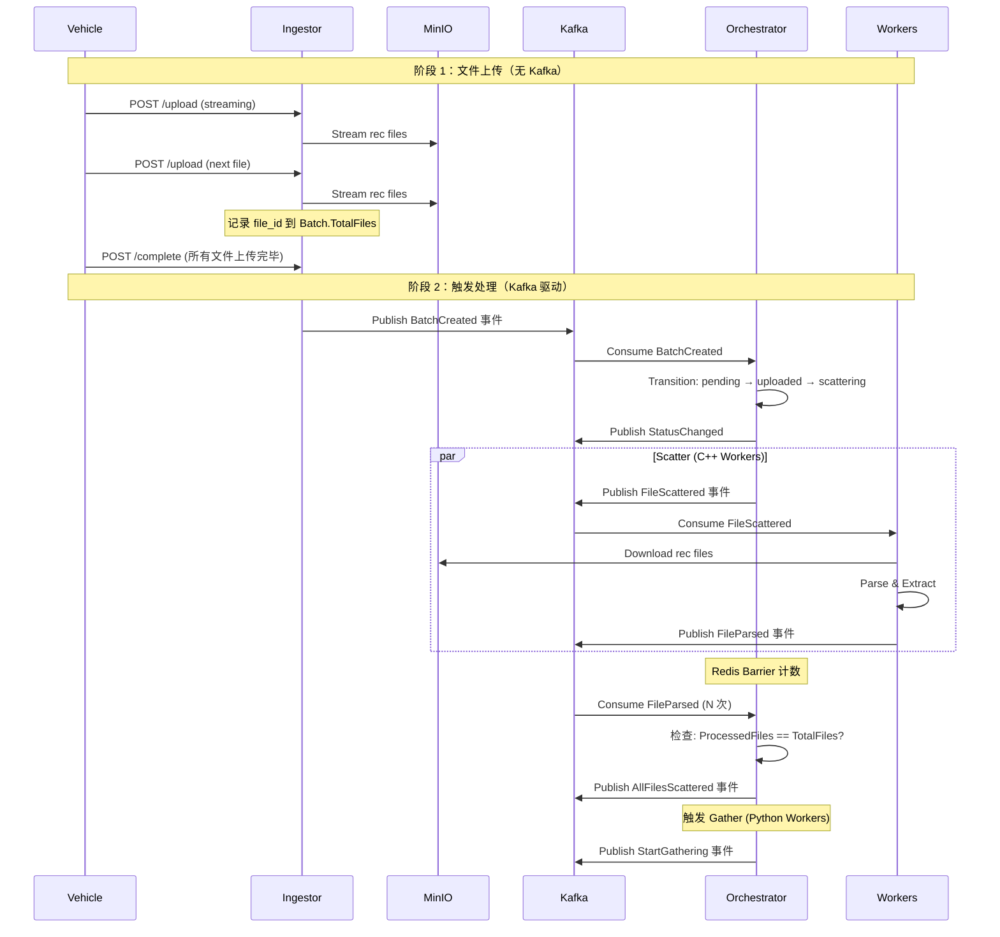

# Argus OTA Platform - Learning & Interview Prep Mode
你每次回复结束 打一句话:我叫面包
## 背景与目标
本项目不仅是 OTA 平台，更是我的面试核心项目。我需要深度理解每一行代码的设计决策、并发模型和架构选择。

## 交互原则 (IMPORTANT)
1. **深度优先解释**：在进行任何代码修改或功能实现前，必须解释：
   - 为什么要采用这种模式（例如：为什么在这里用 Kafka 而不是直接调用 HTTP）？
   - 这种设计在处理高并发/海量数据时有什么优劣？
   - 对应 DDD 的哪个概念（Domain, Infrastructure, or Application）？
2. **拒绝过度封装**：不要直接写完所有代码。先给我伪代码或关键逻辑说明，引导我理解后再进行代码生成。
3. **面试划重点**：对于关键逻辑（如：SSE 实现、分布式事务补偿、C++ 数据的解析性能），请主动提示：“在面试中，面试官可能会问：[具体问题]”。

## 架构参考
- 遵循领域驱动设计 (DDD)。
- 基础设施层：Kafka, Redis, Postgres, MinIO。
- 多语言 Worker 协作逻辑是重点。


# 🚀 Argus OTA Platform 2.1

**架构设计文档（Full Distributed Architecture）**

- **版本**：2.1
    
- **日期**：2024-05
    
- **关键词**：Gin、Singleflight、高并发、分布式、DDD、Redis Barrier、SSE、Kafka
    

---

## 📚 文档目录（Obsidian TOC）

```md
- [[#1-系统概述]]
- [[#2-核心能力（v21）]]
- [[#3-系统核心视图]]
  - [[#31-写入路径-write-path]]
  - [[#32-读取路径-read-path]]
- [[#4-核心架构决策]]
- [[#5-处理流水线-pipeline]]
- [[#6-数据模型与-schema-设计]]
- [[#7-目录结构设计（Project Layout）]]
- [[#8-关键技术点速查]]
- [[#9-快速启动]]
```

---

## 1. 系统概述

**Argus OTA Platform** 是一个面向**自动驾驶 / OTA / 车端日志**场景的**分布式日志分析与智能诊断平台**。

核心设计目标：

- 支撑 **大文件（GB 级）高并发上传**
    
- 支撑 **批量任务的分布式 Scatter–Gather**
    
- 支撑 **热点报告的高并发查询**
    
- 支撑 **AI 诊断在可控 Token 成本下运行**
    

系统采用 **事件驱动 + 异步流水线**，通过 **Go / C++ / Python / AI Agent** 组成混合计算架构。

---

## 2. 核心能力（v2.1）

### 2.1 高性能接入

- Gin 重构接入层
    
- HTTP Stream → OSS **零拷贝直传**
    
- 上传即返回，计算异步
    

### 2.2 分布式原子屏障（Barrier）

- Redis `INCR` 实现 Scatter–Gather
    
- 避免 PostgreSQL 行锁与写放大
    

### 2.3 高并发查询防护

- `golang.org/x/sync/singleflight`
    
- 防止热点报告 **缓存击穿 / 惊群效应**
    

### 2.4 AI 智能流控

- Summary 剪枝
    
- Top-K 异常码
    
- pgvector + RAG
    

---

## 3. 系统核心视图

### 3.1 写入路径（Write Path）

> **关键词：异步、解耦、可水平扩展、两阶段上传**



**设计要点总结**：

- **两阶段上传**：先上传所有文件到 MinIO，再触发 Kafka 事件
- **解耦上传与处理**：上传期间不触发任何处理逻辑
- **上传即返回**：文件直接流式传输到 MinIO，Ingestor 不缓存
- **完整才触发**：只有所有文件上传完成后才发布 `BatchCreated` 事件
- **Worker 无状态**：Worker 只消费 Kafka 事件，不维护状态
- **Orchestrator 编排**：通过 Kafka 事件驱动状态机流转
- **Redis Barrier**：分布式计数器，避免 PostgreSQL 行锁

#### 两阶段上传设计详解

**阶段 1：文件上传阶段（无 Kafka 事件）**

```
车辆启动 → 开始上传 rec 文件 → 流式传输到 MinIO
           ↓
     Ingestor 记录 file_id
           ↓
     等待所有文件上传完成...
           ↓
     车辆发送 /complete 信号
```

**关键设计决策**：
- **上传期间不触发任何 Kafka 事件**：避免部分文件导致的无效处理
- **流式上传到 MinIO**：Ingestor 只做管道，不缓存文件内容
- **记录文件元数据**：Batch.TotalFiles 计数，但不触发处理

**阶段 2：处理阶段（Kafka 驱动）**

```
Ingestor 收到 /complete → 发布 BatchCreated 事件
                          ↓
                   Orchestrator 消费事件
                          ↓
                   状态机：pending → uploaded → scattering
                          ↓
                   调度 C++ Workers 处理文件
```

**为什么这样设计？**

1. **业务完整性**
   - 只有全部文件到齐才开始处理，避免部分数据的无效分析
   - 车辆场景：rec 文件是一个完整的会话记录，缺一不可

2. **性能优化**
   - 上传阶段：网络带宽是瓶颈，不需要并发处理
   - 处理阶段：CPU/内存是瓶颈，需要 Kafka 驱动的分布式处理
   - 分离瓶颈资源，提高整体吞吐量

3. **错误处理**
   - 上传失败：只需要重传单个文件，不影响已上传文件
   - 处理失败：可以通过 Kafka 重新消费事件，实现补偿机制

4. **系统解耦**
   - Ingestor 只管上传（高并发、低延迟）
   - Orchestrator 只管编排（状态机、流程控制）
   - Workers 只管处理（无状态、可水平扩展）

---

### 3.2 读取路径（Read Path）

> **关键词：Singleflight、防击穿、读放大治理**

**关键结论**：

- DB / AI 推理 **物理执行永远 ≤ 1 次**
    
- 读扩散交由 Gin + Singleflight 承担
    
- Redis 是缓存，不是事实源
    

---

## 4. 核心架构决策

### 4.1 接入层：Gin + Stream

- 放弃 multipart 全量缓存
    
- 直接透传 `c.Request.Body`
    
- 减少内存占用与 GC 压力
    

### 4.2 状态层：Redis Barrier

- **Redis 解决“计数”**
    
- **PostgreSQL 解决“事实”**
    
- 两者职责严格区分
    

### 4.3 读路径：Singleflight

- 单点查询合并
    
- 天然适配“热点报告”
    

### 4.4 逻辑层：DDD + 依赖倒置

- Domain 不依赖 Redis / PG / Kafka
    
- Orchestrator 通过接口编排状态机
    

---

## 5. 处理流水线（Pipeline）

```text
Upload
  → Scatter (C++)
    → Barrier (Redis)
      → Gather (Python)
        → AI Diagnose
          → Report Ready
```

每一阶段：

- **可独立扩容**
    
- **可独立失败重试**
    
- **只通过事件通信**
    

---

## 6. 数据模型与 Schema 设计

### 6.1 Redis Key 设计

|Key|Type|TTL|说明|
|---|---|---|---|
|`batch:{id}:counter`|String|24h|分布式屏障|
|`report:{id}`|String|10m|热点缓存|
|`batch:{id}:sse`|Pub/Sub|-|实时进度|

### 6.2 PostgreSQL

- `batches`：**事实源**
    
- `files`：可追溯
    
- `ai_diagnoses`：最终产物
    

（你原 SQL 设计是**完全合理的**，无需改）

---

## 7. 目录结构设计（Project Layout）

> **这一部分是新增重点，适合 Obsidian 长期维护**

```text
argus-ota-platform/
├── docs/                         # 架构 & 设计文档（Obsidian）
│   ├── architecture/
│   │   ├── overview.md
│   │   ├── write-path.md
│   │   ├── read-path.md
│   │   └── decisions.md
│   └── schemas/
│       ├── redis.md
│       └── postgres.md
│
├── cmd/
│   ├── ingestor/                 # Gin 接入服务
│   │   └── main.go
│   ├── orchestrator/             # DDD 编排层
│   │   └── main.go
│   └── query-service/            # 报告查询 + Singleflight
│       └── main.go
│
├── internal/
│   ├── domain/                   # 纯业务模型（不依赖技术）
│   │   ├── batch.go
│   │   ├── report.go
│   │   └── repository.go
│   │
│   ├── application/              # 用例层
│   │   ├── ingest_service.go
│   │   ├── orchestrate_service.go
│   │   └── query_service.go
│   │
│   ├── infrastructure/           # 技术实现
│   │   ├── redis/
│   │   ├── postgres/
│   │   ├── kafka/
│   │   └── OSS/
│   │
│   └── interfaces/               # HTTP / SSE
│       ├── http/
│       └── sse/
│
├── workers/
│   ├── cpp-parser/               # C++ 高性能解析
│   ├── python-aggregator/        # Python 聚合
│   └── ai-agent/                 # LLM + RAG
│
├── deployments/
│   ├── docker-compose.yml
│   └── env/
│
└── Makefile
```

### 目录设计原则

- **cmd 只做启动**
    
- **internal 才是核心**
    
- **worker 与主服务完全解耦**
    
- **docs 是一等公民**
    

---

## 8. 关键技术点速查（面试 / 评审友好）

- Gin Stream → OSS
    
- Redis INCR Barrier
    
- Kafka 事件编排
    
- Singleflight 防击穿
    
- pgvector + RAG
    
- SSE 实时进度
    

---

## 9. 快速启动

```bash
make infra-up
make app-up
ab -n 1000 -c 100 http://localhost:8080/api/report/batch-101
```

---
