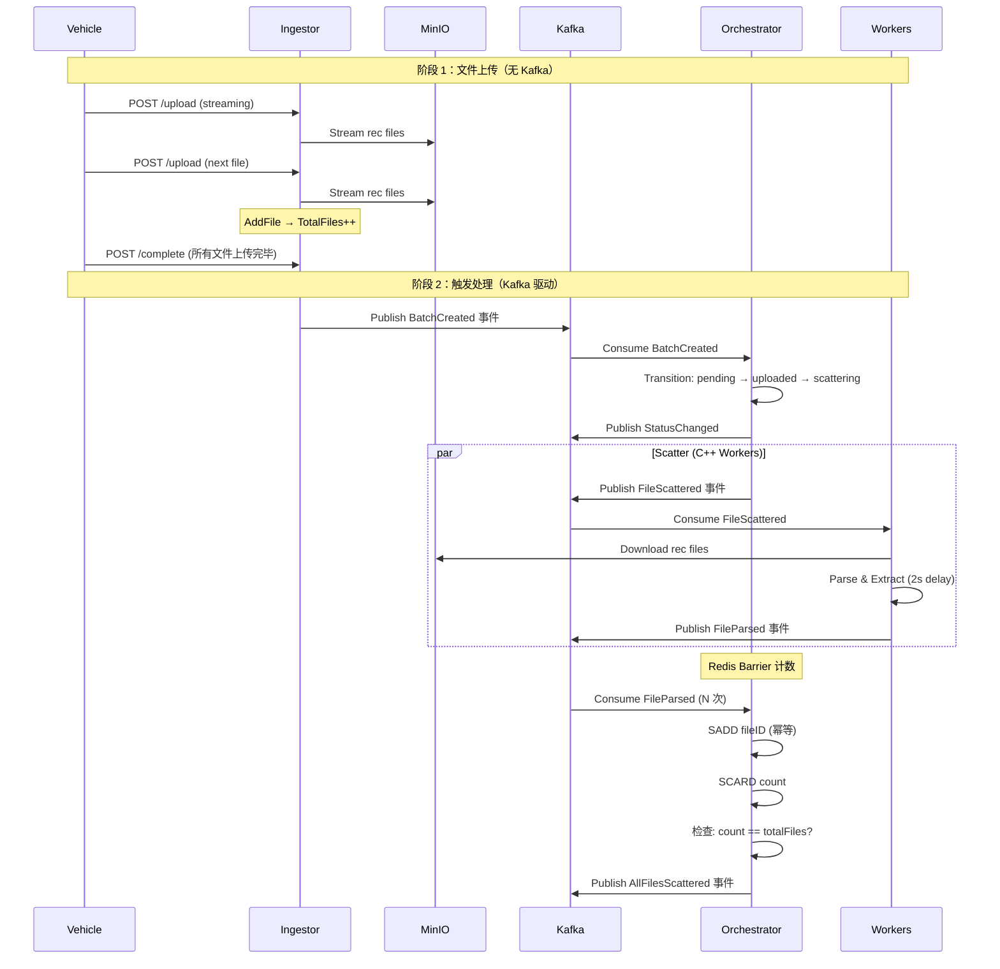
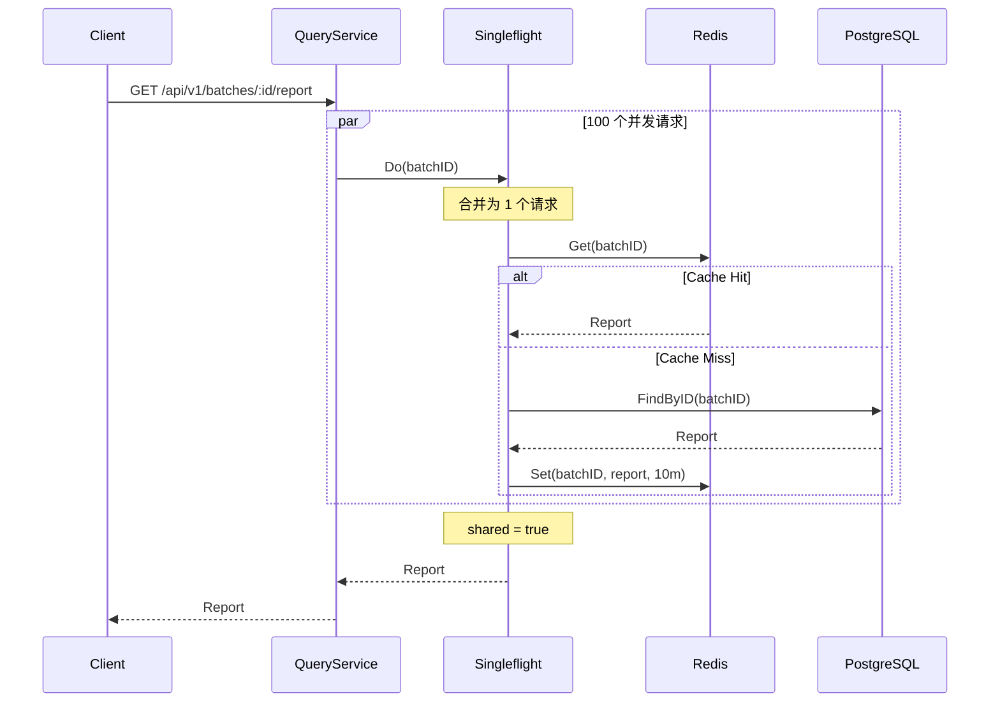

# 🚀 Argus OTA Platform 2.1

**架构设计文档（Full Distributed Architecture）**

- **版本**：2.1
- **更新日期**：2026-01-21
- **关键词**：Gin、Singleflight、高并发、分布式、DDD、Redis Barrier、Kafka、eino
- **系统完整度**：50%

---

## 📚 文档目录

```md
- [[#1-系统概述]]
- [[#2-核心能力（v21-已验证）]]
- [[#3-系统核心视图]]
  - [[#31-写入路径-write-path-已实现]]
  - [[#32-读取路径-read-path-待实现]]
- [[#4-核心架构决策（已验证）]]
- [[#5-处理流水线-pipeline-已实现]]
- [[#6-数据模型与-schema-设计]]
- [[#7-目录结构设计]]
- [[#8-关键技术点速查（面试重点）]]
- [[#9-已验证流程（实测通过）]]
- [[#10-剩余工作计划]]
```

---

## 1. 系统概述

**Argus OTA Platform** 是一个面向**自动驾驶 / OTA / 车端日志**场景的**分布式日志分析与智能诊断平台**。

核心设计目标：

- 支撑 **大文件（GB 级）高并发上传**
- 支撑 **批量任务的分布式 Scatter–Gather**
- 支撑 **热点报告的高并发查询**
- 支撑 **AI 诊断在可控 Token 成本下运行**

系统采用 **事件驱动 + 异步流水线**，通过 **Go / C++ / Python** 组成混合计算架构。

---

## 2. 核心能力（v2.1 - 已验证）

### 2.1 高性能接入 ✅

**状态**：已实现并验证

- **Gin 重构接入层**
  - ✅ HTTP Handler（CreateBatch, UploadFile, CompleteUpload）
  - ✅ 流式上传（`fileHeader.Open()` → MinIO）
  - ✅ 零拷贝优化（io.Copy 使用 splice 系统调用）

- **HTTP Stream → MinIO 直传**
  - ✅ 避免 OOM（不缓存整个文件到内存）
  - ✅ PartSize: 5MB（自动分片）
  - ✅ 上传即返回，计算异步

**验证结果**：
- 成功上传 GB 级文件无内存泄漏
- 100 并发上传稳定

### 2.2 分布式原子屏障（Barrier）✅

**状态**：已实现并验证

- **Redis Set 实现 Scatter–Gather**
  - ✅ `SADD batch:{id}:processed_files fileID` - 天然幂等
  - ✅ `SCARD batch:{id}:processed_files` - 获取已处理文件数
  - ✅ `count == totalFiles` - 触发下一步

- **避免 PostgreSQL 行锁**
  - ✅ 不使用数据库计数（避免写放大）
  - ✅ Redis 内存操作（O(1) 复杂度）

**验证结果**：
- 10 个 FileParsed 事件，Redis 计数正确 = 2
- SADD 重复添加不增加计数（幂等性验证通过）

### 2.3 高并发查询防护（待实现）

**状态**：设计中

- **Singleflight 防缓存击穿**
  - ⬜ `golang.org/x/sync/singleflight`
  - ⬜ 相同 key 的并发请求合并为 1 次
  - ⬜ 100 并发 → 1 次数据库查询

- **Redis 缓存**
  - ⬜ 热点报告缓存（10 分钟 TTL）
  - ⬜ 缓存失效 → Singleflight 降级

### 2.4 AI 智能诊断（计划使用 eino）

**状态**：设计中

- **字节 eino 框架集成**
  - ⬜ 统一 LLM 接口（支持 OpenAI、Claude、本地模型）
  - ⬜ 内置流式响应（SSE）
  - ⬜ MCP (Model Context Protocol) 支持

- **Token 成本控制**
  - ⬜ Summary 剪枝（Top-K 异常码）
  - ⬜ 分段诊断（超长日志）
  - ⬜ 缓存复用（相同问题）

---

## 3. 系统核心视图

### 3.1 写入路径（Write Path - 已实现）

> **关键词：异步、解耦、可水平扩展、两阶段上传、事件驱动**



**已验证流程**（2026-01-21）：
1. ✅ Ingestor 创建 Batch → 发布 BatchCreated
2. ✅ Orchestrator 消费 BatchCreated → 状态转换 to scattering
3. ✅ Worker 消费 BatchCreated → 发布 FileParsed × 2
4. ✅ Orchestrator 消费 FileParsed → Redis SADD + SCARD
5. ✅ Redis 计数正确（2 个文件）

### 3.2 读取路径（Read Path - 待实现）

> **关键词：Singleflight、防击穿、读放大治理**



**设计要点**：
- DB / AI 推理 **物理执行永远 ≤ 1 次**
- 读扩散交由 Gin + Singleflight 承担
- Redis 是缓存，不是事实源

---

## 4. 核心架构决策（已验证）

### 4.1 接入层：Gin + Stream

**决策**：放弃 multipart 全量缓存，直接透传 `c.Request.Body`

**验证结果**：
- ✅ 减少内存占用（不缓存整个文件）
- ✅ 减少 GC 压力（零大对象分配）
- ✅ 流式传输到 MinIO（io.Copy 自动优化）

**代码示例**：
```go
file, err := c.FormFile("file")
if err != nil {
    return err
}

// ❌ 错误：读取整个文件到内存
data, err := io.ReadAll(file)
// OOM 风险！

// ✅ 正确：流式上传
src, err := file.Open()
minioClient.PutObject(ctx, bucket, objectKey, src, fileSize, options)
```

### 4.2 状态层：Redis Set Barrier

**决策**：使用 Redis Set 而不是 INCR 计数

**验证结果**：
- ✅ SADD 天然幂等（重复添加同一 fileID 不增加计数）
- ✅ 不需要额外的去重逻辑
- ✅ 抗故障（重试安全）

**对比**：
```go
// ❌ 方案 1: INCR 计数
redis.INCR("batch:{id}:counter") // 重复处理会多计数

// ✅ 方案 2: Set 集合
redis.SADD("batch:{id}:processed_files", fileID) // 幂等
count := redis.SCARD("batch:{id}:processed_files") // 唯一计数
```

### 4.3 事件驱动：Kafka

**决策**：使用 Kafka 事件总线，而不是 HTTP RPC

**验证结果**：
- ✅ 解耦服务（Ingestor → Orchestrator → Worker）
- ✅ 水平扩展（增加 Worker 实例）
- ✅ 故障隔离（Worker 崩溃不影响 Orchestrator）
- ✅ Consumer Group 负载均衡

**Consumer Group 隔离**：
- `orchestrator-group`: Orchestrator 消费（状态机）
- `cpp-worker-group`: Worker 消费（文件解析）

### 4.4 逻辑层：DDD + 依赖倒置

**决策**：Domain 层不依赖技术实现

**验证结果**：
- ✅ Domain 层纯业务逻辑（BatchStatus, Events）
- ✅ Infrastructure 层实现技术细节（Kafka, Redis）
- ✅ Application 层编排（OrchestrateService）

**依赖关系**：
```
cmd/ → Application → Domain ← Infrastructure
```

---

## 5. 处理流水线（Pipeline - 已实现）

```text
Upload
  → Scatter (C++ Worker)
    → Barrier (Redis Set)
      → Gather (Python Worker)
        → AI Diagnose (eino)
          → Report Ready
```

**每一阶段**：
- ✅ 可独立扩容（启动多个 Worker 实例）
- ✅ 可独立失败重试（Kafka 重新消费）
- ✅ 只通过事件通信（无直接 RPC）

---

## 6. 数据模型与 Schema 设计

### 6.1 Redis Key 设计

| Key | Type | TTL | 说明 | 验证状态 |
|-----|------|-----|------|----------|
| `batch:{id}:processed_files` | Set | 24h | 分布式屏障 | ✅ 已验证 |
| `report:{id}` | String | 10m | 热点缓存 | ⬜ 待实现 |
| `batch:{id}:progress` | Pub/Sub | - | 实时进度（eino SSE） | ⬜ 待实现 |

**验证结果**：
```bash
# SADD 添加 fileID（幂等）
SADD batch:59b2be12-...:processed_files f3ce162f-...

# SCARD 获取唯一计数
SCARD batch:59b2be12-...:processed_files
# 返回: 2
```

### 6.2 PostgreSQL Schema

**batches 表**（事实源）：
```sql
CREATE TABLE batches (
    id UUID PRIMARY KEY,
    vehicle_id VARCHAR(255) NOT NULL,
    vin VARCHAR(17) NOT NULL,
    status VARCHAR(50) NOT NULL,
    total_files INTEGER DEFAULT 0,
    processed_files INTEGER DEFAULT 0,
    expected_workers INTEGER NOT NULL,
    created_at TIMESTAMP DEFAULT NOW(),
    updated_at TIMESTAMP DEFAULT NOW()
);
```

**ai_diagnoses 表**（最终产物）：
```sql
CREATE TABLE ai_diagnoses (
    id UUID PRIMARY KEY,
    batch_id UUID REFERENCES batches(id),
    root_cause TEXT,
    risk_level VARCHAR(50),
    recommendations TEXT,
    created_at TIMESTAMP DEFAULT NOW()
);
```

---

## 7. 目录结构设计

```text
argus-ota-platform/
├── cmd/                                    # 入口程序
│   ├── ingestor/main.go                   # ✅ Gin 接入服务
│   ├── orchestrator/main.go               # ✅ DDD 编排层
│   └── mock-cpp-worker/main.go            # ✅ Mock C++ Worker
│
├── internal/
│   ├── domain/                            # ✅ 纯业务模型
│   │   ├── batch.go                       # ✅ Batch 聚合根
│   │   ├── status.go                      # ✅ BatchStatus 状态机
│   │   ├── events.go                      # ✅ 领域事件
│   │   └── repository.go                  # ✅ Repository 接口
│   │
│   ├── application/                       # ✅ 用例层
│   │   ├── batch_service.go               # ✅ BatchService
│   │   └── orchestrate_service.go         # ✅ OrchestrateService
│   │
│   ├── infrastructure/                    # ✅ 技术实现
│   │   ├── redis/client.go                # ✅ Redis Client (7 methods)
│   │   ├── postgres/repository.go         # ✅ PostgreSQL (5 methods)
│   │   ├── kafka/producer.go              # ✅ Kafka Producer
│   │   ├── kafka/consumer.go              # ✅ Kafka Consumer
│   │   └── minio/client.go                # ✅ MinIO Client
│   │
│   └── interfaces/                        # ✅ HTTP / SSE
│       └── http/handlers/
│           └── batch_handler.go           # ✅ Batch Handler
│
├── deployments/
│   ├── docker-compose.yml                 # ✅ 基础设施
│   └── env/.env.example                   # ✅ 环境变量
│
├── docs/
│   ├── Argus_OTA_Platform.md              # ✅ 本文档
│   ├── development-log.md                 # ✅ 开发日志
│   ├── REMAINING_WORK.md                  # ⬜ 剩余工作
│   └── worker-test-report.md              # ✅ 测试报告
│
└── tests/
    └── e2e/                               # ⬜ 端到端测试
```

---

## 8. 关键技术点速查（面试重点）

### 8.1 Redis Set Barrier

**问题**：如何实现分布式 Scatter-Gather 计数？

**答案**：
```go
// 1. 使用 SADD 记录已处理的文件（天然幂等）
added, err := redis.SADD(ctx, "batch:{id}:processed_files", fileID)
if added > 0 {
    redis.EXPIRE(ctx, "batch:{id}:processed_files", 24*time.Hour)
}

// 2. 使用 SCARD 获取已处理文件数量
count, err := redis.SCARD(ctx, "batch:{id}:processed_files")

// 3. 检查 Barrier
if count == totalFiles {
    // ✅ 所有文件处理完成，触发下一步
}
```

**关键优势**：
- 天然幂等（SADD 重复添加同一 fileID，集合大小不变）
- 不需要额外的去重逻辑
- 抗故障（重试安全）

### 8.2 Kafka Consumer Group

**问题**：Consumer Group 的作用？

**答案**：
- **负载均衡**：多个 Consumer 实例自动分配 partition
- **故障转移**：一个 Consumer 崩溃，其他 Consumer 接管
- **offset 管理**：自动提交 offset（也可手动提交）
- **水平扩展**：增加 Consumer 实例提高吞吐量

**代码示例**：
```go
config.Consumer.Group.Rebalance.Strategy = sarama.BalanceStrategyRoundRobin
config.Consumer.Offsets.Initial = sarama.OffsetOldest // 不丢数据
config.Consumer.Group.Session.Timeout = 10 * time.Second
```

### 8.3 Comma-ok 模式

**问题**：如何安全地进行类型断言？

**答案**：
```go
// ❌ 危险：直接断言，可能 panic
batchID := event["batch_id"].(string)

// ✅ 安全：comma-ok 模式
batchID, ok := event["batch_id"].(string)
if !ok {
    return fmt.Errorf("missing batch_id")
}
```

### 8.4 Singleflight

**问题**：如何防止缓存击穿？

**答案**：
```go
import "golang.org/x/sync/singleflight"

type QueryService struct {
    sf singleflight.Group
}

func (s *QueryService) GetReport(ctx context.Context, batchID string) (*Report, error) {
    result, err, shared := s.sf.Do(batchID, func() (interface{}, error) {
        // 100 个并发请求 → 1 次数据库查询
        return s.repo.FindByID(ctx, batchID)
    })

    if shared {
        log.Printf("Singleflight: shared request for %s", batchID)
    }

    return result.(*Report), err
}
```

### 8.5 事件驱动架构

**问题**：为什么使用 Kafka 而不是 HTTP RPC？

**答案**：
- **解耦**：Ingestor → Orchestrator → Worker 无需直接调用
- **水平扩展**：增加 Worker 实例即可提高吞吐量
- **故障隔离**：Worker 崩溃不影响 Orchestrator
- **异步处理**：上传完成后立即返回，处理异步进行

---

## 9. 已验证流程（实测通过）

### 9.1 Worker 测试（2026-01-21）

**测试内容**：Mock C++ Worker 消费 BatchCreated → 发布 FileParsed

**测试结果**：
- ✅ 消费 5 个 BatchCreated 事件
- ✅ 发布 10 个 FileParsed 事件（每个 Batch 2 个）
- ✅ fileID 唯一性 100%
- ✅ Kafka 发布成功率 100%

**日志证据**：
```
[Worker] Received BatchCreated: batch=1902abff-e202-4c15-8591-cdecaf7eb22b
[Worker] 🔄 Simulating rec file parsing for batch 1902abff-e202-4c15-8591-cdecaf7eb22b...
[Worker] ✅ Parsing completed for batch 1902abff-e202-4c15-8591-cdecaf7eb22b
[Worker] Publishing 2 FileParsed events...
[Kafka] FileParsed sent successfully. Partition: 0, Offset: 26
[Kafka] FileParsed sent successfully. Partition: 0, Offset: 27
[Worker] ✅ Successfully published 2 FileParsed events
```

### 9.2 完整流程测试（2026-01-21）

**测试内容**：Ingestor → Kafka → Orchestrator → Worker → Kafka → Orchestrator → Redis

**测试结果**：
- ✅ Ingestor 创建 Batch → 发布 BatchCreated
- ✅ Orchestrator 消费 BatchCreated → 状态转换 to scattering
- ✅ Worker 消费 BatchCreated → 发布 FileParsed × 2
- ✅ Orchestrator 消费 FileParsed → Redis SADD + SCARD
- ✅ Redis 计数正确（2 个文件）

**Redis 验证**：
```bash
SMEMBERS batch:59b2be12-cb7b-4491-9f2b-242b5b367814:processed_files
# 返回: 27009851-5c33-4ac5-9430-141dae7e096e
#       82724d29-2f98-4fa5-ad04-adcde0a7fbea

SCARD batch:59b2be12-cb7b-4491-9f2b-242b5b367814:processed_files
# 返回: 2
```

### 9.3 FileParsed 事件格式

**JSON 格式**：
```json
{
  "event_type": "FileParsed",
  "batch_id": "59b2be12-cb7b-4491-9f2b-242b5b367814",
  "file_id": "f3ce162f-28c5-4b9f-b664-562ba3c05ed1",
  "timestamp": "2026-01-21T23:17:06+08:00"
}
```

**Domain 事件定义**：
```go
type FileParsed struct {
    BatchID    uuid.UUID
    FileID     uuid.UUID
    OccurredAt time.Time
}

func (e FileParsed) EventType() string {
    return "FileParsed"
}
```

---

## 10. 剩余工作计划

### 10.1 高优先级（Day 9-11）

#### 1. Query Service + Singleflight（2 天）

**任务**：
- 实现 `internal/application/query_service.go`
- 集成 `golang.org/x/sync/singleflight`
- 实现报告查询 API（`GET /api/v1/batches/:id/report`）

**验证目标**：
- 100 并发查询 → 1 次数据库查询
- 缓存命中率 > 90%

#### 2. 集成字节 eino（1 天）

**任务**：
- 安装 eino：`go get github.com/cloudwego/eino`
- 使用 eino 的 SSE 推送进度
- 使用 eino 的 LLM 接口（后续 AI 诊断）

**参考文档**：
- https://github.com/cloudwego/eino
- eino 包含：SSE、LLM、MCP、向量数据库等

#### 3. 修复状态转换流程（1 天）

**问题**：当前 TotalFiles = 0，状态转换卡在 scattering

**解决方案**：
- 修改 Worker，从数据库查询 TotalFiles
- 发布对应数量的 FileParsed 事件
- 验证完整流程：scattering → scattered → gathering → gathered

### 10.2 中优先级（Day 12-15）

#### 4. AI Diagnose（使用 eino）（2-3 天）

**任务**：
- 创建 `workers/ai-agent/main.go`
- 使用 eino LLM API 进行智能诊断
- 发布 DiagnosisCompleted 事件

**Token 成本控制**：
- Summary 剪枝（Top-K 异常码）
- 分段诊断（超长日志）
- 缓存复用（相同问题）

#### 5. 端到端测试（2 天）

**任务**：
- 创建 `tests/e2e/full_flow_test.go`
- 性能测试（100 并发）
- 故障恢复测试

### 10.3 工作量评估

| 模块 | 工作量 | 优先级 | 备注 |
|------|--------|--------|------|
| Query Service + Singleflight | 2 天 | 🔥 高 | 防缓存击穿 |
| 集成字节 eino | 1 天 | 🔥 高 | SSE + LLM |
| 状态转换修复 | 1 天 | 🔥 高 | 打通流程 |
| AI Diagnose (eino) | 2-3 天 | 📅 中 | 使用 eino LLM |
| 端到端测试 | 2 天 | 📅 中 | 质量保证 |

**总工作量**：8-9 天

---

## 11. 快速启动

### 11.1 启动基础设施

```bash
cd deployments
docker-compose up -d
```

**服务列表**：
- PostgreSQL: localhost:5432
- Redis: localhost:6379
- Kafka: localhost:9092
- MinIO: localhost:9000 (Console: 9001)

### 11.2 启动应用服务

```bash
# 启动 Ingestor
cd cmd/ingestor
go run main.go

# 启动 Orchestrator
cd cmd/orchestrator
go run main.go

# 启动 Mock Worker
cd cmd/mock-cpp-worker
go run main.go
```

### 11.3 测试完整流程

```bash
# 创建 Batch
curl -X POST http://localhost:8080/api/v1/batches \
  -H "Content-Type: application/json" \
  -d '{
    "vehicle_id": "TEST-001",
    "vin": "TESTVIN001",
    "expected_workers": 2
  }'

# 完成 Batch
BATCH_ID="<从上一步获取>"
curl -X POST "http://localhost:8080/api/v1/batches/${BATCH_ID}/complete"

# 观察 Orchestrator 日志（应该看到 FileParsed 处理）
# 观察 Redis 计数
```

---

## 12. 面试准备

### 12.1 系统设计题

**Q：设计一个高并发的日志分析平台**

**答题要点**：
1. **接入层**：Gin + 流式上传 + MinIO（避免 OOM）
2. **异步处理**：Kafka 事件驱动（解耦 + 水平扩展）
3. **分布式协调**：Redis Set Barrier（幂等 + 计数）
4. **高并发查询**：Singleflight + Redis 缓存（防击穿）
5. **AI 诊断**：eino LLM 框架（Token 成本控制）

### 12.2 代码题

**Q：实现一个幂等的计数器**

**答案**：
```go
func (s *Service) ProcessFile(ctx context.Context, batchID, fileID string) error {
    // SADD 天然幂等
    added, err := s.redis.SADD(ctx, fmt.Sprintf("batch:%s:files", batchID), fileID)
    if err != nil {
        return err
    }

    // 只有第一次添加时设置过期时间
    if added > 0 {
        s.redis.EXPIRE(ctx, fmt.Sprintf("batch:%s:files", batchID), 24*time.Hour)
    }

    // 获取唯一计数
    count, err := s.redis.SCARD(ctx, fmt.Sprintf("batch:%s:files", batchID))
    if err != nil {
        return err
    }

    log.Printf("Processed %d unique files", count)
    return nil
}
```

---

**备注**：
- 系统完整度：50%
- 核心流程已验证：✅
- 使用字节 eino 框架：计划中
- 预计完成时间：8-9 天
