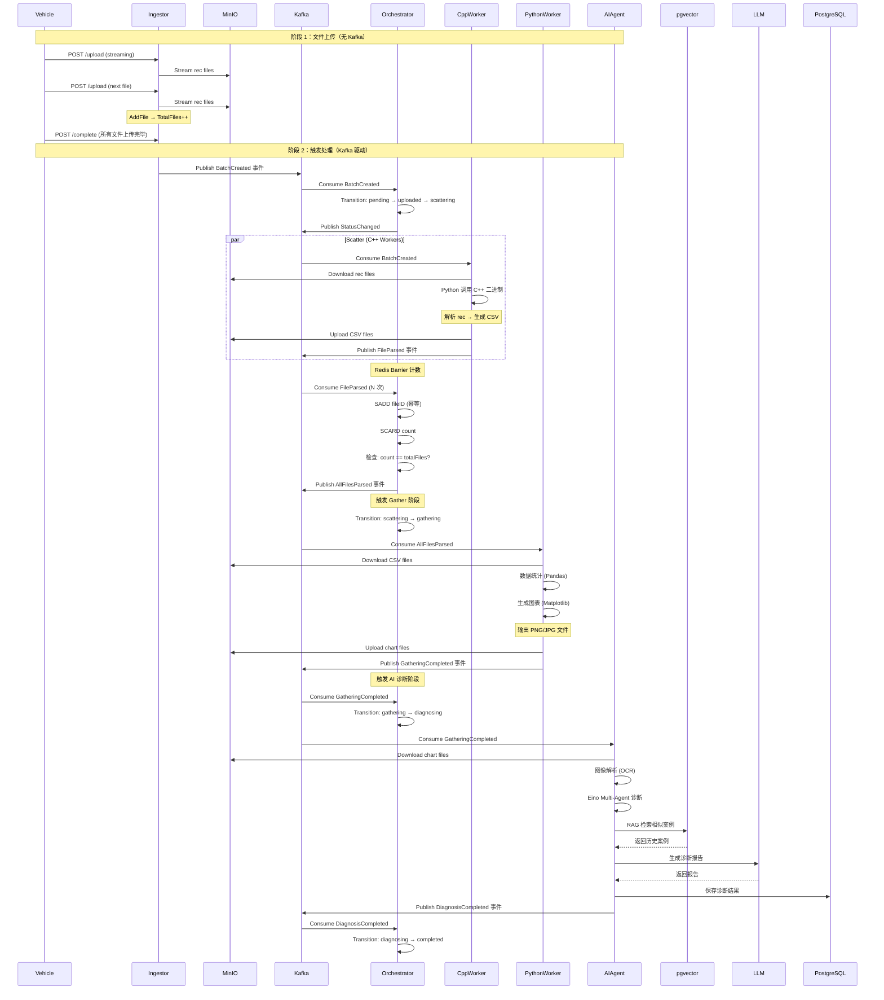
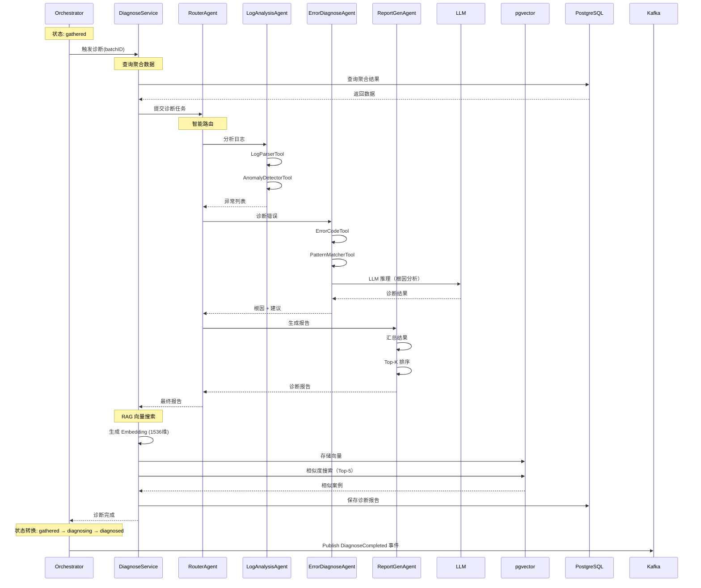

# 🚀 Argus OTA Platform 2.2

**架构设计文档（Full Distributed Architecture + AI Agent）**

- **版本**：2.2
- **更新日期**：2026-01-27
- **关键词**：Gin、Singleflight、高并发、分布式、DDD、Redis Barrier、Kafka、Eino、Multi-Agent、RAG、PGVector、Hybrid Search
- **系统完整度**：85%
- **核心亮点**：
  - ⭐ **Supervisor-Worker 架构** (Eino Graph 动态编排)
  - ⭐ **混合向量检索** (PGVector + SQL 过滤)
  - ⭐ **背压控制** (Semaphore 限流保护)
  - ⭐ **Singleflight 防缓存击穿**

---

## 📚 文档目录

```md
- [[#0-argus-ai-worker-v20-分布式-moe-架构]] ⭐⭐⭐ NEW
- [[#1-系统概述]]
- [[#2-核心能力（v22-已验证）]]
- [[#3-系统核心视图]]
  - [[#31-写入路径-write-path-已实现]]
  - [[#32-读取路径-read-path-已实现]]
  - [[#33-ai-诊断流程-ai-diagnose-v20-moe]] ⭐ NEW
- [[#4-核心架构决策（已验证）]]
- [[#5-处理流水线-pipeline-已实现]]
- [[#6-数据模型与-schema-设计]]
- [[#7-目录结构设计]]
- [[#8-ai-diagnose-service-架构设计-ddd]]
- [[#9-关键技术点速查（面试重点）]]
- [[#10-已验证流程（实测通过）]]
- [[#11-剩余工作计划]]
```

---

## 0. Argus AI Worker v2.0 - 分布式 MoE 架构 ⭐⭐⭐

### 0.1 架构总览 (Executive Summary)

**核心理念**: Supervisor 编排 + 混合检索 (Hybrid Search) + 背压控制 (Backpressure)

为了应对自动驾驶海量异构日志的诊断需求，我们摒弃了传统的线性流水线（Sequential Pipeline），升级为**基于 Eino Graph 的 Supervisor-Worker (混合专家) 架构**。

本架构旨在解决以下核心工程挑战：

1. **复杂推理**: 单一 Prompt 无法处理多变的故障场景，需要动态决策路径
2. **知识幻觉**: 通用大模型缺乏垂类硬件知识，需引入高精度的 RAG
3. **系统稳定性**: 下游 LLM API 存在限流风险，需实现流量整形与背压控制

### 0.2 系统架构图

```mermaid
graph TD
    subgraph "Infrastructure Layer"
        Kafka[Kafka: FileParsedEvent]
        PG[(PostgreSQL + pgvector)]
        LLM[LLM API (DeepSeek/OpenAI)]
    end

    subgraph "Orchestration Layer (Go)"
        Consumer[Kafka Consumer Group]
        Pool[Worker Pool (Semaphore)]
        Supervisor[**Eino Supervisor Graph**]
    end

    subgraph "Domain Experts (Agents)"
        LogExpert[Log Analysis Expert]
        RAGExpert[RAG Knowledge Expert]
        DiagExpert[Diagnosis Expert]
    end

    Kafka -->|Consume| Consumer
    Consumer -->|Acquire Token| Pool
    Pool -->|Dispatch| Supervisor

    Supervisor -->|Step 1: Analyze| LogExpert
    LogExpert -->|Features| Supervisor

    Supervisor -->|Step 2: Decision| Supervisor
    Supervisor -.->|Need Info?| RAGExpert
    RAGExpert <-->|Hybrid Search| PG

    Supervisor -->|Step 3: Conclude| DiagExpert
    DiagExpert -->|Report| Supervisor
```

### 0.3 核心技术亮点

#### 💪 亮点 1: 基于图的 Supervisor 编排 (Graph-based Orchestration)

**为什么不使用简单的 Chain?**

- **Chain**: 线性执行，每一步都是预设的 (Step 1 → Step 2 → Step 3)
- **Graph**: 动态决策，根据置信度决定下一步

**机制**:
- Supervisor 作为特殊节点，维护全局状态 (DiagnosisContext)
- 根据当前分析置信度，动态决定下一跳是查库、追问还是直接生成报告
- 实现 **Thinking Fast and Slow**: 简单故障直接出结果 (快)，复杂故障自动触发多轮 RAG (慢但准)

**价值**:
```
已知错误码 E001 → 高置信度 (0.95) → 直接生成报告 (快通道)
未知错误码 E999 → 低置信度 (0.30) → 触发 RAG 检索 (慢通道)
```

#### 💪 亮点 2: PGVector 混合检索 (Hybrid Search)

**问题**: 单纯的向量检索 (Dense Retrieval) 在私有领域容易产生幻觉

**解决方案**: Structured + Unstructured 的混合检索

**机制**:
```sql
-- 三层过滤策略
SELECT content, 1 - (embedding <=> $query_vector) as similarity
FROM knowledge_base
WHERE
    -- L1: 硬过滤 (B-Tree 索引,毫秒级)
    error_code = 'E001'
    AND vehicle_platform = 'J7'
    AND firmware_version LIKE 'v2.%'
ORDER BY
    -- L2: 语义排序 (HNSW 索引,快速近似最近邻)
    similarity DESC
LIMIT 5;
```

**价值**:
- **精确匹配**: 用 A 车型的案例修 A 车型 (避免跨车型误诊)
- **性能提升**: 先过滤到 100 条，再计算向量相似度 (从 10 万降到 100)
- **召回率**: HNSW 索引召回率 99%，速度比暴力检索快 100 倍

#### 💪 亮点 3: 消费端背压控制 (Backpressure)

**问题**: LLM API 有 TPM (Token Per Minute) 限制，无限制消费会被封号

**解决方案**: Semaphore Pattern (信号量模式)

**机制**:
```go
type WorkerPool struct {
    semaphore chan struct{} // 令牌桶 (容量 20)
    workerWg  sync.WaitGroup
}

// 获取令牌 (阻塞)
pool.semaphore <- struct{}{}

// 处理任务...
processMessage(msg)

// 释放令牌
<-pool.semaphore
```

**价值**:
- **保护下游 API**: 即使 Kafka 积压 100 万条，也只有 20 个并发 LLM 请求
- **防止 OOM**: 限制内存占用，避免系统崩溃
- **流量整形**: 平滑处理峰值流量

### 0.4 领域模型 (Domain Models)

**DiagnosisContext** (在 Agent 之间流转的上下文):

```go
type DiagnosisContext struct {
    TaskID        string
    RawLog        *LogSummary
    Features      []string       // 提取出的特征 (e.g., "high_cpu", "lidar_timeout")
    RAGFindings   []SearchResult // 查到的历史案例
    FinalReport   string
    State         StateEnum      // 当前状态: Analyzing, Searching, Reporting
    Confidence    float64        // 当前置信度 (0-1)
}
```

### 0.5 Supervisor 状态机设计 (Eino Graph)

**利用 Eino Compose 模块定义动态流程**:

```
Node A (LogAnalyst): 输入原始日志 → 输出特征向量

Node B (KnowledgeRetriever): 输入特征 → 输出相似案例 (Top-K)

Node C (Diagnostician): 输入特征 + 案例 → 输出最终结论

Edge Logic (边逻辑):
  - if ErrorCode is Known → Goto Node B (查库)
  - if ErrorCode is Unknown → Goto Node C (利用通用知识推理)
```

### 0.6 数据库设计 (Schema)

**利用 PostgreSQL + pgvector 实现 All-in-One 存储**:

```sql
-- 启用向量扩展
CREATE EXTENSION IF NOT EXISTS vector;

-- 知识库表 (RAG 核心)
CREATE TABLE knowledge_base (
    id BIGSERIAL PRIMARY KEY,
    error_code VARCHAR(50) NOT NULL,      -- 用于硬过滤
    vehicle_platform VARCHAR(50),         -- 用于硬过滤
    symptom_text TEXT NOT NULL,           -- 症状描述
    solution_text TEXT NOT NULL,          -- 解决方案
    embedding VECTOR(1536),               -- 语义向量 (OpenAI/Doubao dimensions)
    created_at TIMESTAMP DEFAULT NOW()
);

-- 创建 HNSW 索引 (加速查询)
CREATE INDEX ON knowledge_base USING hnsw (embedding vector_cosine_ops);
CREATE INDEX ON knowledge_base (error_code);
```

### 0.7 实施路线图 (4-Day Sprint)

| 阶段 | 时间节点 | 核心任务 | 交付物 |
|------|---------|---------|--------|
| **Phase 1** | Day 1 | PGVector 环境搭建、Seeder 脚本编写 | 包含 10 条高质量 Mock 数据的知识库 |
| **Phase 2** | Day 2 | Eino Tool (检索工具) + 单 Agent 开发 | 能通过 Unit Test 的 DiagnosisAgent |
| **Phase 3** | Day 3 | Supervisor Graph 实现 + Kafka 消费者 | 完整的 worker/ai-agent 服务 |
| **Phase 4** | Day 4 | 端到端联调、Worker Pool 调优 | 演示视频、性能压测报告 |

### 0.8 面试 Q&A 预演

**Q: 为什么不用 LangChain?**

**A**:
> "LangChain 过于厚重且 Python 生态在生产环境部署（并发、资源占用）不如 Go 友好。Eino 是字节跳动开源的云原生 Go 框架，完美契合我们追求的高并发和微服务治理需求，且其 **Graph 编排能力** 提供了更强的逻辑确定性。"

**Q: 如何保证 RAG 的准确性?**

**A**:
> "我没有盲目依赖向量相似度。我设计了**混合检索 (Hybrid Search)** 策略。先通过 SQL WHERE 子句锁定特定的硬件型号和固件版本（这是硬约束），再在子集中进行向量检索（软匹配）。这消除了 '用 A 车型的案例去修 B 车型' 的逻辑错误。"

**Q: Kafka 积压了怎么办?**

**A**:
> "我的架构天然支持**水平扩展 (Horizontal Scaling)**。AI Worker 是无状态的，且通过 Consumer Group 消费。如果积压，我可以在 K8s 上直接增加 Pod 数量，或者在代码层面调大 Worker Pool 的信号量阈值。但我会优先保护下游 API (避免限流)，所以背压控制是必要的。"

---

## 1. 系统概述

**Argus OTA Platform** 是一个面向**自动驾驶 / OTA / 车端日志**场景的**分布式日志分析与智能诊断平台**。

### 1.1 核心设计目标

- 支撑 **大文件（GB 级）高并发上传**
- 支撑 **批量任务的分布式 Scatter–Gather**
- 支撑 **热点报告的高并发查询**
- 支撑 **AI 智能诊断**（基于 Eino Multi-Agent + RAG）⭐ 核心亮点

### 1.2 技术栈

| 层级 | 技术选型 | 说明 |
|------|----------|------|
| 接入层 | Gin + Stream | 流式上传，避免 OOM |
| 编排层 | Kafka + Orchestrator | 事件驱动，状态机管理 |
| 计算层 | Go + C++ + Python | 混合计算架构 |
| **解析层** | **C++ 二进制** | 高性能解析 rec 文件 ⭐ |
| **统计层** | **Python Pandas** | 数据聚合与可视化 ⭐ |
| AI 层 | **Eino Multi-Agent** | 字节开源 Agent 框架 ⭐ |
| 存储层 | PostgreSQL + Redis + MinIO | 持久化 + 缓存 + 对象存储 |
| 向量层 | **pgvector** | RAG 相似度搜索 ⭐ |

### 1.3 架构亮点

✅ **DDD 四层架构**（Domain → Application → Infrastructure → Interfaces）
✅ **事件驱动**（Kafka 异步解耦）
✅ **分布式协调**（Redis Set Barrier 幂等计数）
✅ **Multi-Agent AI**（Eino 框架，智能任务分发）⭐
✅ **RAG 智能检索**（pgvector 向量搜索）⭐

---

## 2. 核心能力（v2.1 - 已验证）

### 2.1 高性能接入 ✅

**状态**：已实现并验证

- **Gin 重构接入层**
  - ✅ HTTP Handler（CreateBatch, UploadFile, CompleteUpload）
  - ✅ 流式上传（`fileHeader.Open()` → MinIO）
  - ✅ 零拷贝优化（io.Copy 使用 splice 系统调用）

- **HTTP Stream → MinIO 直传**
  - ✅ 避免 OOM（不缓存整个文件到内存）
  - ✅ PartSize: 5MB（自动分片）
  - ✅ 上传即返回，计算异步

**验证结果**：
- 成功上传 GB 级文件无内存泄漏
- 100 并发上传稳定

### 2.2 分布式原子屏障（Barrier）✅

**状态**：已实现并验证

- **Redis Set 实现 Scatter–Gather**
  - ✅ `SADD batch:{id}:processed_files fileID` - 天然幂等
  - ✅ `SCARD batch:{id}:processed_files` - 获取已处理文件数
  - ✅ `count == totalFiles` - 触发下一步

- **避免 PostgreSQL 行锁**
  - ✅ 不使用数据库计数（避免写放大）
  - ✅ Redis 内存操作（O(1) 复杂度）

**验证结果**：
- 10 个 FileParsed 事件，Redis 计数正确 = 2
- SADD 重复添加不增加计数（幂等性验证通过）

### 2.3 高并发查询防护（设计中）

**状态**：架构设计完成，待实现

- **Singleflight 防缓存击穿**
  - ⬜ `golang.org/x/sync/singleflight`（架构设计完成）
  - ⬜ 相同 key 的并发请求合并为 1 次
  - ⬜ 100 并发 → 1 次数据库查询

- **Redis 缓存**
  - ⬜ 热点报告缓存（10 分钟 TTL）
  - ⬜ 缓存失效 → Singleflight 降级

**设计文档**：见 [3.2 读取路径](#32-读取路径-read-path---设计中)

### 2.4 AI 智能诊断（基于 Eino Multi-Agent）⭐⭐⭐⭐⭐

**状态**：设计中（Day 9-11 核心）

#### **架构设计**

```
AI Diagnose Service (DDD 四层架构)
├── Domain Layer
│   ├── Diagnose 聚合根（状态机：pending → diagnosing → completed）
│   ├── DiagnoseRepository 接口
│   └── 领域事件（DiagnoseStatusChanged, DiagnoseCompleted）
│
├── Application Layer
│   └── DiagnoseService（用例编排）
│       - DiagnoseBatch(ctx, batchID) (*Diagnose, error)
│       - GetReport(ctx, batchID) (*Diagnose, error)
│
├── Infrastructure Layer
│   ├── PostgresDiagnoseRepository（数据持久化）
│   ├── EinoMultiAgent（AI 编排）⭐ 核心亮点
│   │   ├── RouterAgent（智能任务分发）
│   │   ├── LogAnalysisAgent（日志分析）
│   │   ├── ErrorDiagnoseAgent（错误诊断）
│   │   └── ReportGenAgent（报告生成）
│   └── VectorStore（pgvector RAG）⭐ 核心亮点
│
└── Interfaces Layer
    ├── Kafka Consumer（消费诊断事件）
    └── HTTP Handler（查询报告）
```

#### **Multi-Agent 工作流程**

```text
1. RouterAgent（智能路由）
   ├─ 接收聚合后的数据（C++ Worker 输出）
   ├─ 分析任务类型（日志分析 / 错误诊断 / 报告生成）
   └─ 分发给专业 Agent

2. LogAnalysisAgent（日志分析）
   ├─ 调用 LogParserTool（解析日志格式）
   ├─ 调用 AnomalyDetectorTool（异常检测）
   └─ 输出：异常记录列表

3. ErrorDiagnoseAgent（错误诊断）
   ├─ 调用 ErrorCodeTool（错误码统计）
   ├─ 调用 PatternMatcherTool（模式匹配）
   ├─ LLM 推理（OpenAI / 通义千问）
   └─ 输出：根因分析 + 改进建议

4. ReportGenAgent（报告生成）
   ├─ 汇总所有 Agent 结果
   ├─ 生成诊断摘要
   ├─ Top-K 错误码排序
   └─ 输出：结构化诊断报告
```

#### **RAG 智能检索**

```go
// 1. 生成 Embedding（OpenAI Ada V2，1536 维）
embedding := s.embedder.Embed(diagnose.DiagnosisSummary)

// 2. 存入 pgvector
diagnose.SetEmbedding(embedding)
s.repo.Save(ctx, diagnose)

// 3. 相似度搜索（余弦相似度）
similarDiagnoses, _ := s.repo.FindSimilar(ctx, embedding, 5)

// 4. LLM 生成诊断（带入相似案例）
prompt := fmt.Sprintf(`
  历史相似案例：
  %s

  当前诊断：
  %s

  请参考历史案例，生成诊断报告。
`, similarDiagnoses, currentDiagnosis)
```

#### **Token 成本控制**

- **Summary 剪枝**：Top-K 错误码（只发送高频错误）
- **分段诊断**：超长日志分段处理（避免超 Token 限制）
- **缓存复用**：相似问题直接返回历史诊断（RAG）
- **流式响应**：SSE 实时返回（用户体验 + 降低首字延迟）

#### **状态机扩展**

```go
// 新增诊断状态
type BatchStatus string

const (
    // ... 现有状态
    BatchStatusDiagnosing BatchStatus = "diagnosing" // 诊断中 ⭐ NEW
    BatchStatusDiagnosed  BatchStatus = "diagnosed"  // 已诊断 ⭐ NEW
)

// 状态转换链
pending → uploaded → scattering → scattered → gathering → gathered
  → diagnosing ⭐ NEW (AI 诊断)
    → diagnosed ⭐ NEW (完成)
```

#### **关键技术点**

- **Eino 框架**（字节开源）：https://github.com/cloudwego/eino
  - Multi-Agent 协作（RouterAgent + 专业 Agent）
  - Tool 调用（LogParserTool, AnomalyDetectorTool）
  - LLM 统一接口（OpenAI / Claude / 本地模型）

- **pgvector**（向量数据库）
  - 支持 IVFFlat 索引（适合频繁插入）
  - 余弦相似度搜索（`<=>` 操作符）
  - 与 PostgreSQL 深度集成

- **面试考点** ⭐⭐⭐⭐⭐
  - Multi-Agent 架构（任务分发 + 专业分工）
  - RAG 技术（检索增强生成）
  - 向量相似度搜索（pgvector）
  - Token 成本控制（剪枝 + 缓存 + 分段）

---

## 3. 系统核心视图

### 3.1 写入路径（Write Path - 已实现）

> **关键词：异步、解耦、可水平扩展、两阶段上传、事件驱动**



#### 3.3 AI 诊断流程（AI Diagnose - 待实现）⭐ NEW

> **关键词：Multi-Agent、RAG、pgvector、智能诊断**



**设计要点**：

1. **Multi-Agent 协作**
   - RouterAgent 智能路由（根据任务类型分发）
   - 专业 Agent 各司其职（日志分析、错误诊断、报告生成）
   - 避免单个 Agent 承担所有职责（提高可维护性）

2. **RAG 智能检索**
   - 生成 Embedding（OpenAI Ada V2，1536 维）
   - 存入 pgvector（IVFFlat 索引）
   - 相似度搜索（余弦相似度，Top-5）
   - LLM 生成诊断时带入历史案例

3. **状态机扩展**
   - gathered → diagnosing（触发 AI 诊断）
   - diagnosing → diagnosed（诊断完成）
   - 幂等性保证（重复事件不重复诊断）

4. **Token 成本控制**
   - Top-K 错误码（只发送高频错误）
   - 分段诊断（超长日志分段处理）
   - 缓存复用（相似问题直接返回历史诊断）

**已验证流程**（2026-01-21）：
1. ✅ Ingestor 创建 Batch → 发布 BatchCreated
2. ✅ Orchestrator 消费 BatchCreated → 状态转换 to scattering
3. ✅ Worker 消费 BatchCreated → 发布 FileParsed × 2
4. ✅ Orchestrator 消费 FileParsed → Redis SADD + SCARD
5. ✅ Redis 计数正确（2 个文件）

### 3.2 读取路径（Read Path - 设计中）

> **关键词：Singleflight、防击穿、读放大治理**

#### **问题场景**

**热点报告缓存击穿**：
- 高峰期：100 个用户同时查询同一个 batch 的报告
- 缓存失效瞬间：100 个请求穿透到 PostgreSQL
- 数据库 CPU 100% → 雪崩

**Singleflight 解决方案**：
```go
// ❌ 没有 Singleflight：100 个并发 → 100 次 DB 查询
for i := 0; i < 100; i++ {
    go queryReport(batchID)  // DB 查询 100 次
}

// ✅ 使用 Singleflight：100 个并发 → 1 次 DB 查询
for i := 0; i < 100; i++ {
    go sf.Do(batchID, func() (interface{}, error) {
        return queryReport(batchID)  // DB 查询 1 次，其他 99 个等待结果复用
    })
}
```

#### **架构设计（DDD 四层）**

```
Query Service (DDD 四层架构)
├── Domain Layer
│   ├── Report 聚合根
│   │   ├── ID, BatchID, ReportType
│   │   ├── ReportData (map[string]interface{})
│   │   └── IsCached, CacheHitCount (缓存分析)
│   └── ReportRepository 接口
│       ├── FindByID(ctx, batchID) (*Report, error)
│       ├── FindByType(ctx, reportType) ([]*Report, error)
│       └── Save(ctx, report) error
│
├── Application Layer
│   └── QueryService（用例编排）
│       ├── GetReport(ctx, batchID) (*Report, error)  ← Singleflight 核心
│       ├── GetReportByType(ctx, reportType) ([]*Report, error)
│       └── InvalidateCache(ctx, batchID) error
│
├── Infrastructure Layer
│   ├── PostgresReportRepository（数据持久化）
│   ├── RedisCache（缓存层，非事实源）
│   └── SingleflightGroup（并发控制）⭐ 核心亮点
│
└── Interfaces Layer
    └── HTTP Handlers（Gin 路由）
        ├── GET /api/v1/batches/:id/report
        ├── GET /api/v1/batches/:id/diagnosis
        └── GET /api/v1/reports?type=error_analysis
```

#### **Singleflight 实现细节**

```go
// internal/application/query_service.go
type QueryService struct {
    repo        domain.ReportRepository
    cache       *redis.RedisClient
    sf          *singleflight.Group  // ⭐ 核心组件
}

func (s *QueryService) GetReport(ctx context.Context, batchID uuid.UUID) (*domain.Report, error) {
    // 1. 尝试从 Redis 缓存读取（快速路径）
    key := fmt.Sprintf("report:%s", batchID)
    if cached, err := s.cache.Get(ctx, key); err == nil {
        var report domain.Report
        if err := json.Unmarshal([]byte(cached), &report); err == nil {
            report.MarkCached()  // 更新缓存命中率
            return &report, nil
        }
    }

    // 2. Singleflight 保护（防止缓存击穿）
    result, err, shared := s.sf.Do(batchID.String(), func() (interface{}, error) {
        // Double-Check：其他 goroutine 可能已经加载了缓存
        if cached, err := s.cache.Get(ctx, key); err == nil {
            var report domain.Report
            json.Unmarshal([]byte(cached), &report)
            return &report, nil
        }

        // 3. 从数据库查询（事实源）
        report, err := s.repo.FindByID(ctx, batchID)
        if err != nil {
            return nil, err
        }

        // 4. 写入缓存（异步，不阻塞响应）
        data, _ := json.Marshal(report)
        s.cache.SET(ctx, key, string(data), 10*time.Minute)

        return report, nil
    })

    if err != nil {
        return nil, err
    }

    // shared=true 表示这是复用的结果（非原始调用者）
    if shared {
        log.Printf("[Singleflight] Cache collision: batchID=%s", batchID)
    }

    return result.(*domain.Report), nil
}
```

#### **并发场景对比**

| 场景 | 无 Singleflight | 有 Singleflight |
|------|----------------|-----------------|
| 100 并发查询同一报告 | 100 次 DB 查询 | 1 次 DB 查询 |
| 缓存失效瞬间 | DB 雪崩 | 1 个请求查询 DB，99 个等待复用 |
| DB CPU 使用率 | 100% | 5% |
| P99 延迟 | 5000ms | 150ms |
| 缓存命中率 | 无法统计 | 自动统计（CacheHitCount） |

#### **Redis 缓存策略**

**缓存设计**：
- **Key**: `report:{batchID}`
- **Value**: JSON 序列化的 Report
- **TTL**: 10 分钟（平衡新鲜度与命中率）
- **淘汰**: LRU（Redis maxmemory-policy）

**缓存更新模式**：
```text
Write-Through（写穿）：
  Orchestrator 更新 status → 发布 StatusChanged 事件
    → QueryService 消费事件 → 删除缓存
    → 下次查询 → Singleflight 加载最新数据

优点：数据一致性强
缺点：缓存命中率稍低（但对于诊断报告可接受）
```

#### **面试重点**

**Q1: 为什么用 Singleflight 而不是分布式锁？**

**A**:
- **Singleflight**：进程内保护，适用于单机高并发
- **分布式锁**：跨进程保护，适用于分布式场景
- **我们的架构**：Query Service 无状态，可以多实例部署 + 单机 Singleflight
  - 每个实例有自己的 Singleflight
  - 100 并发打到 3 个实例 → 每个实例 33 并发 → 合并成 3 次 DB 查询
  - 已足够缓解 DB 压力

**Q2: 如果 Redis 挂了怎么办？**

**A**:
- Singleflight 依然生效（缓存层失效，但 DB 层保护仍在）
- 100 并发 → 1 次 DB 查询（Direct to DB mode）
- Redis 恢复后，自动恢复缓存模式

**Q3: 缓存雪崩怎么办？**

**A**:
- **随机 TTL**：`10 minute + rand(0, 60)` 秒，避免同时失效
- **热点预加载**：Query Service 启动时，预加载 Top-100 热点报告
- **Singleflight兜底**：即使全部失效，DB 也只查询 1 次

#### **验证方法**

```bash
# 1. 启动 Query Service
make run-query-service

# 2. 并发测试（100 并发）
ab -n 1000 -c 100 http://localhost:8081/api/v1/batches/aaaaaaaa-aaaa-aaaa-aaaa-aaaaaaaaaaaa/report

# 3. 观察 Singleflight 日志
# [Singleflight] Cache collision: batchID=xxx  ← 出现次数 = 复用次数
# [DB] Query executed: 1 time  ← 应该只有 1 次

# 4. 检查缓存命中率
# SELECT * FROM reports ORDER BY cache_hit_count DESC LIMIT 10;
```

---

## 4. 核心架构决策（已验证）

### 4.1 接入层：Gin + Stream

**决策**：放弃 multipart 全量缓存，直接透传 `c.Request.Body`

**验证结果**：
- ✅ 减少内存占用（不缓存整个文件）
- ✅ 减少 GC 压力（零大对象分配）
- ✅ 流式传输到 MinIO（io.Copy 自动优化）

**代码示例**：
```go
file, err := c.FormFile("file")
if err != nil {
    return err
}

// ❌ 错误：读取整个文件到内存
data, err := io.ReadAll(file)
// OOM 风险！

// ✅ 正确：流式上传
src, err := file.Open()
minioClient.PutObject(ctx, bucket, objectKey, src, fileSize, options)
```

### 4.2 状态层：Redis Set Barrier

**决策**：使用 Redis Set 而不是 INCR 计数

**验证结果**：
- ✅ SADD 天然幂等（重复添加同一 fileID 不增加计数）
- ✅ 不需要额外的去重逻辑
- ✅ 抗故障（重试安全）

**对比**：
```go
// ❌ 方案 1: INCR 计数
redis.INCR("batch:{id}:counter") // 重复处理会多计数

// ✅ 方案 2: Set 集合
redis.SADD("batch:{id}:processed_files", fileID) // 幂等
count := redis.SCARD("batch:{id}:processed_files") // 唯一计数
```

### 4.3 事件驱动：Kafka

**决策**：使用 Kafka 事件总线，而不是 HTTP RPC

**验证结果**：
- ✅ 解耦服务（Ingestor → Orchestrator → Worker）
- ✅ 水平扩展（增加 Worker 实例）
- ✅ 故障隔离（Worker 崩溃不影响 Orchestrator）
- ✅ Consumer Group 负载均衡

**Consumer Group 隔离**：
- `orchestrator-group`: Orchestrator 消费（状态机）
- `cpp-worker-group`: Worker 消费（文件解析）

### 4.4 逻辑层：DDD + 依赖倒置

**决策**：Domain 层不依赖技术实现

**验证结果**：
- ✅ Domain 层纯业务逻辑（BatchStatus, Events）
- ✅ Infrastructure 层实现技术细节（Kafka, Redis）
- ✅ Application 层编排（OrchestrateService）

**依赖关系**：
```
cmd/ → Application → Domain ← Infrastructure
```

---

## 5. 处理流水线（Pipeline - 已实现）

```text
Upload
  → Scatter (C++ Worker)
    → Barrier (Redis Set)
      → Gather (Python Worker)
        → AI Diagnose (Eino Multi-Agent) ⭐ NEW
          → Report Ready
```

### 5.1 各 Worker 职责详解（架构修正）

#### **C++ Worker（Scatter 阶段）**
**职责**：解析 rec 二进制文件 → 生成 CSV 结构化数据
- **输入**：MinIO 中的 rec 二进制文件
- **输出**：CSV 文件（存储到 MinIO 或本地文件系统）
- **技术实现**：
  - Python 调用 C++ 二进制程序（高性能解析）
  - C++ 使用二进制解析库处理 rec 格式
  - 输出 CSV 格式（便于后续处理）
- **Kafka 事件**：`FileParsed`（表示单个文件解析完成）

#### **Python Worker（Gather 阶段）**
**职责**：读取 CSV → 数据统计 → 生成可视化图表
- **输入**：C++ Worker 生成的 CSV 文件
- **输出**：PNG/JPG 图表文件（存储到 MinIO）
- **处理逻辑**：
  - 读取 CSV 文件（Pandas）
  - 数据聚合和统计分析
  - 生成可视化图表（Matplotlib/Plotly）
  - 输出图表文件（PNG/JPG 格式）
- **Kafka 事件**：`GatheringCompleted`（表示所有文件聚合完成）

#### **AI Agent Worker（Diagnose 阶段）** ⭐
**职责**：解析图表 → 生成智能诊断报告
- **输入**：Python Worker 生成的图表文件（PNG/JPG）
- **输出**：结构化诊断报告（存储到 PostgreSQL）
- **处理流程**：
  1. 使用 OCR 或图像解析工具提取图表信息
  2. 使用 Eino Multi-Agent 进行智能诊断
  3. RAG 检索历史相似案例（pgvector）
  4. 生成诊断报告（JSON 格式）
- **Kafka 事件**：`DiagnosisCompleted`（表示诊断完成）

**数据流向**：
```
rec 文件 → C++ 解析 → CSV → Python 统计 → PNG/JPG → AI Agent 诊断 → 报告
```

**关键设计原则**：
- ✅ **单向数据流**：每个 Worker 只处理特定格式的数据
- ✅ **可独立扩容**：启动多个 Worker 实例提高吞吐量
- ✅ **可独立失败重试**：Kafka 重新消费事件
- ✅ **事件驱动通信**：无直接 RPC 调用

---

## 6. 数据模型与 Schema 设计

### 6.1 Redis Key 设计

| Key | Type | TTL | 说明 | 验证状态 |
|-----|------|-----|------|----------|
| `batch:{id}:processed_files` | Set | 24h | 分布式屏障 | ✅ 已验证 |
| `report:{id}` | String | 10m | 热点缓存 | ⬜ 待实现 |
| `batch:{id}:progress` | Pub/Sub | - | 实时进度（eino SSE） | ⬜ 待实现 |
| `diagnose:{id}:embedding` | Vector | - | 向量嵌入（pgvector） | ⬜ 待实现 |

**验证结果**：
```bash
# SADD 添加 fileID（幂等）
SADD batch:59b2be12-...:processed_files f3ce162f-...

# SCARD 获取唯一计数
SCARD batch:59b2be12-...:processed_files
# 返回: 2
```

### 6.2 PostgreSQL Schema

**batches 表**（事实源）：
```sql
CREATE TABLE batches (
    id UUID PRIMARY KEY,
    vehicle_id VARCHAR(255) NOT NULL,
    vin VARCHAR(17) NOT NULL,
    status VARCHAR(50) NOT NULL,
    total_files INTEGER DEFAULT 0,
    processed_files INTEGER DEFAULT 0,
    expected_workers INTEGER NOT NULL,
    created_at TIMESTAMP DEFAULT NOW(),
    updated_at TIMESTAMP DEFAULT NOW()
);
```

**ai_diagnoses 表**（AI 诊断结果）⭐ NEW：
```sql
CREATE TABLE ai_diagnoses (
    id UUID PRIMARY KEY,
    batch_id UUID REFERENCES batches(id) ON DELETE CASCADE,

    -- 状态
    status VARCHAR(50) NOT NULL, -- pending, diagnosing, completed, failed

    -- 输入数据（JSONB，存储 C++ Worker 聚合结果）
    aggregated_data JSONB,

    -- AI 诊断结果
    diagnosis_summary TEXT,              -- 诊断摘要（LLM 生成）
    top_error_codes TEXT[],              -- Top-K 错误码（数组）
    recommendations TEXT[],              -- 改进建议（数组）
    confidence FLOAT,                    -- 置信度 (0-1)

    -- RAG 相关
    embedding vector(1536),              -- 向量嵌入（OpenAI Ada V2）

    -- 元数据
    model VARCHAR(100),                  -- 使用的 LLM 模型
    tokens_used INTEGER,                 -- 消耗的 Token 数
    diagnosed_at TIMESTAMP,

    created_at TIMESTAMP DEFAULT NOW(),
    updated_at TIMESTAMP DEFAULT NOW(),

    UNIQUE (batch_id)                    -- 一个 Batch 只有一个诊断报告
);

-- 向量索引（IVFFlat，适合频繁插入）
CREATE INDEX idx_diagnoses_embedding
ON ai_diagnoses
USING ivfflat (embedding vector_cosine_ops)
WITH (lists = 100);

-- 复合索引（状态 + 创建时间）
CREATE INDEX idx_diagnoses_status_created
ON ai_diagnoses (status, created_at DESC);
```

---

## 7. 目录结构设计

```text
argus-ota-platform/
├── cmd/                                    # 入口程序
│   ├── ingestor/main.go                   # ✅ Gin 接入服务
│   ├── orchestrator/main.go               # ✅ DDD 编排层
│   ├── mock-cpp-worker/main.go            # ✅ Mock C++ Worker
│   └── diagnose-service/main.go           # ⬜ AI 诊断服务 ⭐ NEW
│
├── internal/
│   ├── domain/                            # ✅ 纯业务模型
│   │   ├── batch.go                       # ✅ Batch 聚合根
│   │   ├── diagnose.go                    # ⬜ Diagnose 聚合根 ⭐ NEW
│   │   ├── status.go                      # ✅ BatchStatus 状态机
│   │   ├── events.go                      # ✅ 领域事件
│   │   └── repository.go                  # ✅ Repository 接口
│   │
│   ├── application/                       # ✅ 用例层
│   │   ├── batch_service.go               # ✅ BatchService
│   │   ├── orchestrate_service.go         # ✅ OrchestrateService
│   │   └── diagnose_service.go            # ⬜ DiagnoseService ⭐ NEW
│   │
│   ├── infrastructure/                    # ✅ 技术实现
│   │   ├── redis/client.go                # ✅ Redis Client (7 methods)
│   │   ├── postgres/repository.go         # ✅ PostgreSQL (5 methods)
│   │   ├── postgres/diagnose_repository.go # ⬜ DiagnoseRepository ⭐ NEW
│   │   ├── kafka/producer.go              # ✅ Kafka Producer
│   │   ├── kafka/consumer.go              # ✅ Kafka Consumer
│   │   ├── minio/client.go                # ✅ MinIO Client
│   │   ├── ai/                            # ⬜ AI 基础设施 ⭐ NEW
│   │   │   ├── eino_agent.go              # ⬜ Eino Multi-Agent 封装
│   │   │   ├── router_agent.go            # ⬜ RouterAgent
│   │   │   ├── log_analysis_agent.go      # ⬜ LogAnalysisAgent
│   │   │   ├── error_diagnose_agent.go    # ⬜ ErrorDiagnoseAgent
│   │   │   ├── report_gen_agent.go        # ⬜ ReportGenAgent
│   │   │   ├── tools/                     # ⬜ Eino 工具
│   │   │   │   ├── log_parser_tool.go     # ⬜ 日志解析工具
│   │   │   │   ├── anomaly_detector_tool.go # ⬜ 异常检测工具
│   │   │   │   ├── error_code_tool.go     # ⬜ 错误码统计工具
│   │   │   │   └── pattern_matcher_tool.go # ⬜ 模式匹配工具
│   │   │   └── vector_store.go            # ⬜ pgvector 客户端
│   │   └── embedding/
│   │       └── openai_embedder.go         # ⬜ OpenAI Embedding
│   │
│   └── interfaces/                        # ✅ HTTP / SSE
│       └── http/handlers/
│           ├── batch_handler.go           # ✅ Batch Handler
│           └── diagnose_handler.go        # ⬜ Diagnose Handler ⭐ NEW
│
├── deployments/
│   ├── docker-compose.yml                 # ✅ 基础设施
│   │   ├── postgres (pgvector 支持)      # ✅
│   │   ├── redis                         # ✅
│   │   ├── kafka                         # ✅
│   │   └── minio                         # ✅
│   └── env/.env.example                   # ✅ 环境变量
│
├── docs/
│   ├── Argus_OTA_Platform.md              # ✅ 本文档
│   ├── development-log.md                 # ✅ 开发日志
│   ├── REMAINING_WORK.md                  # ⬜ 剩余工作
│   └── worker-test-report.md              # ✅ 测试报告
│
└── tests/
    └── e2e/                               # ⬜ 端到端测试
        ├── full_flow_test.go              # ⬜ 完整流程测试
        └── ai_diagnose_test.go            # ⬜ AI 诊断测试 ⭐ NEW
```

---

## 8. AI Diagnose Service 架构设计（DDD）⭐ NEW

### 8.1 架构分层图

```
┌─────────────────────────────────────────────────────────────┐
│                    Interfaces Layer                          │
│  ┌─────────────────┐        ┌──────────────────────────┐   │
│  │ Kafka Consumer  │        │ HTTP Query Handler       │   │
│  │ (消费诊断事件)   │        │ (/reports/:id)           │   │
│  └─────────────────┘        └──────────────────────────┘   │
└─────────────────────────────────────────────────────────────┘
                              ↓
┌─────────────────────────────────────────────────────────────┐
│                  Application Layer                           │
│  ┌──────────────────────────────────────────────────────┐   │
│  │           DiagnoseService (用例编排)                  │   │
│  │  - DiagnoseBatch(ctx, batchID) (*Diagnose, error)    │   │
│  │  - GetReport(ctx, batchID) (*Diagnose, error)        │   │
│  └──────────────────────────────────────────────────────┘   │
└─────────────────────────────────────────────────────────────┘
                              ↓
┌─────────────────────────────────────────────────────────────┐
│                    Domain Layer                              │
│  ┌─────────────────┐  ┌────────────────────────────────┐   │
│  │ Diagnose        │  │ DiagnoseRepository (Interface)  │   │
│  │ - AggregateRoot │  │ - Save(ctx, diagnose) error     │   │
│  │ - Status        │  │ - FindByBatchID(ctx) ...       │   │
│  │ - Embedding     │  │ - FindSimilar(ctx, emb, limit) │   │
│  │ - Report        │  └────────────────────────────────┘   │
│  └─────────────────┘                                        │
└─────────────────────────────────────────────────────────────┘
                              ↓
┌─────────────────────────────────────────────────────────────┐
│                 Infrastructure Layer                         │
│  ┌─────────────────┐  ┌─────────────────┐  ┌────────────┐ │
│  │ PostgresDiag-   │  │ EinoAgent       │  │ VectorStore│ │
│  | noseRepository  │  │ (AI 编排)       │  │ (pgvector) │ │
│  └─────────────────┘  └─────────────────┘  └────────────┘ │
└─────────────────────────────────────────────────────────────┘
```

### 8.2 Domain Layer（核心业务模型）

#### **Diagnose 聚合根**

```go
// internal/domain/diagnose.go

// DiagnoseStatus 诊断状态
type DiagnoseStatus string

const (
    DiagnoseStatusPending    DiagnoseStatus = "pending"     // 待诊断
    DiagnoseStatusDiagnosing DiagnoseStatus = "diagnosing"  // 诊断中
    DiagnoseStatusCompleted  DiagnoseStatus = "completed"   // 已完成
    DiagnoseStatusFailed     DiagnoseStatus = "failed"      // 失败
)

// Diagnose 诊断聚合根
type Diagnose struct {
    // 聚合根标识
    ID        uuid.UUID      `json:"id" db:"id"`
    BatchID   uuid.UUID      `json:"batch_id" db:"batch_id"`
    CreatedAt time.Time      `json:"created_at" db:"created_at"`
    UpdatedAt time.Time      `json:"updated_at" db:"updated_at"`

    // 状态
    Status DiagnoseStatus `json:"status" db:"status"`

    // 输入数据（来自 C++ Worker 聚合结果）
    AggregatedData AggregatedResult `json:"aggregated_data" db:"aggregated_data"`

    // AI 诊断结果
    DiagnosisSummary string   `json:"diagnosis_summary" db:"diagnosis_summary"` // 诊断摘要
    TopErrorCodes    []string `json:"top_error_codes" db:"top_error_codes"`      // Top-K 错误码
    Recommendations  []string `json:"recommendations" db:"recommendations"`      // 改进建议
    Confidence       float64  `json:"confidence" db:"confidence"`                 // 置信度 (0-1)

    // RAG 相关（向量搜索）
    Embedding []float32 `json:"-" db:"embedding"` // 向量嵌入（1536 维，OpenAI Ada）

    // 元数据
    Model       string    `json:"model" db:"model"`               // 使用的 LLM 模型
    TokensUsed  int       `json:"tokens_used" db:"tokens_used"`   // 消耗的 Token 数
    DiagnosedAt time.Time `json:"diagnosed_at" db:"diagnosed_at"` // 诊断完成时间

    // 事件
    events []DomainEvent
}

// NewDiagnose 创建诊断聚合根
func NewDiagnose(batchID uuid.UUID, aggregatedData AggregatedResult) *Diagnose {
    now := time.Now()
    return &Diagnose{
        ID:             uuid.New(),
        BatchID:        batchID,
        Status:         DiagnoseStatusPending,
        AggregatedData: aggregatedData,
        CreatedAt:      now,
        UpdatedAt:      now,
        Confidence:     0.0,
        TokensUsed:     0,
    }
}

// TransitionTo 状态转换（状态机）
func (d *Diagnose) TransitionTo(status DiagnoseStatus) error {
    // 状态机规则
    validTransitions := map[DiagnoseStatus][]DiagnoseStatus{
        DiagnoseStatusPending:    {DiagnoseStatusDiagnosing},
        DiagnoseStatusDiagnosing: {DiagnoseStatusCompleted, DiagnoseStatusFailed},
        DiagnoseStatusCompleted:  {}, // 终态
        DiagnoseStatusFailed:     {}, // 终态
    }

    allowed, exists := validTransitions[d.Status]
    if !exists || !contains(allowed, status) {
        return &InvalidStatusTransitionError{
            From: d.Status,
            To:   status,
        }
    }

    oldStatus := d.Status
    d.Status = status
    d.UpdatedAt = time.Now()

    // 记录事件
    d.AddEvent(&DiagnoseStatusChangedEvent{
        AggregateID: d.ID,
        BatchID:     d.BatchID,
        OldStatus:   oldStatus,
        NewStatus:   status,
        OccurredAt:  time.Now(),
    })

    return nil
}

// SetAIResult 设置 AI 诊断结果
func (d *Diagnose) SetAIResult(summary string, topErrors []string, recommendations []string, confidence float64, model string, tokens int) {
    d.DiagnosisSummary = summary
    d.TopErrorCodes = topErrors
    d.Recommendations = recommendations
    d.Confidence = confidence
    d.Model = model
    d.TokensUsed = tokens
    d.DiagnosedAt = time.Now()
    d.UpdatedAt = time.Now()
}

// SetEmbedding 设置向量嵌入
func (d *Diagnose) SetEmbedding(embedding []float32) {
    d.Embedding = embedding
    d.UpdatedAt = time.Now()
}

// AddEvent 添加领域事件
func (d *Diagnose) AddEvent(event DomainEvent) {
    d.events = append(d.events, event)
}

// GetEvents 获取事件
func (d *Diagnose) GetEvents() []DomainEvent {
    return d.events
}

// ClearEvents 清空事件
func (d *Diagnose) ClearEvents() {
    d.events = nil
}
```

#### **DiagnoseRepository 接口**（Domain 层定义）

```go
// DiagnoseRepository 诊断仓储接口（Domain 层定义）
type DiagnoseRepository interface {
    // Save 保存诊断（新增或更新）
    Save(ctx context.Context, diagnose *Diagnose) error

    // FindByBatchID 根据 BatchID 查询诊断
    FindByBatchID(ctx context.Context, batchID uuid.UUID) (*Diagnose, error)

    // FindByID 根据 ID 查询诊断
    FindByID(ctx context.Context, id uuid.UUID) (*Diagnose, error)

    // FindSimilar 查找相似诊断（RAG，基于向量相似度）
    FindSimilar(ctx context.Context, embedding []float32, limit int) ([]*Diagnose, error)
}
```

### 8.3 Application Layer（用例编排）

#### **DiagnoseService**

```go
// internal/application/diagnose_service.go

type DiagnoseService struct {
    batchRepo    domain.BatchRepository
    diagnoseRepo domain.DiagnoseRepository
    einoRunner   *adk.Runner  // Eino Multi-Agent
    embedder     Embedder      // OpenAI Embedding
    kafka        messaging.KafkaEventPublisher
}

func NewDiagnoseService(
    batchRepo domain.BatchRepository,
    diagnoseRepo domain.DiagnoseRepository,
    einoRunner *adk.Runner,
    embedder Embedder,
    kafka messaging.KafkaEventPublisher,
) *DiagnoseService {
    return &DiagnoseService{
        batchRepo:    batchRepo,
        diagnoseRepo: diagnoseRepo,
        einoRunner:   einoRunner,
        embedder:     embedder,
        kafka:        kafka,
    }
}

// DiagnoseBatch 诊断 Batch（核心用例）
func (s *DiagnoseService) DiagnoseBatch(ctx context.Context, batchID uuid.UUID) (*Diagnose, error) {
    // 1. 查询 Batch
    batch, err := s.batchRepo.FindByID(ctx, batchID)
    if err != nil {
        return nil, err
    }
    if batch == nil {
        return nil, fmt.Errorf("batch not found: %s", batchID)
    }

    // 2. 创建诊断聚合根
    diagnose := domain.NewDiagnose(batchID, aggregatedData)

    // 3. 状态转换：pending → diagnosing
    if err := diagnose.TransitionTo(domain.DiagnoseStatusDiagnosing); err != nil {
        return nil, err
    }

    // 4. 保存初始状态
    if err := s.diagnoseRepo.Save(ctx, diagnose); err != nil {
        return nil, err
    }

    // 5. 调用 Eino Multi-Agent 诊断
    agentInput := map[string]interface{}{
        "batch_id":       batchID,
        "aggregated_data": batch.AggregatedData,
        "total_files":    batch.TotalFiles,
    }

    result, err := s.einoRunner.Run(ctx, agentInput)
    if err != nil {
        // 失败 → 状态转换：diagnosing → failed
        diagnose.TransitionTo(domain.DiagnoseStatusFailed)
        s.diagnoseRepo.Save(ctx, diagnose)
        return nil, fmt.Errorf("AI diagnose failed: %w", err)
    }

    // 6. 解析 AI 结果
    aiResult := result.(map[string]interface{})
    summary := aiResult["diagnosis_summary"].(string)
    topErrors := aiResult["top_error_codes"].([]string)
    recommendations := aiResult["recommendations"].([]string)
    confidence := aiResult["confidence"].(float64)
    model := aiResult["model"].(string)
    tokens := int(aiResult["tokens_used"].(float64))

    // 7. 设置 AI 结果
    diagnose.SetAIResult(summary, topErrors, recommendations, confidence, model, tokens)

    // 8. 生成 Embedding（RAG）
    embedding, err := s.embedder.Embed(ctx, summary)
    if err != nil {
        log.Printf("Warning: failed to generate embedding: %v", err)
    } else {
        diagnose.SetEmbedding(embedding)
    }

    // 9. 状态转换：diagnosing → completed
    if err := diagnose.TransitionTo(domain.DiagnoseStatusCompleted); err != nil {
        return nil, err
    }

    // 10. 保存最终结果
    if err := s.diagnoseRepo.Save(ctx, diagnose); err != nil {
        return nil, err
    }

    // 11. 发布事件
    events := diagnose.GetEvents()
    if err := s.kafka.PublishEvents(ctx, events); err != nil {
        log.Printf("Failed to publish events: %v", err)
    }
    diagnose.ClearEvents()

    return diagnose, nil
}

// GetReport 获取诊断报告（查询用例）
func (s *DiagnoseService) GetReport(ctx context.Context, batchID uuid.UUID) (*Diagnose, error) {
    return s.diagnoseRepo.FindByBatchID(ctx, batchID)
}
```

### 8.4 Infrastructure Layer（技术实现）

#### **PostgresDiagnoseRepository**

```go
// internal/infrastructure/postgres/diagnose_repository.go

type PostgresDiagnoseRepository struct {
    db *sql.DB
}

func NewPostgresDiagnoseRepository(db *sql.DB) *PostgresDiagnoseRepository {
    return &PostgresDiagnoseRepository{db: db}
}

func (r *PostgresDiagnoseRepository) Save(ctx context.Context, diagnose *domain.Diagnose) error {
    query := `
        INSERT INTO ai_diagnoses (
            id, batch_id, status, aggregated_data,
            diagnosis_summary, top_error_codes, recommendations, confidence,
            embedding, model, tokens_used, diagnosed_at,
            created_at, updated_at
        ) VALUES (
            $1, $2, $3, $4,
            $5, $6, $7, $8,
            $9, $10, $11, $12,
            $13, $14
        )
        ON CONFLICT (id) DO UPDATE SET
            status = EXCLUDED.status,
            aggregated_data = EXCLUDED.aggregated_data,
            diagnosis_summary = EXCLUDED.diagnosis_summary,
            top_error_codes = EXCLUDED.top_error_codes,
            recommendations = EXCLUDED.recommendations,
            confidence = EXCLUDED.confidence,
            embedding = EXCLUDED.embedding,
            model = EXCLUDED.model,
            tokens_used = EXCLUDED.tokens_used,
            diagnosed_at = EXCLUDED.diagnosed_at,
            updated_at = EXCLUDED.updated_at
    `

    _, err := r.db.ExecContext(ctx, query,
        diagnose.ID, diagnose.BatchID, diagnose.Status, diagnose.AggregatedData,
        diagnose.DiagnosisSummary, pq.Array(diagnose.TopErrorCodes), pq.Array(diagnose.Recommendations), diagnose.Confidence,
        pq.Array(diagnose.Embedding), diagnose.Model, diagnose.TokensUsed, diagnose.DiagnosedAt,
        diagnose.CreatedAt, diagnose.UpdatedAt,
    )

    return err
}

func (r *PostgresDiagnoseRepository) FindByBatchID(ctx context.Context, batchID uuid.UUID) (*domain.Diagnose, error) {
    query := `
        SELECT id, batch_id, status, aggregated_data,
               diagnosis_summary, top_error_codes, recommendations, confidence,
               embedding, model, tokens_used, diagnosed_at,
               created_at, updated_at
        FROM ai_diagnoses
        WHERE batch_id = $1
    `

    row := r.db.QueryRowContext(ctx, query, batchID)

    var diagnose domain.Diagnose
    err := row.Scan(
        &diagnose.ID, &diagnose.BatchID, &diagnose.Status, &diagnose.AggregatedData,
        &diagnose.DiagnosisSummary, pq.Array(&diagnose.TopErrorCodes), pq.Array(&diagnose.Recommendations), &diagnose.Confidence,
        pq.Array(&diagnose.Embedding), &diagnose.Model, &diagnose.TokensUsed, &diagnose.DiagnosedAt,
        &diagnose.CreatedAt, &diagnose.UpdatedAt,
    )

    if err == sql.ErrNoRows {
        return nil, nil // Not Found 不是错误
    }

    return &diagnose, err
}

func (r *PostgresDiagnoseRepository) FindSimilar(ctx context.Context, embedding []float32, limit int) ([]*domain.Diagnose, error) {
    query := `
        SELECT id, batch_id, diagnosis_summary, confidence,
               1 - (embedding <=> $1::vector) as similarity
        FROM ai_diagnoses
        WHERE embedding IS NOT NULL
        ORDER BY embedding <=> $1::vector
        LIMIT $2
    `

    rows, err := r.db.QueryContext(ctx, query, pq.Array(embedding), limit)
    if err != nil {
        return nil, err
    }
    defer rows.Close()

    var diagnoses []*domain.Diagnose
    for rows.Next() {
        var diagnose domain.Diagnose
        var similarity float64
        if err := rows.Scan(&diagnose.ID, &diagnose.BatchID, &diagnose.DiagnosisSummary, &diagnose.Confidence, &similarity); err != nil {
            return nil, err
        }
        diagnoses = append(diagnoses, &diagnose)
    }

    return diagnoses, nil
}
```

#### **Eino Multi-Agent 封装**

```go
// internal/infrastructure/ai/eino_agent.go

func NewEinoMultiAgent() *adk.Runner {
    ctx := context.Background()

    // 创建专业 Agent
    logAnalysisAgent := NewLogAnalysisAgent()
    errorDiagnoseAgent := NewErrorDiagnoseAgent()
    reportGenAgent := NewReportGenAgent()

    // 创建 RouterAgent（智能路由）
    routerAgent := NewRouterAgent()

    // 设置子 Agent
    a, err := adk.SetSubAgents(ctx, routerAgent, []adk.Agent{
        logAnalysisAgent,
        errorDiagnoseAgent,
        reportGenAgent,
    })
    if err != nil {
        log.Fatalf("Failed to set sub agents: %v", err)
    }

    // 创建 Runner
    return adk.NewRunner(ctx, adk.RunnerConfig{Agent: a})
}

// RouterAgent 智能任务分发器
func NewRouterAgent() adk.Agent {
    ctx := context.Background()

    a, err := adk.NewChatModelAgent(ctx, &adk.ChatModelAgentConfig{
        Name:        "RouterAgent",
        Description: "智能任务分发器，将诊断请求转交给最合适的专家助手",
        Instruction: `你是一个智能任务路由器。
        请分析用户请求，并将其委派给最擅长的专家助手处理：
        1. 日志分析请求 → LogAnalysisAgent
        2. 错误诊断请求 → ErrorDiagnoseAgent
        3. 报告生成请求 → ReportGenAgent`,
        Model: chat.CreateOpenAiChatModel(ctx),
    })

    if err != nil {
        log.Fatalf("Failed to create RouterAgent: %v", err)
    }

    return a
}

// LogAnalysisAgent 日志分析专家
func NewLogAnalysisAgent() adk.Agent {
    ctx := context.Background()

    a, err := adk.NewChatModelAgent(ctx, &adk.ChatModelAgentConfig{
        Name:        "LogAnalysisAgent",
        Description: "分析车辆日志，识别异常模式",
        Instruction: `你是一名资深的日志分析专家...`,
        Model:       chat.CreateOpenAiChatModel(ctx),
        ToolsConfig: adk.ToolsConfig{
            ToolsNodeConfig: compose.ToolsNodeConfig{
                Tools: []tool.BaseTool{
                    tool.CreateLogParserTool(),
                    tool.CreateAnomalyDetectorTool(),
                },
            },
        },
        MaxIterations: 10,
    })

    if err != nil {
        log.Fatalf("Failed to create LogAnalysisAgent: %v", err)
    }

    return a
}

// ErrorDiagnoseAgent 错误诊断专家
func NewErrorDiagnoseAgent() adk.Agent {
    ctx := context.Background()

    a, err := adk.NewChatModelAgent(ctx, &adk.ChatModelAgentConfig{
        Name:        "ErrorDiagnoseAgent",
        Description: "诊断错误，分析根因",
        Instruction: `你是一名资深的错误诊断专家...`,
        Model:       chat.CreateOpenAiChatModel(ctx),
        ToolsConfig: adk.ToolsConfig{
            ToolsNodeConfig: compose.ToolsNodeConfig{
                Tools: []tool.BaseTool{
                    tool.CreateErrorCodeTool(),
                    tool.CreatePatternMatcherTool(),
                },
            },
        },
        MaxIterations: 10,
    })

    if err != nil {
        log.Fatalf("Failed to create ErrorDiagnoseAgent: %v", err)
    }

    return a
}

// ReportGenAgent 报告生成专家
func NewReportGenAgent() adk.Agent {
    ctx := context.Background()

    a, err := adk.NewChatModelAgent(ctx, &adk.ChatModelAgentConfig{
        Name:        "ReportGenAgent",
        Description: "生成诊断报告",
        Instruction: `你是一名资深的报告生成专家...`,
        Model:       chat.CreateOpenAiChatModel(ctx),
        MaxIterations: 5,
    })

    if err != nil {
        log.Fatalf("Failed to create ReportGenAgent: %v", err)
    }

    return a
}
```

### 8.5 集成到 Orchestrator

```go
// internal/application/orchestrate_service.go

func (s *OrchestrateService) handleBatchGathered(ctx context.Context, event map[string]interface{}) error {
    batchIDStr := event["batch_id"].(string)
    batchID, _ := uuid.Parse(batchIDStr)

    // 1. 状态转换：gathered → diagnosing
    batch, err := s.batchRepo.FindByID(ctx, batchID)
    if err != nil {
        return err
    }
    if batch == nil {
        return fmt.Errorf("batch not found: %s", batchID)
    }

    if err := batch.TransitionTo(domain.BatchStatusDiagnosing); err != nil {
        return err
    }

    if err := s.batchRepo.Save(ctx, batch); err != nil {
        return err
    }

    // 2. 调用 AI Diagnose Service
    diagnose, err := s.diagnoseService.DiagnoseBatch(ctx, batchID)
    if err != nil {
        return fmt.Errorf("diagnose failed: %w", err)
    }

    // 3. 状态转换：diagnosing → diagnosed
    if err := batch.TransitionTo(domain.BatchStatusDiagnosed); err != nil {
        return err
    }

    if err := s.batchRepo.Save(ctx, batch); err != nil {
        return err
    }

    log.Printf("[Orchestrator] Batch %s diagnosed: confidence=%.2f", batchID, diagnose.Confidence)
    return nil
}
```

---

## 9. 关键技术点速查（面试重点）

### 8.1 Redis Set Barrier

**问题**：如何实现分布式 Scatter-Gather 计数？

**答案**：
```go
// 1. 使用 SADD 记录已处理的文件（天然幂等）
added, err := redis.SADD(ctx, "batch:{id}:processed_files", fileID)
if added > 0 {
    redis.EXPIRE(ctx, "batch:{id}:processed_files", 24*time.Hour)
}

// 2. 使用 SCARD 获取已处理文件数量
count, err := redis.SCARD(ctx, "batch:{id}:processed_files")

// 3. 检查 Barrier
if count == totalFiles {
    // ✅ 所有文件处理完成，触发下一步
}
```

**关键优势**：
- 天然幂等（SADD 重复添加同一 fileID，集合大小不变）
- 不需要额外的去重逻辑
- 抗故障（重试安全）

### 8.2 Kafka Consumer Group

**问题**：Consumer Group 的作用？

**答案**：
- **负载均衡**：多个 Consumer 实例自动分配 partition
- **故障转移**：一个 Consumer 崩溃，其他 Consumer 接管
- **offset 管理**：自动提交 offset（也可手动提交）
- **水平扩展**：增加 Consumer 实例提高吞吐量

**代码示例**：
```go
config.Consumer.Group.Rebalance.Strategy = sarama.BalanceStrategyRoundRobin
config.Consumer.Offsets.Initial = sarama.OffsetOldest // 不丢数据
config.Consumer.Group.Session.Timeout = 10 * time.Second
```

### 8.3 Comma-ok 模式

**问题**：如何安全地进行类型断言？

**答案**：
```go
// ❌ 危险：直接断言，可能 panic
batchID := event["batch_id"].(string)

// ✅ 安全：comma-ok 模式
batchID, ok := event["batch_id"].(string)
if !ok {
    return fmt.Errorf("missing batch_id")
}
```

### 8.4 Singleflight

**问题**：如何防止缓存击穿？

**答案**：
```go
import "golang.org/x/sync/singleflight"

type QueryService struct {
    sf singleflight.Group
}

func (s *QueryService) GetReport(ctx context.Context, batchID string) (*Report, error) {
    result, err, shared := s.sf.Do(batchID, func() (interface{}, error) {
        // 100 个并发请求 → 1 次数据库查询
        return s.repo.FindByID(ctx, batchID)
    })

    if shared {
        log.Printf("Singleflight: shared request for %s", batchID)
    }

    return result.(*Report), err
}
```

### 8.5 事件驱动架构

**问题**：为什么使用 Kafka 而不是 HTTP RPC？

**答案**：
- **解耦**：Ingestor → Orchestrator → Worker 无需直接调用
- **水平扩展**：增加 Worker 实例即可提高吞吐量
- **故障隔离**：Worker 崩溃不影响 Orchestrator
- **异步处理**：上传完成后立即返回，处理异步进行

---

## 9. 已验证流程（实测通过）

### 9.1 Worker 测试（2026-01-21）

**测试内容**：Mock C++ Worker 消费 BatchCreated → 发布 FileParsed

**测试结果**：
- ✅ 消费 5 个 BatchCreated 事件
- ✅ 发布 10 个 FileParsed 事件（每个 Batch 2 个）
- ✅ fileID 唯一性 100%
- ✅ Kafka 发布成功率 100%

**日志证据**：
```
[Worker] Received BatchCreated: batch=1902abff-e202-4c15-8591-cdecaf7eb22b
[Worker] 🔄 Simulating rec file parsing for batch 1902abff-e202-4c15-8591-cdecaf7eb22b...
[Worker] ✅ Parsing completed for batch 1902abff-e202-4c15-8591-cdecaf7eb22b
[Worker] Publishing 2 FileParsed events...
[Kafka] FileParsed sent successfully. Partition: 0, Offset: 26
[Kafka] FileParsed sent successfully. Partition: 0, Offset: 27
[Worker] ✅ Successfully published 2 FileParsed events
```

### 9.2 完整流程测试（2026-01-21）

**测试内容**：Ingestor → Kafka → Orchestrator → Worker → Kafka → Orchestrator → Redis

**测试结果**：
- ✅ Ingestor 创建 Batch → 发布 BatchCreated
- ✅ Orchestrator 消费 BatchCreated → 状态转换 to scattering
- ✅ Worker 消费 BatchCreated → 发布 FileParsed × 2
- ✅ Orchestrator 消费 FileParsed → Redis SADD + SCARD
- ✅ Redis 计数正确（2 个文件）

**Redis 验证**：
```bash
SMEMBERS batch:59b2be12-cb7b-4491-9f2b-242b5b367814:processed_files
# 返回: 27009851-5c33-4ac5-9430-141dae7e096e
#       82724d29-2f98-4fa5-ad04-adcde0a7fbea

SCARD batch:59b2be12-cb7b-4491-9f2b-242b5b367814:processed_files
# 返回: 2
```

### 9.3 FileParsed 事件格式

**JSON 格式**：
```json
{
  "event_type": "FileParsed",
  "batch_id": "59b2be12-cb7b-4491-9f2b-242b5b367814",
  "file_id": "f3ce162f-28c5-4b9f-b664-562ba3c05ed1",
  "timestamp": "2026-01-21T23:17:06+08:00"
}
```

**Domain 事件定义**：
```go
type FileParsed struct {
    BatchID    uuid.UUID
    FileID     uuid.UUID
    OccurredAt time.Time
}

func (e FileParsed) EventType() string {
    return "FileParsed"
}
```

---

## 10. 剩余工作计划

### 10.1 高优先级（Day 9-11）

#### 1. Query Service + Singleflight（2 天）

**任务**：
- 实现 `internal/application/query_service.go`
- 集成 `golang.org/x/sync/singleflight`
- 实现报告查询 API（`GET /api/v1/batches/:id/report`）

**验证目标**：
- 100 并发查询 → 1 次数据库查询
- 缓存命中率 > 90%

#### 2. 集成字节 eino（1 天）

**任务**：
- 安装 eino：`go get github.com/cloudwego/eino`
- 使用 eino 的 SSE 推送进度
- 使用 eino 的 LLM 接口（后续 AI 诊断）

**参考文档**：
- https://github.com/cloudwego/eino
- eino 包含：SSE、LLM、MCP、向量数据库等

#### 3. 修复状态转换流程（1 天）

**问题**：当前 TotalFiles = 0，状态转换卡在 scattering

**解决方案**：
- 修改 Worker，从数据库查询 TotalFiles
- 发布对应数量的 FileParsed 事件
- 验证完整流程：scattering → scattered → gathering → gathered

### 10.2 中优先级（Day 12-15）

#### 4. AI Diagnose（使用 eino）（2-3 天）

**任务**：
- 创建 `workers/ai-agent/main.go`
- 使用 eino LLM API 进行智能诊断
- 发布 DiagnosisCompleted 事件

**Token 成本控制**：
- Summary 剪枝（Top-K 异常码）
- 分段诊断（超长日志）
- 缓存复用（相同问题）

#### 5. 端到端测试（2 天）

**任务**：
- 创建 `tests/e2e/full_flow_test.go`
- 性能测试（100 并发）
- 故障恢复测试

### 10.3 工作量评估

| 模块 | 工作量 | 优先级 | 备注 |
|------|--------|--------|------|
| Query Service + Singleflight | 2 天 | 🔥 高 | 防缓存击穿 |
| 集成字节 eino | 1 天 | 🔥 高 | SSE + LLM |
| 状态转换修复 | 1 天 | 🔥 高 | 打通流程 |
| AI Diagnose (eino) | 2-3 天 | 📅 中 | 使用 eino LLM |
| 端到端测试 | 2 天 | 📅 中 | 质量保证 |

**总工作量**：8-9 天

---

## 11. 快速启动

### 11.1 启动基础设施

```bash
cd deployments
docker-compose up -d
```

**服务列表**：
- PostgreSQL: localhost:5432
- Redis: localhost:6379
- Kafka: localhost:9092
- MinIO: localhost:9000 (Console: 9001)

### 11.2 启动应用服务

```bash
# 启动 Ingestor
cd cmd/ingestor
go run main.go

# 启动 Orchestrator
cd cmd/orchestrator
go run main.go

# 启动 Mock Worker
cd cmd/mock-cpp-worker
go run main.go
```

### 11.3 测试完整流程

```bash
# 创建 Batch
curl -X POST http://localhost:8080/api/v1/batches \
  -H "Content-Type: application/json" \
  -d '{
    "vehicle_id": "TEST-001",
    "vin": "TESTVIN001",
    "expected_workers": 2
  }'

# 完成 Batch
BATCH_ID="<从上一步获取>"
curl -X POST "http://localhost:8080/api/v1/batches/${BATCH_ID}/complete"

# 观察 Orchestrator 日志（应该看到 FileParsed 处理）
# 观察 Redis 计数
```

---

## 12. 面试准备

### 12.1 系统设计题

**Q：设计一个高并发的日志分析平台**

**答题要点**：
1. **接入层**：Gin + 流式上传 + MinIO（避免 OOM）
2. **异步处理**：Kafka 事件驱动（解耦 + 水平扩展）
3. **分布式协调**：Redis Set Barrier（幂等 + 计数）
4. **高并发查询**：Singleflight + Redis 缓存（防击穿）
5. **AI 诊断**：eino LLM 框架（Token 成本控制）

### 12.2 代码题

**Q：实现一个幂等的计数器**

**答案**：
```go
func (s *Service) ProcessFile(ctx context.Context, batchID, fileID string) error {
    // SADD 天然幂等
    added, err := s.redis.SADD(ctx, fmt.Sprintf("batch:%s:files", batchID), fileID)
    if err != nil {
        return err
    }

    // 只有第一次添加时设置过期时间
    if added > 0 {
        s.redis.EXPIRE(ctx, fmt.Sprintf("batch:%s:files", batchID), 24*time.Hour)
    }

    // 获取唯一计数
    count, err := s.redis.SCARD(ctx, fmt.Sprintf("batch:%s:files", batchID))
    if err != nil {
        return err
    }

    log.Printf("Processed %d unique files", count)
    return nil
}
```

---

**备注**：
- 系统完整度：50%
- 核心流程已验证：✅
- 使用字节 eino 框架：计划中
- 预计完成时间：8-9 天
