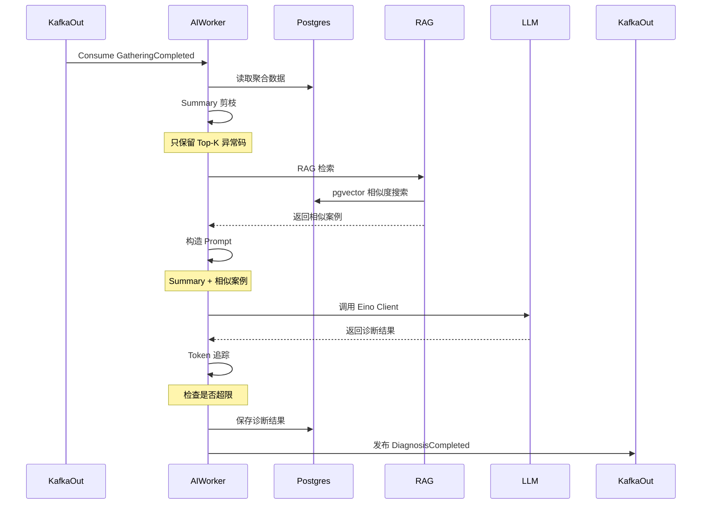

# AI Agent Worker - 架构设计文档

> 版本：v1.0
> 日期：2025-01-18
> 技术栈：Go + Eino + pgvector + Kafka

---

## 📚 目录

- [1. 架构概述](#1-架构概述)
- [2. DDD 分层设计](#2-ddd-分层设计)
- [3. 核心流程](#3-核心流程)
- [4. 技术选型](#4-技术选型)
- [5. 接口定义](#5-接口定义)
- [6. 数据模型](#6-数据模型)
- [7. Token 成本控制](#7-token-成本控制)
- [8. RAG 检索设计](#8-rag-检索设计)
- [9. 开发策略](#9-开发策略)

---

## 1. 架构概述

### 1.1 职责

AI Agent Worker 负责：
- 接收 Kafka 事件（GatheringCompleted）
- 从 PostgreSQL 读取聚合数据
- 调用 LLM 进行智能诊断
- 通过 RAG 检索历史相似案例
- 保存诊断结果到 PostgreSQL
- 发布 DiagnosisCompleted 事件

### 1.2 在系统中的位置

```text
Pipeline 流程：
Upload → Scatter (C++) → Barrier (Redis) → Gather (Python) → AI Diagnose (本模块) → Report Ready
```

---

## 2. DDD 分层设计

### 目录结构

```
workers/ai-agent/
├── main.go                          # 入口（依赖注入）
├── go.mod
├── go.sum
├── config/
│   └── config.go                    # 配置结构体
│
├── internal/
│   ├── domain/                      # 领域层（纯业务模型）
│   │   ├── diagnosis.go             # 诊断结果聚合根
│   │   ├── prompt.go                # Prompt 模板
│   │   ├── token_usage.go           # Token 使用记录
│   │   ├── llm_client.go            # LLM Client 接口
│   │   └── repository.go            # Repository 接口
│   │
│   ├── application/                 # 应用层（用例编排）
│   │   ├── diagnose_service.go      # 诊断服务
│   │   ├── prompt_builder.go        # Prompt 构建器
│   │   ├── summary_pruner.go        # Summary 剪枝器
│   │   └── token_tracker.go         # Token 追踪器
│   │
│   ├── infrastructure/              # 基础设施层（技术实现）
│   │   ├── llm/
│   │   │   ├── eino_client.go       # Eino Client 实现
│   │   │   └── mock_client.go       # Mock Client（测试用）
│   │   ├── rag/
│   │   │   ├── vector_retriever.go  # pgvector 检索器
│   │   │   ├── embeddings.go        # Embedding 生成
│   │   │   └── mock_retriever.go    # Mock 检索器
│   │   ├── postgres/
│   │   │   ├── diagnosis_repo.go    # Diagnosis Repository
│   │   │   └── queries.go           # SQL 查询
│   │   └── kafka/
│   │       ├── consumer.go          # Kafka Consumer
│   │       └── producer.go          # Kafka Producer
│   │
│   └── interfaces/                  # 接口层（如果需要 HTTP API）
│       └── http/
│           └── handler.go           # 健康检查端点
│
└── prompts/                         # Prompt 模板
    ├── system_prompt.txt            # 系统 Prompt
    ├── diagnosis_prompt.txt         # 诊断 Prompt
    └── few_shots.json               # Few-shot 示例
```

---

## 3. 核心流程

### 3.1 诊断流程图



### 3.2 伪代码

```go
func (s *DiagnoseService) DiagnoseBatch(ctx context.Context, batchID uuid.UUID) error {
    // 1. Token 检查
    if err := s.tokenTracker.CheckDailyLimit(); err != nil {
        return err  // 超限，跳过诊断
    }

    // 2. 读取聚合数据
    data, err := s.diagnosisRepo.FindAggregatedData(ctx, batchID)
    if err != nil {
        return err
    }

    // 3. Summary 剪枝（减少 Token）
    summary := s.summaryPruner.Prune(data, PruneConfig{
        MaxErrorCodes: 10,  // 只保留 Top 10
        MaxLogs:       100, // 只保留 100 条日志
    })

    // 4. RAG 检索
    similarCases, err := s.ragRetriever.Retrieve(ctx, summary.TopKErrors)
    if err != nil {
        log.Warn("RAG failed, continuing without it", err)
    }

    // 5. 构造 Prompt
    prompt := s.promptBuilder.Build(summary, similarCases)

    // 6. 调用 LLM
    diagnosisResp, err := s.llmClient.Diagnose(ctx, prompt)
    if err != nil {
        return err
    }

    // 7. Token 追踪
    s.tokenTracker.Record(diagnosisResp.Usage.TotalTokens)

    // 8. 保存结果
    diagnosis := s.toDiagnosis(batchID, summary, diagnosisResp)
    if err := s.diagnosisRepo.Save(ctx, diagnosis); err != nil {
        return err
    }

    // 9. 发布事件
    return s.kafkaProducer.Publish(ctx, DiagnosisCompleted{
        BatchID: batchID,
        Result:  diagnosis.Result,
    })
}
```

---

## 4. 技术选型

### 4.1 LLM 框架：Eino

**为什么选择 Eino？**
- ✅ Go 原生，与主项目技术栈一致
- ✅ 轻量级，比 LangChain 简单
- ✅ 高性能，适合高并发场景
- ✅ 内置 Token 追踪
- ✅ 支持多种 LLM Provider（OpenAI, Anthropic, 本地模型）

**依赖**：
```go
import (
    "github.com/cloudwego/eino/components/model"
    "github.com/cloudwego/eino/components/model/openai"
)
```

### 4.2 向量数据库：pgvector

**为什么选择 pgvector？**
- ✅ 已经有 PostgreSQL，无需额外部署
- ✅ 支持相似度搜索（<=> 操作符）
- ✅ 性能足够（百万级向量）

**SQL 示例**：
```sql
-- 创建扩展
CREATE EXTENSION vector;

-- 创建表
CREATE TABLE historical_diagnoses (
    id UUID PRIMARY KEY,
    diagnosis TEXT,
    embedding vector(1536)  -- OpenAI embedding 维度
);

-- 相似度搜索
SELECT id, diagnosis, embedding <=> $1 as distance
FROM historical_diagnoses
ORDER BY distance
LIMIT 5;
```

### 4.3 Embedding：OpenAI API

```go
import "github.com/sashabaranov/go-openai"

func GetEmbedding(text string) ([]float32, error) {
    client := openai.NewClient("sk-xxx")
    resp, err := client.CreateEmbeddings(ctx, openai.EmbeddingRequest{
        Input: []string{text},
        Model: openai.AdaEmbeddingV2,
    })
    return resp.Data[0].Embedding, err
}
```

---

## 5. 接口定义

### 5.1 Domain 层接口

#### LLMClient 接口

```go
package domain

import "context"

type LLMClient interface {
    // Diagnose - 调用 LLM 进行诊断
    Diagnose(ctx context.Context, prompt string) (*DiagnosisResponse, error)

    // GetEmbedding - 生成文本 Embedding（用于 RAG）
    GetEmbedding(ctx context.Context, text string) ([]float32, error)

    // Close - 关闭连接
    Close() error
}

type DiagnosisResponse struct {
    Result      string              // 诊断结果
    Reasoning   string              // 推理过程
    Confidence  float64             // 置信度
    Usage       TokenUsage          // Token 使用情况
    Model       string              // 使用的模型
    Timestamp   time.Time           // 时间戳
}
```

#### VectorRetriever 接口

```go
package domain

import "context"

type VectorRetriever interface {
    // Retrieve - 检索相似案例
    Retrieve(ctx context.Context, query string, topK int) ([]SimilarCase, error)

    // Index - 索引新的诊断案例（用于增量更新）
    Index(ctx context.Context, diagnosis *Diagnosis) error
}

type SimilarCase struct {
    ID          uuid.UUID
    Diagnosis   string
    Distance    float64          // 相似度距离（越小越相似）
    VehicleID   string
    ErrorCodes  []string
}
```

#### DiagnosisRepository 接口

```go
package domain

import "context"

type DiagnosisRepository interface {
    // Save - 保存诊断结果
    Save(ctx context.Context, diagnosis *Diagnosis) error

    // FindByID - 查询诊断结果
    FindByID(ctx context.Context, id uuid.UUID) (*Diagnosis, error)

    // FindByBatchID - 查询指定 Batch 的诊断结果
    FindByBatchID(ctx context.Context, batchID uuid.UUID) (*Diagnosis, error)

    // FindAggregatedData - 读取聚合数据（用于诊断输入）
    FindAggregatedData(ctx context.Context, batchID uuid.UUID) (*AggregatedData, error)

    // FindRecentDiagnoses - 查询最近的诊断结果（用于 RAG 索引）
    FindRecentDiagnoses(ctx context.Context, limit int) ([]*Diagnosis, error)
}
```

### 5.2 Application 层接口

#### DiagnoseService 接口

```go
package application

import "context"

type DiagnoseService struct {
    llmClient       domain.LLMClient
    vectorRetriever domain.VectorRetriever
    diagnosisRepo   domain.DiagnosisRepository
    tokenTracker    *TokenTracker
    promptBuilder   *PromptBuilder
    summaryPruner   *SummaryPruner
}

func NewDiagnoseService(
    llmClient domain.LLMClient,
    vectorRetriever domain.VectorRetriever,
    diagnosisRepo domain.DiagnosisRepository,
) *DiagnoseService {
    return &DiagnoseService{
        llmClient:       llmClient,
        vectorRetriever: vectorRetriever,
        diagnosisRepo:   diagnosisRepo,
        tokenTracker:    NewTokenTracker(100000),  // 每日 10 万 Token
        promptBuilder:   NewPromptBuilder(),
        summaryPruner:   NewSummaryPruner(),
    }
}

// DiagnoseBatch - 诊断指定 Batch
func (s *DiagnoseService) DiagnoseBatch(ctx context.Context, batchID uuid.UUID) error

// GetDiagnosis - 查询诊断结果
func (s *DiagnoseService) GetDiagnosis(ctx context.Context, id uuid.UUID) (*Diagnosis, error)
```

---

## 6. 数据模型

### 6.1 Diagnosis - 诊断结果聚合根

```go
package domain

import "time"

type Diagnosis struct {
    ID              uuid.UUID
    BatchID         uuid.UUID
    VehicleID       string
    VIN             string

    // 输入数据（剪枝后）
    InputSummary    Summary

    // LLM 输出
    Result          string           // 诊断结果
    Reasoning       string           // 推理过程
    Confidence      float64          // 置信度（0-1）
    Recommendations []string        // 建议措施

    // Token 使用
    TokenUsage      TokenUsage

    // RAG 相关
    SimilarCases    []SimilarCase   // 使用的相似案例

    // 元数据
    Model           string          // 使用的 LLM 模型
    DiagnosedAt     time.Time       // 诊断时间
    CompletedAt     *time.Time      // 完成时间
    CreatedAt       time.Time
    UpdatedAt       time.Time
}

type Summary struct {
    VehicleID       string
    VIN             string
    TotalFiles      int
    TotalLogs       int
    TimeRange       TimeRange
    TopKErrors      []ErrorCode     // Top-K 异常码
    CriticalErrors  []string        // 严重错误
}

type ErrorCode struct {
    Code        string
    Count       int
    Severity    string  // "critical", "warning", "info"
    Description string
}

type TokenUsage struct {
    PromptTokens     int
    CompletionTokens int
    TotalTokens      int
    EstimatedCost    float64  // 预估成本（美元）
}

type TimeRange struct {
    Start time.Time
    End   time.Time
}
```

### 6.2 PostgreSQL Schema

```sql
-- 诊断结果表
CREATE TABLE diagnoses (
    id UUID PRIMARY KEY,
    batch_id UUID NOT NULL REFERENCES batches(id),
    vehicle_id VARCHAR(255) NOT NULL,
    vin VARCHAR(50) NOT NULL,

    -- 输入数据（JSON）
    input_summary JSONB,

    -- LLM 输出
    result TEXT NOT NULL,
    reasoning TEXT,
    confidence FLOAT,
    recommendations TEXT[],

    -- Token 使用
    prompt_tokens INT,
    completion_tokens INT,
    total_tokens INT,
    estimated_cost FLOAT,

    -- 元数据
    model VARCHAR(100),
    diagnosed_at TIMESTAMP NOT NULL,
    completed_at TIMESTAMP,
    created_at TIMESTAMP NOT NULL DEFAULT NOW(),
    updated_at TIMESTAMP NOT NULL DEFAULT NOW()
);

-- 索引
CREATE INDEX idx_diagnoses_batch_id ON diagnoses(batch_id);
CREATE INDEX idx_diagnoses_vehicle_id ON diagnoses(vehicle_id);
CREATE INDEX idx_diagnoses_vin ON diagnoses(vin);
CREATE INDEX idx_diagnoses_diagnosed_at ON diagnoses(diagnosed_at DESC);

-- RAG 向量表
CREATE TABLE diagnosis_embeddings (
    id UUID PRIMARY KEY REFERENCES diagnoses(id),
    embedding vector(1536) NOT NULL,
    created_at TIMESTAMP NOT NULL DEFAULT NOW()
);

-- 向量相似度索引
CREATE INDEX ON diagnosis_embeddings USING ivfflat (embedding vector_cosine_ops) WITH (lists = 100);

-- Token 使用记录表（用于成本控制）
CREATE TABLE token_usage_log (
    id SERIAL PRIMARY KEY,
    date DATE NOT NULL,
    total_tokens INT NOT NULL,
    estimated_cost FLOAT NOT NULL,
    diagnosis_count INT NOT NULL,
    created_at TIMESTAMP NOT NULL DEFAULT NOW(),
    UNIQUE(date)
);
```

---

## 7. Token 成本控制

### 7.1 策略

1. **Summary 剪枝**
   - 只保留 Top-K 异常码（默认 K=10）
   - 压缩日志（只保留关键信息）
   - 移除重复错误

2. **Prompt 优化**
   - 使用简洁的 Prompt
   - Few-shot 示例精简
   - 避免 Prompt 注入

3. **每日限额**
   - 设置每日 Token 上限（如 10 万）
   - 超限后降级（返回 Top-K 异常码）

4. **Token 追踪**
   - 记录每次调用的 Token 使用
   - 统计每日成本
   - 异常告警

### 7.2 实现

```go
package application

type TokenTracker struct {
    dailyLimit  int
    dailyUsed   int
    costPerToken float64  // GPT-4o: $0.005/1K tokens
}

func (t *TokenTracker) CheckDailyLimit() error {
    if t.dailyUsed >= t.dailyLimit {
        return fmt.Errorf("token limit exceeded: %d/%d", t.dailyUsed, t.dailyLimit)
    }
    return nil
}

func (t *TokenTracker) Record(usage TokenUsage) error {
    t.dailyUsed += usage.TotalTokens
    log.Printf("[TokenTracker] Used: %d, Cost: $%.4f", usage.TotalTokens, usage.EstimatedCost)
    return nil
}

// 降级策略：Token 超限时返回 Top-K 异常码
func (s *DiagnoseService) Fallback(batchID uuid.UUID, summary Summary) error {
    log.Warn("Token limit exceeded, using fallback")

    result := fmt.Sprintf("诊断失败：Token 额度不足\nTop 异常码：%v", summary.TopKErrors)

    diagnosis := &Diagnosis{
        Result:     result,
        Confidence: 0.0,
        Model:      "fallback",
    }

    return s.diagnosisRepo.Save(ctx, diagnosis)
}
```

---

## 8. RAG 检索设计

### 8.1 流程

```text
1. 输入：Top-K 异常码
2. 生成 Embedding：调用 OpenAI Embedding API
3. pgvector 相似度搜索：查找历史相似案例
4. 返回：Top 5 最相似的诊断案例
```

### 8.2 实现

```go
package infrastructure

import (
    "github.com/lib/pq"
    "github.com/pgvector/pgvector-go"
    "github.com/sashabaranov/go-openai"
)

type VectorRetriever struct {
    db          *sql.DB
    openaiClient *openai.Client
}

func (r *VectorRetriever) Retrieve(ctx context.Context, query string, topK int) ([]SimilarCase, error) {
    // 1. 生成 Embedding
    embedding, err := r.getEmbedding(ctx, query)
    if err != nil {
        return nil, err
    }

    // 2. pgvector 相似度搜索
    rows, err := r.db.QueryContext(ctx, `
        SELECT d.id, d.result, d.vehicle_id, d.input_summary->'top_k_errors' as errors,
               de.embedding <=> $1 as distance
        FROM diagnoses d
        JOIN diagnosis_embeddings de ON d.id = de.id
        ORDER BY distance
        LIMIT $2
    `, pgvector.Vector(embedding), topK)

    // 3. 解析结果
    cases := make([]SimilarCase, 0, topK)
    for rows.Next() {
        var c SimilarCase
        rows.Scan(&c.ID, &c.Diagnosis, &c.VehicleID, &c.ErrorCodes, &c.Distance)
        cases = append(cases, c)
    }

    return cases, nil
}

func (r *VectorRetriever) getEmbedding(ctx context.Context, text string) ([]float32, error) {
    resp, err := r.openaiClient.CreateEmbeddings(ctx, openai.EmbeddingRequest{
        Input: []string{text},
        Model: openai.AdaEmbeddingV2,
    })
    if err != nil {
        return nil, err
    }
    return resp.Data[0].Embedding, nil
}
```

---

## 9. 开发策略

### 9.1 依赖关系

```text
AI Agent Worker 依赖：
├── PostgreSQL（已有）
│   ├── batches 表（待创建）
│   ├── files 表（待创建）
│   └── diagnoses 表（待创建）
│
├── Kafka（已有）
│   ├── 消费：GatheringCompleted
│   └── 发布：DiagnosisCompleted
│
├── pgvector（待安装）
│   └── PostgreSQL 扩展
│
└── OpenAI API（待申请）
    └── API Key
```

### 9.2 开发优先级

#### 阶段 1：基础框架（1-2 天）
- [ ] 创建项目结构（`workers/ai-agent/`）
- [ ] 定义 Domain 层接口（Diagnosis, LLMClient, VectorRetriever）
- [ ] 实现 main.go（依赖注入）
- [ ] 实现 Kafka Consumer（消费 GatheringCompleted）
- [ ] 实现 Kafka Producer（发布 DiagnosisCompleted）

#### 阶段 2：数据层（1 天）
- [ ] 创建 PostgreSQL Migration（diagnoses 表）
- [ ] 实现 DiagnosisRepository（Postgres）
- [ ] 实现 AggregatedData 查询（JOIN batches, files）

#### 阶段 3：LLM 集成（1-2 天）
- [ ] 添加 Eino 依赖
- [ ] 实现 EinoClient（封装 OpenAI API）
- [ ] 实现 DiagnoseService（核心逻辑）
- [ ] 实现 PromptBuilder（构造 Prompt）
- [ ] 实现 SummaryPruner（剪枝）

#### 阶段 4：Token 控制（0.5 天）
- [ ] 实现 TokenTracker
- [ ] 实现每日限额检查
- [ ] 实现降级策略
- [ ] 创建 token_usage_log 表

#### 阶段 5：RAG 检索（1-2 天）
- [ ] 安装 pgvector 扩展
- [ ] 创建 diagnosis_embeddings 表
- [ ] 实现 VectorRetriever（pgvector）
- [ ] 实现 Embedding 生成（OpenAI API）
- [ ] 实现增量索引（Index 方法）

#### 阶段 6：测试与优化（1-2 天）
- [ ] 单元测试（Mock LLMClient, Mock VectorRetriever）
- [ ] 集成测试（端到端诊断流程）
- [ ] 压力测试（并发诊断）
- [ ] Prompt 优化（迭代）

**总计：6-9 天**

### 9.3 风险与应对

| 风险 | 应对 |
|------|------|
| OpenAI API 限流 | 实现重试机制 + 队列 |
| Token 成本过高 | 剪枝 + 缓存 + 降级 |
| RAG 检索慢 | pgvector 索引优化 + 缓存 |
| LLM 输出不稳定 | Few-shot + 验证规则 |

---

## 10. 下一步行动

### 立即开始
1. 创建 `workers/ai-agent/` 目录结构
2. 添加 Eino 依赖：`go get github.com/cloudwego/eino/...`
3. 定义 Domain 层接口
4. 实现 Kafka Consumer 框架

### 依赖等待
- [ ] Orchestrator 完成（发布 GatheringCompleted 事件）
- [ ] Python Aggregator 完成（聚合数据）
- [ ] PostgreSQL Migration 完成

---

**备注**：
- 本文档是 AI Agent Worker 的完整架构设计
- 开发策略遵循 DDD 原则
- 优先级可根据实际情况调整
