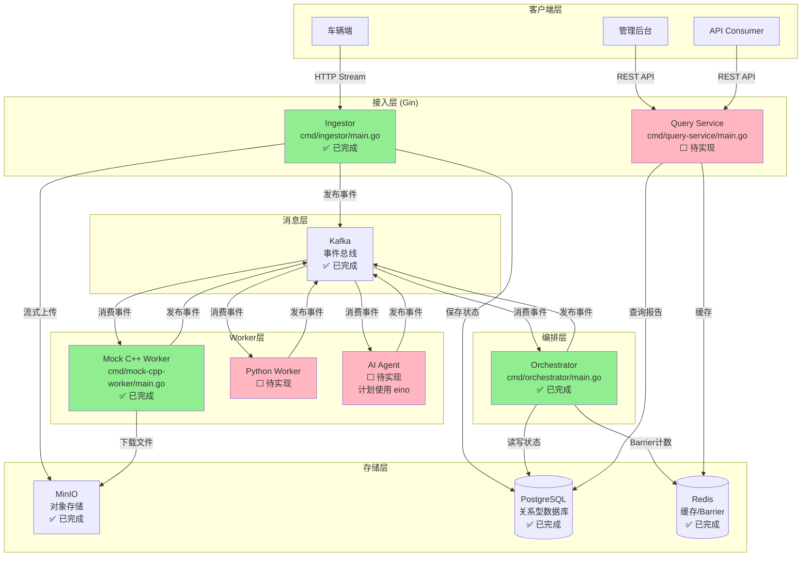
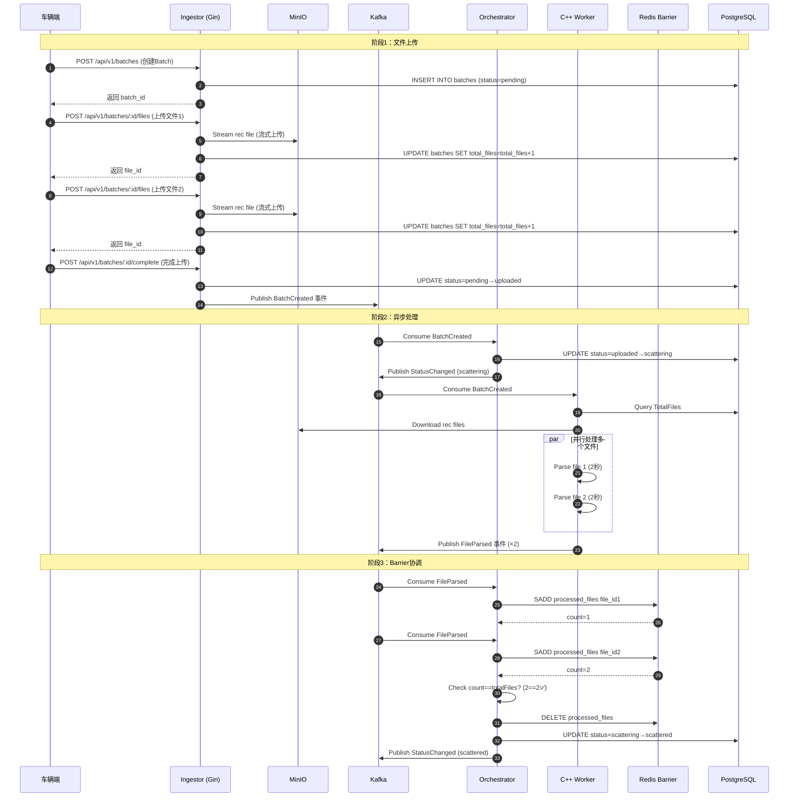
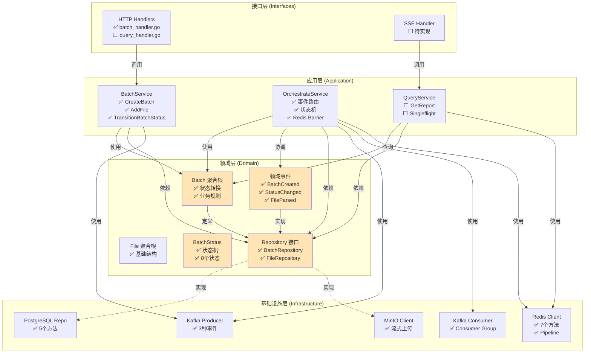
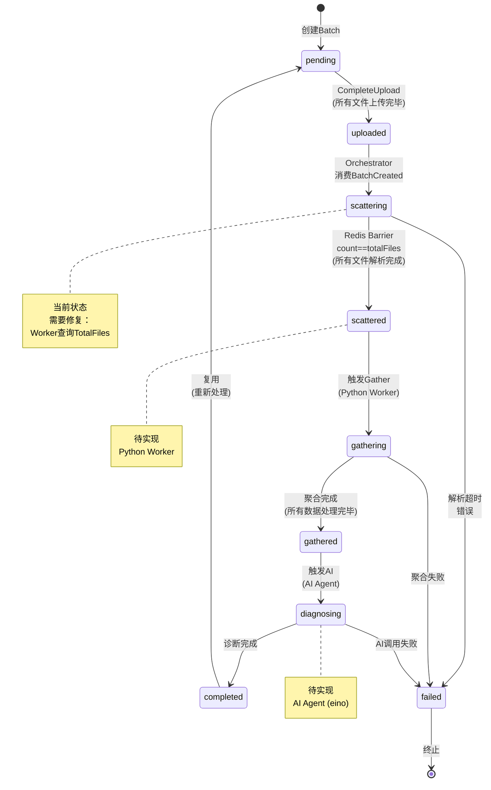
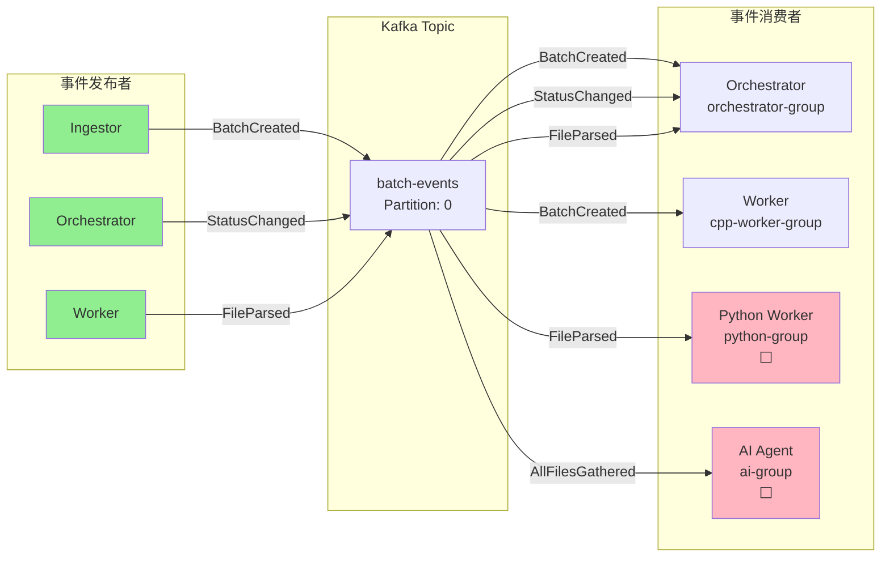
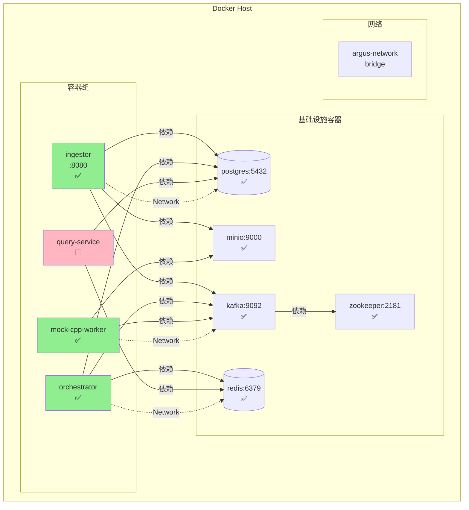
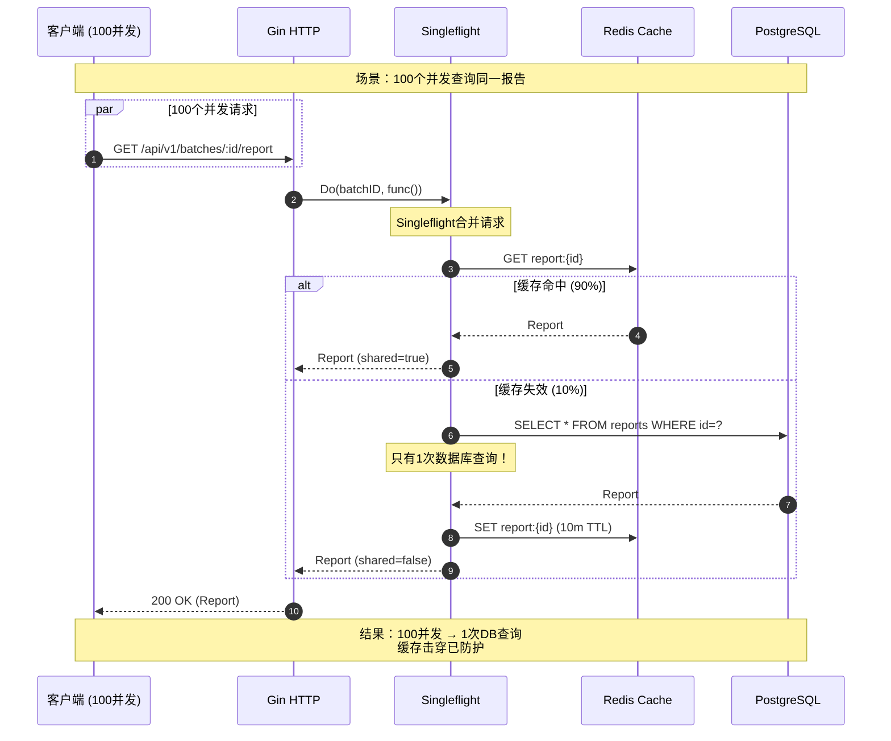
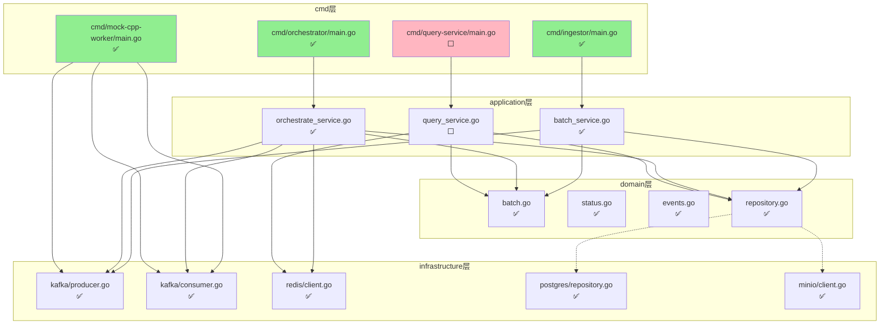
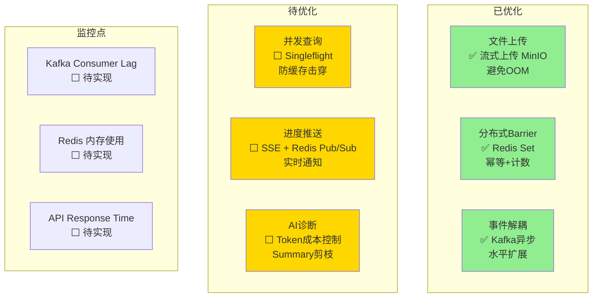

# Argus OTA Platform - 架构图

**使用 Mermaid 绘制的系统架构**

---

## 1. 系统整体架构图



---

## 2. 数据流向图（完整流程）



---

## 3. DDD 分层架构图



---

## 4. 状态机流转图



---

## 5. Kafka 事件流图



---

## 6. Redis 数据结构图

```mermaid
graph TB
    subgraph "Redis Keys"
        Barrier[batch:{id}:processed_files<br/>Type: Set<br/>TTL: 24h<br/>✅ 已实现]
        Cache[report:{id}<br/>Type: String<br/>TTL: 10m<br/>⬜ 待实现]
        Progress[batch:{id}:progress<br/>Type: Pub/Sub<br/>TTL: -<br/>⬜ 待实现]
    end

    subgraph "Barrier 操作"
        SADD[SADD fileID<br/>✅ 幂等添加]
        SCARD[SCARD<br/>✅ 获取计数]
        DEL[DEL<br/>✅ 清理]
    end

    subgraph "Cache 操作"
        GET[GET<br/>⬜ 查询缓存]
        SET[SET report 10m<br/>⬜ 写入缓存]
    end

    subgraph "Progress 操作"
        PUBLISH[PUBLISH progress<br/>⬜ 广播进度]
        SUBSCRIBE[SUBSCRIBE<br/>⬜ 订阅进度]
    end

    Barrier --> SADD
    Barrier --> SCARD
    Barrier --> DEL

    Cache --> GET
    Cache --> SET

    Progress --> PUBLISH
    Progress --> SUBSCRIBE

    style Barrier fill:#90EE90
    style Cache fill:#FFB6C1
    style Progress fill:#FFB6C1
```

---

## 7. 部署架构图



---

## 8. 并发查询防护图（Singleflight）



---

## 9. 完整组件依赖图



---

## 10. 性能瓶颈与优化点



---

**使用说明**：
- ✅ 绿色：已完成并验证
- 🟡 黄色：待实现（高优先级）
- 🟥 粉色：待实现（中优先级）
- ⬜ 灰色：未开始

**图表说明**：
1. 系统整体架构图 - 展示所有组件及其关系
2. 数据流向图 - 完整的业务流程时序图
3. DDD 分层架构图 - 展示依赖倒置原则
4. 状态机流转图 - Batch 的 8 个状态转换
5. Kafka 事件流图 - 事件发布与订阅关系
6. Redis 数据结构图 - Barrier、Cache、Pub/Sub
7. 部署架构图 - Docker 容器部署结构
8. 并发查询防护图 - Singleflight 防缓存击穿
9. 完整组件依赖图 - 代码级别的依赖关系
10. 性能瓶颈与优化点 - 已优化 vs 待优化
